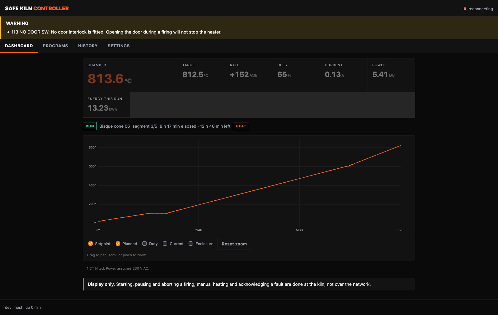

<!--
SPDX-FileCopyrightText: 2026 Bitcrush Testing
SPDX-License-Identifier: GPL-3.0-or-later
-->


# Safe Kiln Controller

[](https://github.com/bitcrushtesting/SafeKilnController/actions/workflows/ci.yml)
[](.github/workflows/ci.yml)
[](tools/mcdc.sh)
[](.clang-tidy)
[](docs/03_software_req.sdoc)
[](LICENSE)

An open-source PID controller for electric ceramic and glass kilns, built on the
**ESP32-S3** with **ESP-IDF**.

- **Simple local display**: a 128×64 OLED showing current and target temperature at a glance, plus state, segment progress and rate of rise.
- **Web interface**: served by the device itself. Live dashboard, charts of the logged data, power and energy, and the firing programs the firmware carries. **Observation only**: nothing reachable over the network can start a firing, heat the kiln or change its configuration. Those are done at the kiln.
- **PID with automatic tuning**: relay (Åström–Hägglund) autotune on the real kiln; no manual gain hunting.
- **Firing profiles are compiled in**: the device ships with its curves and nothing edits them, not over the network and not at the kiln. That removes every authoring path and the attack surface each one carries, and it has a real cost: a curve of your own means building a firmware that carries it.
- **Safety first**: thermal runaway, thermocouple failure, shorted-SSR, over-temperature and door-interlock detection, with a safety supervisor that has sole authority over a heat-enable line that decays unless actively refreshed.
- **Current monitoring**: a current transformer turns relay and element failures from slow thermal inferences into fast electrical facts, with the thermal rules retained as an independent backstop.
- **Self-contained**: no SD card, no external database, no account, no filesystem. Logs live in a circular partition on internal flash and programs in a fixed-slot one, each built so a power cut cannot tear a record; web assets are embedded in the firmware. The device makes **one** outbound connection, a daily check for a firmware update that carries nothing about the device and can be turned off at the display.
- **Designed for testability**: all decision logic is hardware-free C++ that runs on a development host against a simulated kiln.



The dashboard mid-firing. Everything on it is read from the device: the `RUN`
and `HEAT` badges, the segment progress, the logged curve. There is no button
here that changes what the kiln is doing, because there is no route behind one
(`SWR-WEB-26`), which is why both notices at the foot of the page say so
plainly.

No kiln was involved. That is the development harness of
[`host/webhost`](firmware/controller/host/webhost) running the real firmware
logic against a simulated one, and it is two commands if you want to click
around yourself:

```sh
cmake -B build-webhost -S firmware/controller/host/webhost && cmake --build build-webhost
./build-webhost/webhost --accel 60 --fire "Bisque cone 06"   # then open http://127.0.0.1:8080
```

`--fire` exists because of the read-only interface: a firing cannot be started
from the browser, so the harness starts one of the built-in examples
(`SWR-PRG-09`) through the same call the local display makes.

## Status

**In development, and not ready to fire a kiln.** The control, safety, storage,
web and interface logic is written and tested. The hardware adapters are
written and **have never been run against a board**. Two things block a
release: the field update path is specified and unbuilt, and local control,
which is now the only control, has never been operated by a person.

433 host tests on the controller and 81 on the independent safety supervisor,
all green plain and under AddressSanitizer and UBSan. `clang-tidy` is clean on
host and target with no suppressions baseline, MC/DC over the supervisor's trip
logic is 100 % against an 80 % floor, the `esp32s3` image builds with zero
warnings at 246 kB (88 % of the OTA slot free), and QEMU boots that image and
fires it. The hardware configuration, which that one compiles out, builds at
908 kB with the browser interface gzipped into it and 56 % of the slot free.

The controller is C++20; the supervisor is C++17, which is the standard
MISRA C++:2023 is written against. What is done, what is not, and what blocks
a release is [`tasklist.md`](tasklist.md), which is kept current and is the
only place that count lives.

You can watch a complete firing, and break it in a dozen ways, without any
hardware at all, see [`docs/simulation.md`](docs/simulation.md):

```sh
tools/run-qemu.sh          # the firmware on an emulated ESP32-S3, kiln simulated
```

or run the logic tests directly:

```sh
cmake -B build-host -S firmware/controller/test/host && cmake --build build-host
ctest --test-dir build-host
```

CI runs eleven jobs: the layering and licence checks, both host suites plain
and under AddressSanitizer and UBSan, a coverage gate, `clang-tidy` on host and
on target, StrictDoc over the requirements, the `esp32s3` build with a size
report and a generated bill of materials, the supervisor suites with MC/DC, the
unit design document with documentation warnings as errors, and a QEMU job that
boots the real image and asserts that the simulated kiln passes 100 degC
without latching a fault. Tagging `v*` builds a release.

## Putting a unit into production

Two tools, in this order, because the order is not interchangeable:

```sh
tools/prod-data.py flash --serial SK1-2026-000042   # identity, a plain write
tools/secure-boot.py provision --key keys/prod.pem  # dry run; add --commit
```

The production data block first, while the device is still freely writable.
Then signing, flashing and lockdown.

The two differ in what they do by default, and the difference is the point.
`prod-data.py` writes unless told `--dry-run`, because its write is a plain
flash write that a reflash undoes. `secure-boot.py` does *nothing* unless told
`--commit`, because most of what it does cannot be undone at all. Both carry a
`--self-test` that needs neither a board nor ESP-IDF.

**`secure-boot.py` burns eFuses, and three of its four steps cannot be undone.**
It refuses to touch a board until its pre-flight passes, demands a differently
worded confirmation for each irreversible step, and sequences them so the device
is left bootable at every point. Read the header of
[`firmware/controller/sdkconfig.secure`](firmware/controller/sdkconfig.secure) before the first run;
the short version is that **losing the signing key means the unit can never run
new firmware again**, and that secure boot stops hostile code running but does
nothing about secrets being read off the flash (`SRR-05`).

### Releasing an update

A third tool, for the other end of the lifecycle. The device fetches one signed
static manifest per channel and verifies it against a key compiled into its own
firmware (`SWR-UPD-09` to `SWR-UPD-16`), and this builds that manifest:

```sh
tools/update-manifest.py keygen --key keys/manifest.pem          # once, then keep it offline
tools/update-manifest.py pubkey --key keys/manifest.pem \
    --header firmware/controller/main/update_pubkey.h            # the half that ships
tools/update-manifest.py sign   --key keys/manifest.pem \
    --image build-esp32s3/safekiln.bin --version 1.4.2 \
    --security --advisory advisories/2026-002.html
tools/update-manifest.py verify --manifest dist/update/stable.json \
    --pubkey keys/manifest.pub.pem --image build-esp32s3/safekiln.bin \
    --running-version 1.4.1
```

The **bill of materials** is generated rather than written
([`tools/sbom.py`](tools/sbom.py), `SWR-NFR-28`): the component list comes from
the build's own `project_description.json`, so it names what was actually
linked, and each licence is scanned from that component's own
`SPDX-License-Identifier` tags, with anything untagged reported as
`NOASSERTION` rather than given a plausible default. CycloneDX 1.6 by default,
SPDX 2.3 with `--format spdx`, both published with every release:

```sh
tools/sbom.py --build-dir firmware/controller/build \
    --image firmware/controller/build/safekiln.bin --format both --strict
```

It has to run where `$IDF_PATH` is, which in CI means inside the IDF container
rather than a step afterwards, because a licence cannot be scanned from a tree
that is not there. The question it exists to answer is "an advisory landed this
morning against mbedTLS 3.6.0, did we ship it", and that cannot be answered
after the fact.

**The manifest key is not the secure boot key, and the tool refuses to let it
be** (`SRR-12`). The secure boot key decides what a provisioned board will
*boot* and its digest is burnt into eFuses, so it can never be rotated; this one
decides what a board will be *offered* and is used on every release. `sign` also
refuses an image with no Secure Boot V2 signature, an image whose chip id is not
this target, a version carrying build metadata, and a security release with no
advisory, because each of those produces a manifest that every device must
reject after downloading it.

It deliberately does not burn `DIS_DOWNLOAD_MODE`. Serial download is
`SWR-UPD-14`'s recovery path, for a unit whose update service is unreachable,
whose new image will not confirm itself, or which has to be downgraded; closing
it as well would make such a unit permanently unfixable.

| Document | Contents |
|---|---|
| [`docs/v-model-process.md`](docs/v-model-process.md) | The development process: the V-model levels, which document holds each, the relations between them, and an honest record of which levels exist and which do not. |
| [`docs/01_user_req.sdoc`](docs/01_user_req.sdoc) | User requirements: the target markets (the European Union), the regulatory framework that follows from them with instrument numbers and editions, the user needs with their acceptance criteria, and the project constraints. |
| [`docs/02_system_req.sdoc`](docs/02_system_req.sdoc) | System requirements: the hardware interface, the four safety requirements that hardware discharges, and the assumptions about the environment the system is placed in. |
| [`docs/03_software_req.sdoc`](docs/03_software_req.sdoc) | Software requirements: the functional, safety, non-functional and testability requirements, each with an identifier and a verification method. |
| [`docs/04_software_arch.sdoc`](docs/04_software_arch.sdoc) | Software architecture: the 22 decisions the design rests on, each with the requirement that drove it and the cost it carries. |
| [`docs/safety.sdoc`](docs/safety.sdoc) | Hazards, safety goals and residual risks, each with an identifier, and the chain between them as checked relations: which hazards a goal mitigates, which requirements realise it, and which risk its layers leave. |
| [`docs/safety.md`](docs/safety.md) | Safety concept: the system boundary, the layered protection concept and the independence claimed between layers, detection coverage and timing, the reaction and recovery sequence, and the obligations on the installer and on anyone changing the design. |
| [`docs/security.sdoc`](docs/security.sdoc) | Assets, adversaries, threats, security goals, residual risks and open questions, each with an identifier, and the chain between them as checked relations: which asset a threat is aimed at, which safety hazard it reaches, which goal answers it, and what each goal's implementation status actually is. |
| [`docs/security.md`](docs/security.md) | Security concept: scope, the attack surface and trust boundaries, the physical boundary and why the supervisor's debug port is deliberately open, the update path and why it points outwards, why a security compromise here is a safety event, what the implementation already gets right, the obligations on the owner and on whoever implements the HTTP transport, the verification status, and an inventory of what the Cyber Resilience Act still requires. |
| [`SECURITY.md`](SECURITY.md) | The security policy: where to report a vulnerability and what happens then, the single point of contact and the reporting obligations behind it, the supported versions and the support period, how a fix reaches a device, and what is already documented as a residual risk so a report need not restate it. |
| [`docs/architecture.md`](docs/architecture.md) | Architecture prose: component decomposition, task and timing design, control and safety algorithms, persistence and flash-endurance design, REST API, and the build and test architecture. |
| [`docs/test-concept.md`](docs/test-concept.md) | How the product is verified: unit, integration, system and hardware-in-the-loop, what each level can and cannot prove, the HIL fixture design, and an honest status against every testability requirement. |
| [`docs/safety-supervisor.md`](docs/safety-supervisor.md) | The independent safety supervisor (`SWA-22`): a second microcontroller holding the absolute over-temperature, thermocouple-fault and lid trips, what moves and what stays, the link, the failure modes, and the questions still open. |
| [`docs/coding-standard.md`](docs/coding-standard.md) | The coding standard: which safety standards actually reach the source code and what each asks for, the language subset and the flags that enforce it, why the supervisor contains no floating point, how a deviation is recorded, and what is not met yet. |
| [`docs/simulation.md`](docs/simulation.md) | Running the firmware against a simulated kiln, on the host and under QEMU, including fault injection. |
| [`tasklist.md`](tasklist.md) | Outstanding work, by priority. |

Start with [`docs/03_software_req.sdoc`](docs/03_software_req.sdoc); the architecture
document cites it throughout.

## Repository layout

```
docs/                  requirements, architecture, safety and security
firmware/controller/   the ESP-IDF application
firmware/supervisor/   the independent safety supervisor, STM32G031
web/                   the browser interface, served by the device
tools/                 release, provisioning, analysis and document generation
fixture/               the bed-of-nails test fixture
hardware/              schematic, PCB, pin map
housing/               enclosure
```

## Scope

Safe Kiln Controller supports **single-phase kilns only**. A three-phase kiln can be
monitored on one representative phase, but a fault confined to one of the other
two would be caught only by the thermal rules, slowly, and the power and energy
figures would cover a third of the load. Neither is a safe basis for firing a
three-phase kiln, so it is out of scope rather than partially supported.

## Hardware at a glance

| Part | Choice |
|---|---|
| MCU | ESP32-S3, ≥ 8 MB flash, no PSRAM required |
| Temperature | MAX31856 front ends, type-K. The controller reads chamber and enclosure; the **supervisor reads its own chamber couples on its own SPI buses**, so neither processor depends on the other for a temperature |
| Display | 128×64 monochrome OLED, I²C |
| Input | Rotary encoder with push button |
| Output | Zero-cross SSR in series with a safety contactor |
| Supply | **Single phase only.** One current transformer on the heater conductor |
| Door interlock | Optional normally-closed switch, stops the heater immediately when the door opens |
| Connectivity | WiFi station only. **No access point:** the network is selected and its passphrase typed at the display, so setting it up needs somebody at the kiln. Reachable at `kiln.local` over mDNS, and by IP, which the display shows |

Details and rationale are in
[requirements §6](docs/03_software_req.sdoc).

## Credit

Functionally inspired by [**PIDKiln**](https://github.com/Saur0o0n/PIDKiln) by
Adrian Siemieniak, which showed that a low-cost ESP32 can run a real kiln well.
Safe Kiln Controller borrows its ideas, segment-based programs, dual local/web control,
on-device storage, a redundant SSR + contactor output stage, and rebuilds them
on ESP-IDF with a host-testable core and automatic PID tuning. No PIDKiln source
code is used

## Safety

Safe Kiln Controller is **not** a safety-certified device. A kiln is a multi-kilowatt mains
heater reaching temperatures at which its own wiring and the surrounding building
are at risk.

Mains wiring must be carried out by a competent person in accordance with local regulation.

The hazards, the layered protection concept and the risk that remains are
set out in [`docs/safety.md`](docs/safety.md); the requirements it derives from
are [requirements §5](docs/03_software_req.sdoc).

Safe Kiln Controller is designed for a **trusted local network** and must not be exposed
to the internet. The threat model, the controls and what is still only specified are in [`docs/security.md`](docs/security.md).

## License

GPL-3.0-or-later. See [`LICENSE`](LICENSE).

    Copyright (C) 2026 Bitcrush Testing

    This program is free software: you can redistribute it and/or modify it
    under the terms of the GNU General Public License as published by the Free
    Software Foundation, either version 3 of the License, or (at your option)
    any later version.

    This program is distributed in the hope that it will be useful, but WITHOUT
    ANY WARRANTY; without even the implied warranty of MERCHANTABILITY or
    FITNESS FOR A PARTICULAR PURPOSE.  See the GNU General Public License for
    more details.
