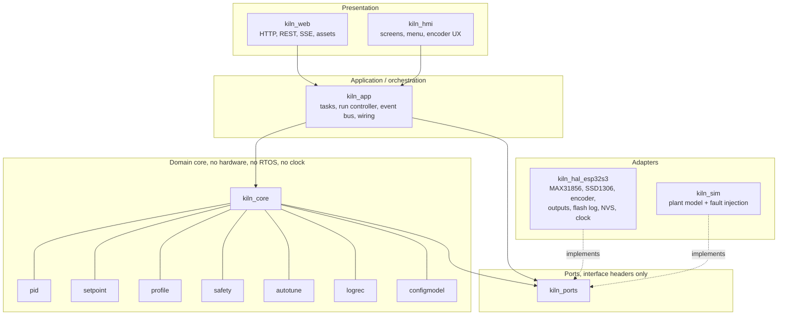
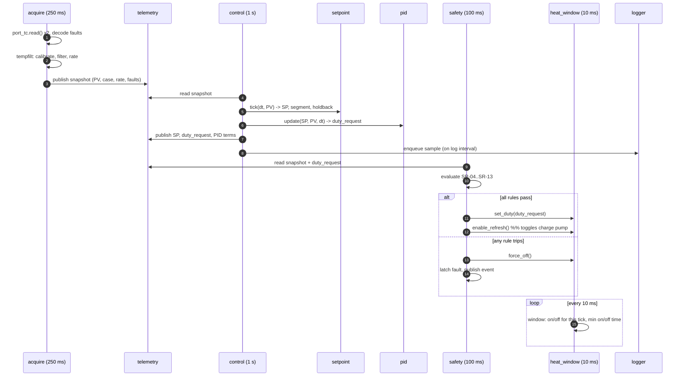
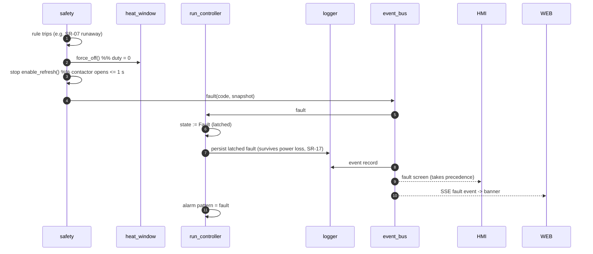
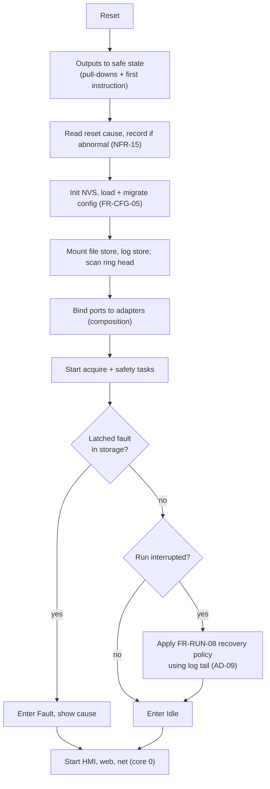
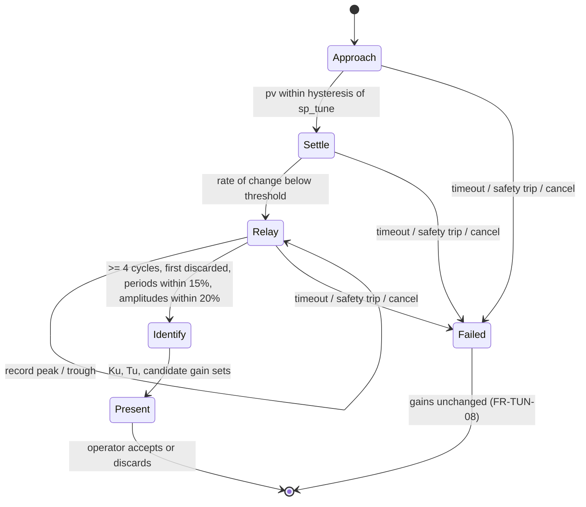
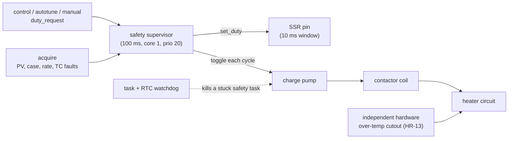
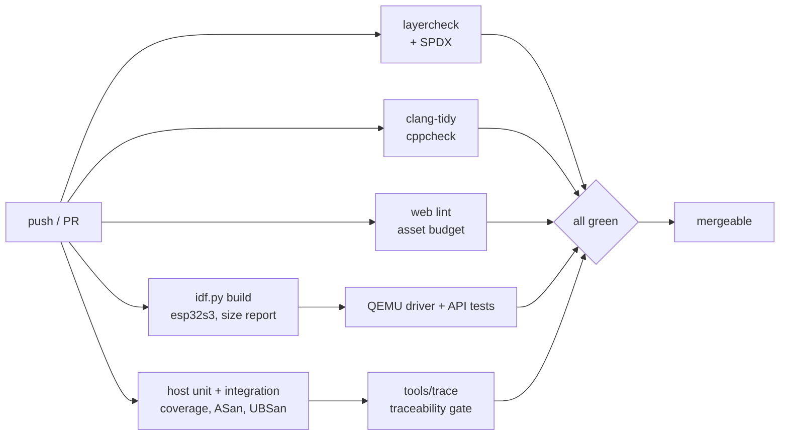

<!--
SPDX-FileCopyrightText: 2026 Bitcrush Testing
SPDX-License-Identifier: GPL-3.0-or-later
-->

# KilnControl, Software Architecture

| | |
|---|---|
| **Document** | Software Architecture Description |
| **Project** | KilnControl, PID kiln controller |
| **Version** | 0.1 (draft) |
| **Date** | 2026-09-26 |
| **Status** | For review |
| **Derives from** | [`requirements.md`](requirements.md) v0.1 |
| **License** | GPL-3.0-or-later |

---

## 1. Purpose and scope

This document describes how the software satisfies [`requirements.md`](requirements.md).
It defines the decomposition into components, the dependency rules between them,
the runtime (task) structure, the data and persistence design, the algorithms of
the control and safety subsystems, and the build and test architecture.

Requirement identifiers are cited as `FR-CTL-07`, `SR-07`, `TR-01` and so on.
[§15](#15-traceability) maps requirement groups to the components and test levels
that realise and verify them.

## 2. Architectural drivers

Ranked. Where drivers conflict, the higher one wins, and the conflict is recorded
as a decision in [§3](#3-key-decisions).

| # | Driver | Source | Architectural consequence |
|---|---|---|---|
| 1 | **A single failure must not heat the kiln uncontrolled.** | `SR-01`, `SR-02` | A safety supervisor that is independent of, and has authority over, the control path; heat enable that decays unless actively refreshed. |
| 2 | **Everything that decides must be testable without hardware.** | `TR-01`–`TR-14` | Ports-and-adapters split: a pure-logic core with no peripheral, RTOS or clock access, driven in tests by a plant simulator. |
| 3 | **Control and safety must meet hard deadlines regardless of load.** | `NFR-01`–`NFR-04` | Core affinity split, priority ordering, no blocking calls on the control path, message passing instead of shared locks. |
| 4 | **No SD card, no external database, no external host.** | `CON-03`, `FR-WEB-02` | Log store as a raw circular flash partition; web assets embedded and gzipped in the firmware image; charting rendered client-side from the device's own API. |
| 5 | **Fits an 8 MB / no-PSRAM ESP32-S3 and runs for a week.** | `NFR-10`–`NFR-14` | Fixed-size records, static allocation in the core, bounded HTTP buffers, flash write pattern designed against an endurance budget. |
| 6 | **GPL-3.0-or-later, self-contained, vendored dependencies.** | `CON-04` | No build-time network fetch, third-party licences audited and recorded. |

## 3. Key decisions

| ID | Decision | Rationale | Consequence / cost |
|---|---|---|---|
| **AD-01** | **Ports and adapters** (hexagonal). A `kiln_core` component holds all decision logic; hardware is reached only through interface headers in `kiln_ports`; adapters in `kiln_hal_esp32s3` implement them. | Directly realises `TR-01`, `TR-02`. Logic becomes ordinary C that a host compiler builds and a debugger steps through in microseconds. | One indirection on every hardware access; interfaces must be designed, not grown. |
| **AD-02** | **Time is injected**, never read. Core functions receive `dt` or take a `kiln_clock_t*`. | `TR-03`. A 168 h firing, a 15 min runaway timer and a 2 h autotune are all testable in milliseconds of wall time. | Every core API grows a time parameter; discipline needed to keep `esp_timer_get_time()` out of the core. |
| **AD-03** | **Explicit context structs, no globals** in the core. | `TR-04`. Lets one test process run several controllers, and makes every test independent. | Slightly more verbose call sites. |
| **AD-04** | **The safety supervisor is a separate, higher-priority task that owns the heat-enable output.** The control path can only *request* heat; safety alone grants it. | `SR-01`, `SR-02`, `SR-13`. A bug, deadlock or overrun anywhere in control, HMI, web or networking cannot produce heat. | Two components must agree on a shared view of the plant; that view is passed as an immutable snapshot, not shared state. |
| **AD-05** | **Heat enable is a software-generated square wave into a hardware charge pump**, not a static level. | `SR-02`, `HR-07`, and gives `SR-14` for free: a hung safety task stops toggling and the contactor drops in ~1 s with no code involved. | Requires the RC/charge-pump circuit on the board; the toggle must never be delegated to a hardware PWM peripheral, or the property is lost. |
| **AD-06** | **The setpoint generator is separate from the PID.** The program produces a moving setpoint; the PID only ever tracks the setpoint it is given. | `FR-CTL-09`. The two hardest pieces of behaviour, curve execution with hold-back, and loop tuning, become independently testable. Also makes manual mode and autotune trivially reuse the same PID. | An extra component and an extra data hand-off per cycle. |
| **AD-07** | **The SSR window is driven by a 10 ms periodic timer callback** that reads a duty value published atomically by the control task. | `FR-CTL-07`, `FR-CTL-08`, `NFR-04`. Switching precision is decoupled from the 1 s control period and from any task scheduling delay. | The callback runs in a timer context: it must be allocation-free, lock-free and short. |
| **AD-17** | **Heater current is measured gated to the commanded output state**, not continuously averaged: conduction current is sampled inside a commanded-on interval and leakage current inside a commanded-off interval, each after a settle delay. | `FR-CUR-04`. A time-proportional output at 2 % duty is off 98 % of the time; a blind average would read ~2 % of full current and make `SR-25`/`SR-26` meaningless. Gating is what turns the measurement into a statement about the *relay*. | The sampler must know the window phase, so it is driven by the same 10 ms timer that owns the SSR pin (`AD-07`), not by an independent ADC loop. Windows too short to measure are skipped rather than mis-measured. |
| **AD-18** | **The log record grows from 16 to 20 bytes** to carry current and its validity flags. | `FR-CUR-09`. Current without a flag saying whether the sample was a conduction, leakage or skipped measurement is uninterpretable. | 204 records per sector instead of 255; capacity falls from 362 h to **290 h** at the default interval, still well above the 150 h of `FR-LOG-07`. Recomputed in [§10.4](#104-flash-endurance-analysis). |
| **AD-08** | **Sample logs live in a dedicated raw flash partition as a circular array of fixed 16-byte records**, not in a filesystem. | `FR-LOG-05`–`FR-LOG-08`, `CON-03`. A filesystem adds metadata writes, fragmentation, and a torn-write failure mode across structures we do not control. A ring of fixed records has a trivially provable wear pattern ([§10.4](#104-flash-endurance-analysis)) and a reader that cannot be confused by a power cut. | A bespoke store to implement and test; no `ls` over logs. Mitigated by `tools/logdump`. |
| **AD-09** | **The log is also the power-loss journal.** Recovery state is reconstructed from the log tail rather than from a separate periodic write. | `FR-RUN-08`, `FR-RUN-09`, `NFR-14`. Removes a 60 000-write-per-run NVS hot spot; the data was already being written. | Recovery granularity equals the log sample interval (default 10 s), which is well inside the `FR-RUN-08` tolerance. |
| **AD-10** | **Configuration in NVS; programs and run records in a raw partition of fixed slots.** Originally LittleFS, revised by `AD-21`. | Config is small, typed, and benefits from NVS wear levelling. Programs and run records want names and atomic replace, which is what the slot store provides; they do not want a directory, because nothing addresses them by anything but a slot number. | Two storage mechanisms to initialise. No general filesystem on the device, so there is no path for a file that is not a program or a run record. |
| **AD-11** | **Web assets are gzipped and embedded in the application image**, not stored in a filesystem. | `FR-WEB-02`, `FR-UPD-05`. Assets and firmware version can never disagree, and an OTA update is atomic across both. | Asset size counts against the 2 MB OTA partition; budget in [§12.4](#124-asset-budget). |
| **AD-12** | **Live updates by Server-Sent Events**, not WebSocket. | `FR-WEB-05`. Telemetry is one-directional; SSE is plain HTTP, needs no framing layer, reconnects by itself, and costs one socket. Commands go over ordinary `POST`. | No client→server push channel; not needed, since no command is latency-critical. |
| **AD-13** | **Tasks communicate by queues and immutable snapshots**, with no mutex on the control path. | `NFR-01`, `NFR-02`. Removes priority inversion and unbounded blocking as a class of failure. | Snapshot copying each cycle; at ~64 bytes per snapshot this is negligible. |
| **AD-14** | **Dual-target build**: the same core sources compile as ESP-IDF components and as a plain CMake library for host tests. | `TR-01`, `TR-13`, `TR-19`. Coverage and sanitisers are available where the logic actually lives. | The core may not include a single IDF header; enforced by a build check ([§14.5](#145-enforcement)). |
| **AD-15** | **Core affinity split**: connectivity and UI on core 0, control and safety on core 1. | `NFR-01`, `NFR-02`. WiFi (priority 23) and lwIP cannot preempt the control or safety task at all, so their deadlines do not depend on radio behaviour. | The core is tied to a dual-core target; `CON-02` fixes ESP32-S3, which is dual-core. |
| **AD-19** | **The log ring is `kiln_core/logring` over a `port_flash`**, not logic inside the log-store adapter. | Everything interesting about the ring is a decision with a failure mode `FR-LOG-06` and `FR-LOG-08` name explicitly: head discovery across 512 sector headers, erase-immediately-before-write ordering so a power cut cannot destroy data the index still claims, and terminating a sector scan at a torn record. Behind `esp_partition` none of it is testable; in the core it is driven by a fake that can cut power mid-write. Revises [§5.2](#52-ports)'s original placement. | One more port, and the core now provides an implementation of `port_logstore` rather than only consuming ports. The adapter in exchange has no logic left to get wrong, three calls that pass straight through. |
| **AD-20** | **The firmware is C++20, analysed by `clang-tidy` as a high-integrity profile.** Not MISRA: `clang-tidy` implements no MISRA checks, and the `hicpp-*` module that approximated High Integrity C++ has been removed from LLVM. The equivalent content is enabled under its current names (`cppcoreguidelines-*`, `bugprone-*`, `cert-*`, `clang-analyzer-*`). | `CON-05` permits C or C++; `NFR-25` requires a static analysis configuration and `TR-24` requires CI to run it, and the C toolchain offered no comparable check set. The migration cost was 9 compile errors across 22 597 lines, because the code already had no heap, no VLAs and explicit context structs. C++20 rather than C++17 because the 152 designated initialisers that name every safety default are a C99 feature C++ regained only in C++20. | A `-std=gnu++20` floor on both build halves. Genuine MISRA C++ compliance is now a *commercial tooling* decision rather than a language one, and nothing in the repository may claim it. Three check groups are deferred rather than clean, `tasklist.md` section F. |
| **AD-21** | **`port_filestore` is `kiln_core/fileslots` over a `port_flash`, a fixed array of two-sector regions, not a filesystem.** Revises `AD-10`. | Two reasons, and either alone would be enough. The first is `CON-04`: LittleFS is not in the ESP-IDF tree, so it arrives either as a managed dependency, which `CON-04` forbids at build time, or as several thousand vendored lines to be maintained and licence-audited. The second is that nothing above it wants a filesystem. `program_store` and `run_index` address `/p/00` to `/p/19` and `/r/00` upward, and between them call read, write_atomic, remove and usage; `list` and `exists` have no caller at all. That is an array. `AD-08` already refused a filesystem for the log, on the grounds that it adds metadata writes, fragmentation and a torn-write mode across structures we do not control, and the same reasoning survives being applied to a second fixed-size store. The in-tree alternatives were considered and rejected: SPIFFS and FAT are both reachable without a fetch and neither is power-fail safe, which is the one property this store is required to have. | One file occupies one region of two erase sectors and alternates between them, so the copy being replaced is never the copy being erased. A name maps to a region through an index built at mount, 64 entries of 72 bytes. The cost is capacity: 40 files in 512 kB where a filesystem would hold hundreds of small ones, which is irrelevant at a fixed 20 programs and 20 run records and would not be if that ever stopped being fixed. See [§10.6](#106-the-file-store). |
| **AD-16** | **The web UI is served only through the public REST API** it documents. | `FR-WEB-19`. The API is exercised by the UI on every use, so it cannot rot; and the UI is replaceable. | No shortcuts for the UI; occasionally a slightly chattier interaction. |

## 4. Layering and dependency rules



**Rules**, enforced at build time (`TR-07`):

1. `kiln_core` may include only C standard library headers and `kiln_ports` headers. Any `esp_*`, `freertos/*`, `driver/*` or `<time.h>` clock call in `kiln_core` is a build failure.
2. `kiln_ports` contains headers only, no `.c` files, no implementation.
3. Nothing depends on `kiln_hal_esp32s3` or `kiln_sim` except the composition root in `kiln_app` (and the test harnesses).
4. `kiln_web` and `kiln_hmi` never touch `kiln_core` state directly; they go through `kiln_app`'s command and query interface.
5. Dependencies are acyclic.

## 5. Component catalogue

### 5.1 Domain core (`kiln_core`)

| Component | Responsibility | Depends on | Verified by |
|---|---|---|---|
| `pid` | PID computation: P/I/D terms, anti-windup, derivative on measurement, bumpless transfer, output clamping. Pure function of state + inputs + `dt`. |, | Host unit, host integration |
| `setpoint` | Executes a profile: advances segment index, ramps the setpoint, applies hold-back, enforces dwell tolerance and acknowledgement gates, computes remaining and predicted end times. Those estimates assume the kiln keeps up, and are **optimistic through a cooling segment**: `FR-CTL-13` makes cooling ramps passive, so a real kiln cools as fast as it cools rather than at the rate the program names. The API and the UI say so. | `profile` | Host unit, host integration |
| `profile` | Program data model, validation, duration prediction, JSON encode/decode. | `configmodel` (for limits) | Host unit |
| `safety` | All detection rules of requirements `SR-04`–`SR-13` and the current-based relay rules `SR-25`–`SR-30`, including the weld-discrimination sequence of `SR-27`. Consumes a plant snapshot, emits a verdict: heat permitted or a specific fault. Stateful (timers, baselines) but pure. | `configmodel` | Host unit, host integration, fault-injection suite |
| `autotune` | Relay-autotune state machine, peak detection, cycle qualification, `Ku`/`Tu` identification, gain-rule application. | `pid` (types only) | Host unit, host integration |
| `window` | Duty → on/off decision for the current 10 ms tick, honouring minimum on/off time. |, | Host unit |
| `tempfilt` | First-order filter, calibration, rate-of-change regression. |, | Host unit |
| `current` | RMS accumulation over whole mains cycles, window gating and settle handling, CT calibration, reference-current learning, deviation and wear tracking. Pure: fed raw ADC samples plus the window phase. |, | Host unit, integration |
| `logrec` | Log record and sector-header encode/decode, CRC, torn-record detection, decimation with extrema preservation. |, | Host unit (incl. fuzz) |
| `logring` | The circular store itself (`AD-19`): head discovery, wrap and erase ordering, torn-record handling, run selection, store statistics. Pure logic over `port_flash`. | `logrec` | Host unit (incl. power-cut injection) |
| `configmodel` | Configuration schema: item table with type, unit, range, default; validation; versioned migration; JSON projection. |, | Host unit |
| `runstate` | Run record model; reconstruction of resume state from a log tail. | `logrec`, `profile` | Host unit |
| `faults` | Fault and warning code tables with descriptions ([requirements Appendix A](requirements.md#appendix-a--fault-code-allocation)). |, | Inspection + code-generated consistency test |

### 5.2 Ports (`kiln_ports`)

Each is a struct of function pointers plus an opaque context, so that a test
double is a compile-time-checked substitution.

| Port | Operations | Adapters |
|---|---|---|
| `port_tc` | `configure(type, filter_hz)`, `read(→ temp_c, cj_c, fault_bits)` | MAX31856; simulator; fault-injecting stub |
| `port_heat` | `set_duty(permille)`, `enable_refresh()`, `force_off()` | GPIO + 10 ms timer; simulator; recording spy |
| `port_alarm` | `set(pattern)` | GPIO; spy |
| `port_display` | `blit(framebuffer)`, `set_contrast()`, `present()` | SSD1306 over I²C; in-memory framebuffer for golden-image tests |
| `port_input` | `poll(→ events)` | PCNT + GPIO; scripted event source |
| `port_current` | `start_burst(window_phase)`, `read_burst(→ samples, n)`, `present()` | ADC continuous-mode DMA burst; simulator; scripted sample source |
| `port_clock` | `now_monotonic_us()`, `now_wall_utc()`, `wall_valid()` | `esp_timer` + SNTP; virtual clock driven by the test |
| `port_flash` | `info()`, `read()`, `write()`, `erase()` | `esp_partition`; RAM fake with NOR semantics and power-cut injection |
| `port_logstore` | `append(record)`, `iterate(range, cb)`, `stats()`, `erase_all()` | `kiln_core/logring` over `port_flash` (`AD-19`) |
| `port_counters` | `load()`, `add_contactor_ops()`, `add_ssr_ops()`, `flush()` | NVS with RAM accumulation (`FR-CUR-13`); spy |
| `port_system` | `reset_cause()`, `fw_info()`, `stats()`, `wdt_subscribe/feed()` | `esp_system` + task WDT; stub |
| `port_update` | `begin/write/finish()`, `confirm_running()`, `rollback()` | `esp_ota_ops`; stub |
| `port_kvstore` | `get/set/erase(namespace, key, blob)` | NVS; in-memory fake |
| `port_filestore` | `list/read/write/delete(path)` | `kiln_core/fileslots` over `port_flash` (`AD-21`); RAM fake on host |
| `port_net` | `state()`, `connect()`, `start_ap()`, `stats()` | WiFi + mDNS + SNTP; stub |

### 5.3 Application (`kiln_app`)

| Component | Responsibility |
|---|---|
| `composition` | The only place that binds ports to concrete adapters. One function; the test harnesses provide their own. |
| `run_controller` | The mode state machine of [requirements §2.2](requirements.md#22-operating-modes). Owns the transition rules, start-up self-check, pause/resume/abort, completion, fault latching and acknowledgement, and power-loss recovery policy. |
| `control_task` | Per-cycle orchestration: read sensors, publish snapshot, advance setpoint, run PID, publish duty, emit log sample. |
| `safety_task` | Per-cycle safety evaluation and the heat-enable refresh. The only writer of heat authority. |
| `event_bus` | Fan-out of state changes, faults, warnings and telemetry to subscribers (logger, HMI, SSE). Bounded queues, non-blocking publish, drop-with-count on overflow. |
| `telemetry` | Maintains the current published snapshot for queries, lock-free for readers. |
| `logger_task` | Drains the log queue to `port_logstore`; the only component that blocks on flash. |
| `settings` | Configuration load, validate, migrate, apply, persist; marks reboot-required items. |
| `program_store` | Program CRUD over `port_filestore`, atomic replace, seeding of read-only examples. |
| `run_index` | Run record persistence and the 20-run retention policy. |

### 5.4 Presentation

| Component | Responsibility |
|---|---|
| `kiln_hmi` | Screen composition into a framebuffer, font and layout, menu and confirmation flows, encoder event interpretation, fault screen precedence. Rendering logic is pure and produces a framebuffer, so screens are verifiable by golden-image comparison on the host. |
| `kiln_web` | `esp_http_server` wiring, route table, request parsing and bounded buffering, authentication, JSON serialisation, SSE stream, OTA endpoint, embedded asset serving. |
| `web/` (browser) | Dashboard, chart, program editor, config, run history. Plain ES modules, no framework, no runtime dependency ([`FR-WEB-02`](requirements.md#37-web-interface-fr-web)). |

## 6. Runtime view

### 6.1 Tasks

| Task | Core | Prio | Trigger | Period | Stack | Blocking allowed? |
|---|---|---|---|---|---|---|
| `heat_window` | 1 | timer ctx | `esp_timer` | 10 ms |, | **No** |
| `safety` | 1 | 20 | timer | 100 ms | 3 kB | No |
| `control` | 1 | 18 | timer | 250 ms … 5 s (cfg, default 1 s) | 4 kB | No |
| `acquire` | 1 | 19 | timer | 250 ms | 3 kB | SPI only, bounded |
| `current` | 1 | 17 | burst complete | per output window | 3 kB | No (DMA completion) |
| `logger` | 0 | 8 | queue | on demand | 3 kB | Yes (flash) |
| `hmi` | 0 | 6 | timer | 100 ms | 4 kB | I²C only, bounded |
| `httpd` | 0 | 5 | socket |, | 8 kB | Yes |
| `net` | 0 | 4 | events |, | 4 kB | Yes |

Rationale for the ordering: `safety` outranks everything so its verdict is never
late (`SR-13`, `NFR-03`); `acquire` outranks `control` so a control cycle always
sees a fresh sample; both sit on core 1 where the WiFi stack (priority 23 on
core 0) cannot reach them (`AD-15`, `NFR-02`).

### 6.2 Normal control cycle



Note the direction of authority: the control task **requests** a duty; the safety
task is what actually applies it and refreshes the enable. That is `AD-04`
realised in the call graph.

### 6.3 Fault reaction



Worst-case latency to zero duty: one safety period (100 ms) plus one window tick
(10 ms) = **110 ms**, inside the 500 ms of `NFR-04`. Contactor release is the
charge-pump decay, specified at ≤ 1 s.

### 6.4 Startup



Safety supervision is running before networking, the HMI or the web server are
started, so there is no window in which heating could be enabled without
supervision (`NFR-09`, `SR-21`).

## 7. Control subsystem

### 7.1 Setpoint generator

State: `{segment_index, phase, segment_elapsed_s, sp_c, holdback_active}` where
`phase ∈ {ramp, dwell, await_ack, done}`.

Per tick, with `dt` in seconds:

```
if holdback enabled and |sp_c - pv_c| > holdback_band:
        holdback_active = true                      # FR-CTL-11
        # sp_c and segment_elapsed_s are both frozen
        return

holdback_active = false

if phase == ramp:
        if rate == 0:                               # FR-CTL-10: "as fast as possible"
                sp_c = target_c
        else:
                step = rate * dt / 3600.0
                sp_c = move_toward(sp_c, target_c, step)
        if sp_c == target_c:
                phase = dwell; segment_elapsed_s = 0

elif phase == dwell:
        if |pv_c - target_c| <= dwell_tol_c:        # FR-CTL-12
                segment_elapsed_s += dt
        if segment_elapsed_s >= dwell_s:
                phase = await_ack if segment.requires_ack else advance()

sp_c = min(sp_c, cfg.max_temp_c)                    # SR-23
```

A cooling segment (`target_c < pv_c`) ramps the setpoint downward and the PID's
own 0 % floor makes it passive; no negative duty exists (`FR-CTL-13`).

Both remaining-time and predicted-end-time are computed by running this same
generator forward over a copy of the state with the current PV held constant , 
one algorithm, one set of tests, no second estimator to drift out of agreement.

### 7.2 PID

Parallel form, explicit units so that stored gains are unambiguous:

| Gain | Unit | Range | Default |
|---|---|---|---|
| `Kp` | % duty per °C | 0 … 100 | 2.0 |
| `Ki` | % duty per (°C·s) | 0 … 10 | 0.01 |
| `Kd` | % duty·s per °C | 0 … 10 000 | 40.0 |

```
e      = sp - pv
P      = Kp * e
I     += Ki * e * dt                       # conditionally, see below
D      = -Kd * (pv - pv_prev) / dt         # FR-CTL-04: derivative on measurement
u_raw  = P + I + D
u      = clamp(u_raw, 0, duty_max)         # FR-CTL-16

# FR-CTL-05 anti-windup: integrate only when it does not push further into saturation
if (u_raw > duty_max and e > 0) or (u_raw < 0 and e < 0):
        undo the integration for this cycle
I      = clamp(I, 0, duty_max)
```

On a mode change the integral is back-calculated as `I := u_current - P - D` so
the output is continuous (`FR-CTL-06`). `pv_prev` is seeded on the first cycle so
no derivative spike occurs at start. All of `P`, `I`, `D`, `e`, `u_raw` and the
saturation flag are published for logging and diagnostics (`FR-CTL-15`).

### 7.3 Time-proportional output

The control task publishes `duty_permille` atomically. The 10 ms timer callback
owns the window:

```
tick_in_window = (tick + 1) % ticks_per_window     # window 0.5..30 s, default 2 s
want_on        = tick_in_window * 1000 < duty_permille
want_on        = apply_min_times(want_on, since_change_ms,
                                 min_on_ms, min_off_ms)   # FR-CTL-08
if not heat_authorised:                                    # AD-04
        want_on = false
gpio_set(SSR_PIN, want_on)
```

With a 2 s window and a 10 ms tick the resolution is 0.5 % duty, and on a 50 Hz
supply every `on` interval covers a whole number of half-cycles of a zero-cross
SSR. `apply_min_times` is pure logic in `window` and is unit-tested exhaustively
across the duty range against the minimum-time constraints.

### 7.4 Autotune



In `Relay`, the output is bang-bang about the tuning setpoint with amplitude `d`
and hysteresis `h`: `u = d` while `pv < sp_tune - h`, `u = 0` while
`pv > sp_tune + h`. Peaks and troughs are detected with the same hysteresis to
reject noise. From the qualified cycles, with `a` the half-amplitude of the
process oscillation in °C and `d` the relay half-amplitude in % duty:

$$K_u = \frac{4d}{\pi a}, \qquad T_u = \text{mean cycle period}$$

Gain rules (`FR-TUN-06`), with `Ki = Kp / Ti` and `Kd = Kp · Td`:

| Rule | `Kp` | `Ti` | `Td` | Character |
|---|---|---|---|---|
| Ziegler–Nichols (PID) | `0.60 · Ku` | `0.50 · Tu` | `0.125 · Tu` | Fast, overshoots |
| **Tyreus–Luyben (PID)**: default | `Ku / 2.2` | `2.2 · Tu` | `Tu / 6.3` | Conservative, low overshoot, suited to a slow, high-inertia kiln and to `NFR-08` |

Both sets are presented; nothing is stored until the operator accepts
(`FR-TUN-09`), and the accepted set is recorded with its provenance
(`FR-TUN-11`). Safety supervision is fully active throughout, autotune is just
another duty requester, subject to the same authority.

## 8. Safety subsystem

### 8.1 Authority model



Three independent things must all hold for the kiln to heat: the safety
supervisor must be running and toggling, the SSR must be commanded on, and the
hardware cutout must be closed. No software path can satisfy more than the first
two, and a crashed or hung MCU satisfies none.

### 8.2 Rule table

Every rule is a pure function of the snapshot plus its own timer state, so each
row below is one host test (`TR-09`, `TR-23`).

| Req | Rule | Inputs | Default thresholds | Action |
|---|---|---|---|---|
| `SR-31` | Door interlock open | door switch | heat off **immediately**; latch after 0.2 s | Latch 27, drop contactor |
| `SR-04` | TC fault persists past grace | fault bits, comms status | 5 s grace | Latch 1–5, 16 |
| `SR-05` | Reversed TC | PV falling while duty high | falling while duty > 50 % | Latch 6 |
| `SR-06` | Stuck sensor | ΔPV over window, duty | < 2 °C over 10 min at > 50 % | Latch 7 |
| `SR-07` | Runaway / heating failure | duty, rate of rise | > 80 % for 15 min with rate < 10 °C/h | Latch 8 |
| `SR-08` | Uncommanded heating | duty, ΔPV | +5 °C over 3 min at 0 % duty, after a 60 s settle | Latch 9, open contactor |
| `SR-09` | Over-temperature | PV, `max_temp` | at limit → heat off; +10 °C → latch | Latch 10 |
| `SR-10` | Setpoint excursion | PV − SP | > 50 °C for 2 min | Latch 11 |
| `SR-11` | Enclosure over-temperature | case PV | > 70 °C | Latch 12 |
| `SR-12` | Insulation degradation | energy-to-temperature vs. baseline | > 1.3 × baseline | **Warning 101** only |
| `SR-13` | Deadline missed | cycle timestamps | > 2 × period | Latch 13 / 14 |
| `SR-25` | Relay fail-on | current in an off-window | > 0.5 A for 2 windows | Latch 21, drop contactor |
| `SR-26` | Relay/element fail-off | current in an on-window | < 20 % of reference for 30 s | Latch 23 |
| `SR-27` | Weld discrimination | current after contactor dropped | persists > 2 s | Latch 22 (welded) else 21 (SSR) |
| `SR-28` | Current deviation | current vs. run reference | warn 10 %, latch 25 % | Warning 112 / Latch 24 |
| `SR-29` | Over-current | current | > 120 % of nominal | Latch 25 |
| `SR-30` | Relay wear | switch counts, intermittent mismatches | configurable life limit | **Warning 109 / 110** only |
| `SR-14` | Watchdog | task WDT, RTC WDT | per task deadline | Reset; charge pump decays |
| `SR-15` | Brownout | brownout detector | IDF default | Reset to safe state |

The insulation baseline of `SR-12` is established from the run history: the
median duty-seconds required to pass each 100 °C boundary across previous
comparable runs, stored in the run index.

`SR-31` is evaluated **first**, ahead even of `SR-13`. It is the only rule that
needs no history, no timer and no trust in any other reading: a door that is
open is a fact, where every other row is an inference from a measurement. It is
also the only rule with an unconditional tier, heat is withheld and the
contactor dropped on the *first* open sample, and only the latch waits for the
confirmation window. An implementation that waited 200 ms before dropping the
heater would satisfy the latch test and miss the requirement, so the two tiers
are tested separately.

Note what the table cannot show: `HR-21` requires the same switch to be wired
in series with the contactor coil as well. The row above is the controller's
*knowledge* of the door, which is what latches, annunciates and logs; the
interlock itself is hardware, and works whether or not this firmware does. The
argument is `AD-05`'s, applied to a second input.

Two parameters in the table deserve their own note, because both change when the
rule is active rather than merely how sensitive it is:

- **`SR-08`'s settle delay** (`uncommanded_settle_s`, default 60 s). After a spell
  at high duty the measured temperature keeps climbing for a while as heat soaks
  inward from the elements, and arming immediately would read that as a shorted
  SSR. The consequence is worth stating plainly: during a normal firing duty is
  rarely zero for a full minute, so **`SR-08` is effectively inactive while
  running**. That is precisely why `SR-25`: which sees the same failure in amps,
  inside a second, is the primary detection and `SR-08` the backstop for a kiln
  whose current monitoring is off or whose transformer has failed (`FR-CUR-12`).
- **`SR-05`'s confirmation window** (`reversed_confirm_s`, default 30 s). The drop
  must persist, not merely occur. A kiln with transport lag whose gains are
  imperfect overshoots and then coasts down several degrees while the controller
  is already pushing duty back up; an instantaneous test reads that as a reversed
  probe and stops a healthy firing. A genuinely reversed couple falls
  monotonically and does not come back, so the confirmation costs it nothing.

### 8.3 Fault latching

A latched fault is written to NVS with its code, a snapshot and a timestamp
before the alarm sounds, so an immediate power loss cannot lose it (`SR-17`).
Clearing requires an explicit operator acknowledgement, and the acknowledgement
is refused while the triggering rule still evaluates true (`SR-18`), the same
rule function is reused for that check, so there is no second implementation to
disagree.

## 9. Data model

All temperatures are °C internally and in the API; display conversion to °F is
presentation-only (`FR-HMI-13`).

```c
/* A firing program. 8 bytes per segment; 32 segments max (FR-PRG-01/02). */
typedef struct {
    uint16_t target_c;        /* 0 .. 1350                                    */
    uint16_t rate_c_per_h;    /* 0 = maximum rate (FR-CTL-10)                 */
    uint16_t dwell_min;       /* 0 .. 5999                                    */
    uint8_t  flags;           /* bit0: requires operator acknowledgement      */
    uint8_t  reserved;
} kiln_segment_t;

typedef struct {
    char           name[32];
    char           description[96];
    uint8_t        segment_count;   /* 1 .. 32                                */
    uint8_t        flags;           /* bit0: read-only example (FR-PRG-09)    */
    uint16_t       schema_version;
    kiln_segment_t segments[32];
} kiln_program_t;

/* Immutable per-cycle view of the plant, passed between tasks (AD-13). */
typedef struct {
    uint64_t t_mono_us;
    float    kiln_c, kiln_c_raw, case_c, cj_c;
    float    rate_c_per_h;
    float    setpoint_c;
    uint16_t duty_permille;
    float    current_a;            /* last valid RMS measurement             */
    float    current_ref_a;        /* run reference, FR-CUR-08               */
    uint8_t  current_flags;        /* conduction / leakage / skipped / stale */
    uint16_t tc_fault_bits, case_fault_bits;
    uint8_t  state, segment_index, segment_count;
    bool     heat_authorised, holdback_active, duty_saturated;
} kiln_snapshot_t;

/* What identifies a run; kept in the run index, not in the sample log. */
typedef struct {
    uint32_t       run_id;
    uint64_t       start_utc, end_utc;
    uint8_t        end_reason;      /* completed / aborted / fault / power loss */
    uint8_t        fault_code;
    float          kp, ki, kd;
    float          current_ref_a;         /* FR-CUR-08, baseline for SR-28     */
    uint32_t       contactor_ops, ssr_ops;/* FR-CUR-13 wear counters           */
    uint32_t       first_seq, last_seq;   /* extent in the log ring            */
    bool           samples_truncated;     /* FR-LOG-09                         */
    kiln_program_t program_as_run;        /* FR-PRG-11                         */
} kiln_run_record_t;
```

## 10. Persistence

### 10.1 Partition table

For an 8 MB device (`NFR-13`); a 16 MB device enlarges only the log partition.

| Name | Type | Size | Purpose |
|---|---|---|---|
| bootloader + table |, | 64 kB |, |
| `nvs` | data/nvs | 24 kB | Configuration, latched fault, WiFi credentials |
| `otadata` | data/ota | 8 kB | OTA selector |
| `phy_init` | data/phy | 4 kB | RF calibration |
| `ota_0` | app | 2 MB | Application slot A (`FR-UPD-02`) |
| `ota_1` | app | 2 MB | Application slot B |
| `kilnfs` | data (custom) | 512 kB | Programs and run records (`AD-21`) |
| `kilnlog` | data (custom) | 2 MB | Circular sample log (`AD-08`) |
| *(unallocated)* |, | ≈ 1.4 MB | Headroom |

### 10.2 Log record format

Fixed **20 bytes** (`AD-18`), 4-byte aligned so `esp_partition_write` needs no
read-modify-write:

| Off | Size | Field | Encoding |
|---|---|---|---|
| 0 | 4 | `t_rel_ms` | ms since run start (49 days range) |
| 4 | 2 | `kiln_raw` | int16, 0.1 °C |
| 6 | 2 | `kiln_filt` | int16, 0.1 °C |
| 8 | 2 | `setpoint` | int16, 0.1 °C |
| 10 | 2 | `case_c` | int16, 0.1 °C |
| 12 | 2 | `current_ca` | uint16, 0.01 A (0…655 A) |
| 14 | 1 | `duty` | 0…200 = 0…100 % in 0.5 % steps |
| 15 | 1 | `segment` | 0…31, 0xFF = not applicable |
| 16 | 1 | `state_flags` | state in low nibble; hold-back, saturation, TC fault, wall-time-valid in high nibble |
| 17 | 1 | `current_flags` | conduction / leakage / skipped / stale / CT fault |
| 18 | 1 | `reserved` | 0, keeps the record 4-byte aligned |
| 19 | 1 | `crc8` | over bytes 0…18 |

`current_flags` is not optional padding: `FR-CUR-04` means a given sample's
current may be a conduction measurement, a leakage measurement, or a window that
was too short to measure at all. Without the flag a reader cannot tell 0.0 A
"the relay is correctly off" from 0.0 A "we did not look".

Sector header, 16 bytes at the start of each 4 kB sector:

| Off | Size | Field |
|---|---|---|
| 0 | 4 | magic `"KLOG"` |
| 4 | 4 | `seq`: monotonic sector sequence number, defines ring order |
| 8 | 4 | `run_id` |
| 12 | 2 | `format_version` |
| 14 | 2 | `crc16` |

So each 4 kB sector holds `(4096 − 16) / 20 = 204` records.

### 10.3 Ring behaviour

- **Capacity:** `2 MB / 4 kB = 512` sectors × 204 = **104 448 records** = **290 h** at the default 10 s interval, against the 150 h of `FR-LOG-07`.
- **Head discovery on boot:** read the 512 sector headers (8 kB total) and take the highest valid `seq`; then scan that sector for the first erased slot (all-`0xFF`). Bounded, fast, and needs no separate metadata to be consistent with the data.
- **Torn write:** a record whose `crc8` fails, or which is partially `0xFF`, terminates the scan of that sector and is skipped by readers (`FR-LOG-08`). At most the one in-flight record is lost.
- **Wrap:** the next sector is erased immediately *before* it is first written, never in advance, so a power loss can never destroy data that the index still claims exists.
- **Non-blocking:** the control task enqueues; only `logger_task` touches flash (`FR-LOG-14`). A full queue drops samples and increments a counter rather than stalling control.
- **Recovery (`AD-09`):** the tail of the ring already carries setpoint, segment index and relative time every 10 s, which is exactly the state `FR-RUN-08` needs.

### 10.4 Flash endurance analysis

One sector fills in `204 × 10 s = 34 min` of logging, so one erase per 34 min of
*running*. Continuous 24/7 operation for 10 years gives
`87 600 h / 34 min ≈ 154 600` sector erases spread over 512 sectors ≈ **302
erases per sector**: 0.6 % of the 100 000-cycle budget of `ASM-08`, and far
inside the 50 000 of `NFR-14`. Realistic hobby use (a few hundred hours a year)
is two orders of magnitude below that again.

`AD-09` is what makes this hold: a naive 10 s run-state write to NVS would have
added ~60 000 writes per week-long run to a 24 kB partition.

### 10.5 Decimation

`GET /api/log` takes `max_points`. The store buckets the requested range into
`max_points` intervals and returns, per bucket, the first timestamp together with
the **minimum and maximum** of each series (`FR-LOG-11`), so a brief excursion
survives downsampling instead of being averaged away. Decimation is in `logrec`
and is therefore host-tested, including the property that the extrema of the
decimated series equal the extrema of the full series.

### 10.6 The file store

`kilnfs` holds programs and run records as a fixed array rather than a
filesystem (`AD-21`). The partition divides into equal **regions of two erase
sectors**, 64 regions in 512 kB. One file occupies one region and alternates
between its two sectors, so the copy being replaced is never the copy being
erased.

Within a sector:

| Offset | Size | Field | Written |
|---|---|---|---|
| 0 | 4 | magic `KFS1` | second |
| 4 | 4 | sequence number, higher wins | second |
| 8 | 2 | payload length | second |
| 10 | 2 | CRC-16 over the name field and the payload | second |
| 12 | 64 | name, NUL padded | first |
| 76 | up to 4020 | payload | first |

The two-stage write is the whole design. The name and payload go down in one
write and the twelve byte commit header in a second. A power cut before the
commit leaves the magic erased, so the half-written copy is not a copy at all
and the previous one still carries the highest sequence number. A power cut
*inside* the commit header is caught by the sequence number when it is torn
early and by the CRC when only the CRC is missing. There is no instant at which
a reader can see a torn file, which is what `FR-RUN-08` needs.

On mount the store reads both copies of every region, validates each against its
CRC, and takes the higher sequence number. There is no separate metadata, so
nothing can disagree with the data. The loser is left in place rather than
erased, because it is the next write's target and erasing it at boot would spend
an erase cycle on every power-up.

Capacity is 40 of 64 regions for the 20 programs of `FR-PRG-04` and the 20 run
records of `FR-LOG-09`. Endurance is generous for the same reason the log's is:
a program is written when a user saves it and a run record once per firing, so a
region sees single-digit erases per year against a 100 000 cycle rating.

Three properties carry the weight and each is a host test, driven through a
flash fake that enforces NOR semantics and can cut power part-way through a
write: a file survives a remount, a cut before the commit leaves the previous
copy, and a cut inside the commit header leaves the previous copy. The same
fake drives `program_store` and `run_index` over the real store in
`test_stores_on_flash`, which is the combination that runs on the board.

## 11. Configuration

`configmodel` holds a static table, one row per item, with key, type, unit,
minimum, maximum, default, flags (`secret`, `reboot_required`, `locked_while_running`).
Everything else is derived from that table: NVS persistence, JSON projection for
the API, range validation, the web form, and the documentation table. Adding a
setting means adding one row (`FR-CFG-01`–`FR-CFG-04`, `FR-CFG-08`).

A `schema_version` accompanies the stored blob. On load: equal version → use;
older → migrate, filling new items with defaults; newer or corrupt → defaults
plus warning (`FR-CFG-05`). Items flagged `secret` are never serialised outward;
the API reports only `"set": true|false` (`FR-CFG-07`).

## 12. Web subsystem

### 12.1 REST API

`Content-Type: application/json` throughout. Errors are
`{"error":{"code":"...","message":"..."}}` with a conventional status
(`FR-WEB-20`). State-changing methods require authentication when a password is
set (`FR-WEB-23`).

| Method | Path | Purpose | Req |
|---|---|---|---|
| `GET` | `/api/status` | Current snapshot, one-shot | `FR-RUN-05` |
| `GET` | `/api/events` | **SSE** stream: `telemetry`, `state`, `fault`, `warning`, `tune` | `FR-WEB-05` |
| `GET` | `/api/info` | Version, git revision, build time, target, uptime, gains + provenance | `FR-UPD-06` |
| `GET` `PUT` | `/api/config` | Read / atomically write configuration | `FR-CFG-03` |
| `POST` | `/api/config/defaults` | Restore defaults | `FR-CFG-06` |
| `GET` `POST` | `/api/programs` | List / create | `FR-PRG-07` |
| `GET` `PUT` `DELETE` | `/api/programs/{id}` | Read / update / delete | `FR-PRG-07` |
| `POST` | `/api/programs/{id}/copy` | Duplicate | `FR-PRG-07` |
| `GET` | `/api/programs/{id}/preview` | Predicted setpoint curve, duration, end time | `FR-PRG-06` |
| `POST` | `/api/run` | Start `{program_id}` | `FR-RUN-02` |
| `POST` | `/api/run/pause` `resume` `abort` `ack` | Run control and segment acknowledgement | `FR-RUN-03/04`, `FR-PRG-03` |
| `PATCH` | `/api/run/segments` | Edit remaining segments of a live run | `FR-PRG-10` |
| `POST` | `/api/manual` | Enter manual mode at a target temperature | `FR-CTL-14` |
| `POST` | `/api/fault/ack` | Acknowledge a latched fault | `SR-17` |
| `POST` | `/api/tune` | Start autotune `{setpoint, amplitude, hysteresis}` | `FR-TUN-03` |
| `GET` | `/api/tune` | Phase, cycles, `Ku`, `Tu`, candidate gain sets | `FR-TUN-10` |
| `POST` | `/api/tune/accept` `cancel` | Accept a rule's gains / cancel | `FR-TUN-09` |
| `GET` | `/api/runs` | Run records, newest first | `FR-LOG-09` |
| `GET` | `/api/log` | `?run=&from=&to=&max_points=&format=json\|csv` | `FR-LOG-10`, `FR-WEB-18` |
| `DELETE` | `/api/log` | Erase all sample logs | `FR-LOG-13` |
| `GET` | `/api/current` | Live RMS current, reference current, power, energy, wear counters | `FR-CUR-07`, `FR-CUR-13` |
| `POST` | `/api/current/calibrate` | One-point calibration against a reference reading | `FR-CUR-06` |
| `GET` | `/api/storage` | Log and filesystem health | `FR-LOG-15` |
| `GET` | `/api/net` | WiFi diagnostics | `FR-NET-09` |
| `POST` | `/api/ota` | Upload firmware | `FR-UPD-01` |

### 12.2 Request handling

Every handler declares a maximum body size and parses into a fixed buffer; there
is no unbounded accumulation and no allocation proportional to input
(`NFR-19`). Long responses, log queries, program lists, are streamed in
bounded chunks. Handlers never call into `kiln_core` directly; they post commands
to `kiln_app` and read the published snapshot (`AD-16`), so no HTTP request can
delay or reorder a control cycle (`NFR-02`, `FR-WEB-21`).

Authentication compares a salted hash of the password in constant time and
applies an increasing delay after repeated failures (`NFR-19`).

`FR-WEB-26` makes the interface an observation surface: no route reachable over
the network can put heat into the kiln, write configuration or clear a latched
fault. The handlers for those routes are **deleted rather than disabled**: the
firmware cannot start a firing over HTTP because the code to do it is not in
the image, which is a stronger claim than a flag somebody could flip back. What
remains writable is program authoring, on the reasoning that a stored curve
cannot heat anything until it is started at the kiln; that is a *capability*
distinction, not a read/write one, and it is the reason the interface is not
literally read-only. Refusals are `403 read_only`, not `405`: the operation
does not exist here at any verb, and the message says where the control is.

### 12.3 Client

Plain ES modules, no framework, no build-time network access (`CON-06`). Four
views: **Dashboard** (live values, chart, run controls), **Programs** (segment
editor with live curve preview), **History** (run list and chart), **Settings**
(generated from the config schema, plus network, tuning and OTA).

The chart is a self-contained canvas renderer in `web/chart.js`: two y-axes, the
measured trace plus the setpoint, optional duty and case series, zoom and pan on
the time axis, and a cursor readout (`FR-WEB-06`, `FR-WEB-07`, `FR-WEB-10`). It
requests `max_points` matched to the canvas width, so a 24 h run arrives as
roughly 800 decimated points rather than 8 600 raw ones, which is how
`FR-WEB-11` is met, and why `FR-LOG-11` insists that decimation preserve
extrema. During a run, the planned remainder is fetched from
`/api/programs/{id}/preview` and drawn as a dashed continuation of the actual
trace (`FR-WEB-08`). [`OQ-04`](requirements.md#11-open-questions) is hereby
resolved in favour of a hand-written renderer: the requirement is two axes and a
handful of series, and this keeps the asset budget and the licence audit trivial.

The SSE connection drives every live value; on disconnect the UI marks values
stale and reconnects with backoff rather than showing old data as current
(`FR-WEB-25`).

### 12.4 Asset budget

| Asset | Budget (gzipped) |
|---|---|
| `index.html` | 4 kB |
| `app.css` | 6 kB |
| `app.js` (views, SSE, API client) | 24 kB |
| `chart.js` | 10 kB |
| Font | 0, system font stack only |
| **Total** | **≤ 48 kB** embedded in the image (`AD-11`) |

## 13. Cross-cutting concerns

### 13.1 Error handling

Core functions return an explicit result enum; nothing is silently ignored
(`NFR-17`). The three classes are distinct: a **fault** is a safety condition
and latches ([§8](#8-safety-subsystem)); a **warning** is a degradation that
does not stop a firing (log store unavailable, display gone, WiFi down) and is
published and displayed but not latched; an **error** is a rejected request,
returned to its caller with a reason and never escalated to the plant.

A failure in the HMI, log store, network or web server can never stop a firing , 
those subsystems are downstream of the control path by construction
(`FR-HMI-14`, `FR-LOG-14`, `FR-NET-07`).

### 13.2 Diagnostic logging

ESP-IDF `ESP_LOGx` at a configurable level, over USB-Serial-JTAG only, never on
a pin shared with a peripheral (`NFR-24`). Operationally significant events go
to the *event* log in flash, not to the console, so a post-mortem needs no
attached terminal. Optional UDP syslog mirrors events for `FR-NET-10`.

### 13.3 Timing budget

Measured and reported by the instrumented build (`TR-18`).

| Path | Budget | Requirement |
|---|---|---|
| `acquire` cycle, two SPI conversions + filtering | ≤ 20 ms | `FR-ACQ-03` |
| `control` cycle, setpoint + PID + publish | ≤ 2 ms | `NFR-01` |
| `safety` cycle, all rules | ≤ 2 ms | `NFR-03` |
| `heat_window` timer callback | ≤ 50 µs | `AD-07` |
| Fault detection → duty 0 | ≤ 110 ms | `NFR-04` |
| Fault detection → contactor open | ≤ 1 s | `NFR-04` |
| Reset → measuring, heat safely off | ≤ 3 s | `NFR-09` |
| Control period jitter | ≤ ±5 % | `NFR-01` |

### 13.4 Resource budget

| Item | Budget |
|---|---|
| Task stacks, total | 29 kB |
| `kiln_core` static state | ≤ 8 kB |
| Log queue (64 × 16 B) | 1 kB |
| Display framebuffer | 1 kB |
| HTTP server + 4 sessions | ≤ 40 kB |
| Free internal heap, minimum | ≥ 48 kB (`NFR-12`) |
| Application image | ≤ 2 MB (`NFR-13`) |

## 14. Build and test architecture

This section is the implementation of [requirements §7](requirements.md#7-testability-requirements).

### 14.1 Repository layout

```
kilncontrol/
├── LICENSE                      GPL-3.0
├── README.md
├── docs/
│   ├── requirements.md
│   └── architecture.md          this document
├── firmware/
│   ├── CMakeLists.txt
│   ├── sdkconfig.defaults
│   ├── partitions.csv
│   ├── main/                    app_main: composition root only
│   ├── components/
│   │   ├── kiln_core/           pure logic (AD-01), no IDF headers
│   │   ├── kiln_ports/          interface headers only
│   │   ├── kiln_hal_esp32s3/    adapters: max31856, ssd1306, encoder,
│   │   │                        heat output, logstore, nvs, clock
│   │   ├── kiln_app/            tasks, run controller, event bus, settings
│   │   ├── kiln_web/            httpd, handlers, embedded gzipped assets
│   │   └── kiln_sim/            plant simulator (TR-11)
│   └── test/
│       ├── host/                CMake, no IDF: unit + integration + fuzz
│       └── target/              Unity + pytest-embedded
├── web/                         UI sources; build output vendored into kiln_web
├── hardware/                    schematic, PCB, pin map
├── housing/                     enclosure
└── tools/
    ├── logdump                  decode a log partition dump to CSV
    ├── trace                    requirement traceability checker (TR-22)
    └── layercheck               dependency-rule enforcement (TR-07)
```

### 14.2 Dual-target build

`kiln_core`, `kiln_ports` and `kiln_sim` carry both an ESP-IDF
`idf_component_register` and a plain `add_library` path, selected by whether
`ESP_PLATFORM` is defined. The host build is an ordinary CMake project:

```
cmake -B build-host -S firmware/test/host -DENABLE_COVERAGE=ON -DENABLE_ASAN=ON
cmake --build build-host && ctest --test-dir build-host
```

Because the core has no IDF dependency, host tests build in seconds and run
under a debugger, ASan and UBSan (`TR-20`), with gcov coverage (`TR-19`).

### 14.3 Plant simulator

First-order-plus-dead-time (`ASM-01`), integrated at the test's own step size:

```
T[n+1] = T[n] + dt/tau * (K * u_delayed(n) + T_ambient - T[n]) + noise(seed)
```

Configurable `K`, `tau`, dead time, ambient, heat-loss nonlinearity at high
temperature, and sensor noise. The simulator also produces a heater **current**
consistent with the commanded output state and the injected electrical faults
(`TR-27`), so the current rules are driven by the same plant as the thermal ones
and a fault shows up in both channels exactly as it would on a real kiln. Deterministic from a seed, so a failure replays
exactly (`TR-12`). Injectable faults, each mapping to a safety rule:

| Injection | Exercises |
|---|---|
| Element open / partially failed | `SR-07`, `SR-26`, `SR-28` |
| Relay fail-on (current with duty 0) | `SR-25` |
| Relay fail-off (no current with duty > 0) | `SR-26` |
| Welded contactor (current persists after contactor opened) | `SR-27` |
| Over-current | `SR-29` |
| Current transformer disconnected | `FR-CUR-11`, `FR-CUR-12` |
| SSR shorted (heats at 0 % duty) | `SR-08`, `SR-25` |
| TC open / short / out of range | `SR-04` |
| TC reversed | `SR-05` |
| TC stuck | `SR-06` |
| TC drift | `FR-ACQ-08`, `SR-12` |
| Lid opened mid-firing | `SR-07`, `FR-CTL-11` |
| Enclosure heating | `SR-11` |
| Power loss at an arbitrary instant | `FR-RUN-08`, `FR-LOG-08` |
| Flash write failure | `FR-LOG-14` |

### 14.4 Test levels

| Level | Where | Content |
|---|---|---|
| Unit | Host | `pid`, `setpoint`, `profile`, `safety` (rule by rule), `autotune`, `window`, `tempfilt`, `current`, `logrec`, `configmodel`, `runstate` |
| Fuzz | Host | `logrec` decode over arbitrary bytes; JSON program and config decode |
| Integration | Host | Real core against the simulator: full programs end to end, every fault injection, autotune convergence across plant parameter sets, power-loss recovery at random instants, hold-back, dwell tolerance, 168 h accelerated soak |
| Golden image | Host | HMI screens rendered to a framebuffer and compared byte-for-byte |
| Driver | Target / QEMU | MAX31856 configuration and fault decode, SSD1306, PCNT encoder, log partition ring including wrap and torn writes, window timing on a scope-verified pin |
| API | Target / QEMU | Every endpoint, authentication, oversized and malformed bodies, SSE, decimation correctness, OTA reject-while-running |
| Timing | Target, instrumented | Period, jitter, worst-case latency, boot time, all under HTTP + WiFi load (`TR-18`) |
| Soak | Target | 168 h run, heap stability, log wrap, WiFi reconnection cycles |
| HIL | Bench jig | Resistive dummy load, thermocouple simulator, real SSR and contactor; explicitly verifies that halting the safety task releases the contactor (`AD-05`, `SR-02`) |

`AD-02`'s injected clock is what makes the accelerated runs possible: the 168 h
soak and the 15 min runaway timer are both simulated in well under a second.

### 14.5 Enforcement

| Check | Mechanism |
|---|---|
| Core contains no hardware dependency | `tools/layercheck` greps the `kiln_core` preprocessor output for forbidden headers; CI-blocking (`TR-01`, `AD-14`) |
| Dependency graph acyclic and layered | `tools/layercheck` over `idf_component_register` declarations (`TR-07`) |
| Test interfaces absent from production | Build-time assertion plus a symbol-table check on the release ELF (`TR-10`) |
| Every requirement traced | `tools/trace` parses requirement IDs from `docs/` and from test names, and fails on an untraced mandatory requirement or a test naming a nonexistent ID (`TR-22`, `TR-26`) |
| Every `SR` automatically tested | `tools/trace` additionally requires an *automated* test for each `SR` (`TR-23`) |
| Coverage floor | gcov gate: 90 % lines on the listed components, 100 % of safety decision branches (`TR-19`) |
| Warnings and static analysis | `-Wall -Wextra -Werror`, clang-tidy, cppcheck (`NFR-25`) |
| Licence hygiene | SPDX header check on every source file; third-party licence inventory (`NFR-18`, `CON-04`) |

### 14.6 CI pipeline

Per `TR-24`, all of the following block merge:



## 15. Traceability

Requirement-level traceability is maintained mechanically by `tools/trace`
(`TR-22`). This table gives the architectural mapping.

| Requirement group | Realised by | Verified at |
|---|---|---|
| `FR-ACQ` | `kiln_hal_esp32s3/max31856`, `core/tempfilt`, `acquire` task | Unit, driver, integration |
| `FR-CUR` | `core/current`, `hal/adc_ct`, `current` task | Unit, integration, driver, HIL |
| `FR-CTL` | `core/pid`, `core/setpoint`, `core/window`, `control` task, `heat_window` | Unit, integration, driver (timing) |
| `FR-TUN` | `core/autotune` | Unit, integration across plant sets |
| `FR-PRG` | `core/profile`, `app/program_store` | Unit, API |
| `FR-RUN` | `app/run_controller`, `core/runstate` | Unit, integration (incl. power loss) |
| `FR-HMI` | `kiln_hmi`, `hal/ssd1306`, `hal/encoder` | Golden image, driver, demonstration |
| `FR-WEB` | `kiln_web`, `web/` | API, browser demonstration |
| `FR-LOG` | `core/logrec`, `hal/logstore`, `logger_task` | Unit, fuzz, driver (wrap, torn write) |
| `FR-CFG` | `core/configmodel`, `app/settings` | Unit, API |
| `FR-NET` | `hal/net`, `net` task | Driver, soak |
| `FR-UPD` | `kiln_web/ota` | API, target |
| `SR-01`…`SR-03` | `AD-04`, `AD-05`, `HR-07` circuit | Analysis, HIL |
| `SR-04`…`SR-13` | `core/safety` rule table ([§8.2](#82-rule-table)) | One host test per rule + fault injection |
| `SR-25`…`SR-30` | `core/safety` current rules + `core/current` | One host test per rule; `SR-27` also on HIL |
| `SR-14`…`SR-15` | IDF watchdog and brownout configuration, charge pump | Target, HIL |
| `SR-16`…`SR-24` | `app/run_controller`, `core/faults`, documentation | Integration, inspection |
| `NFR-01`…`NFR-04` | `AD-13`, `AD-15`, task table ([§6.1](#61-tasks)) | Instrumented target |
| `NFR-09`…`NFR-16` | Startup sequence, [§10.4](#104-flash-endurance-analysis), `AD-09` | Analysis, soak |
| `NFR-19`…`NFR-22` | [§12.2](#122-request-handling) | API tests, inspection |
| `TR-*` | [§14](#14-build-and-test-architecture) | CI configuration |

## 16. Risks

| Risk | Impact | Mitigation |
|---|---|---|
| Relay autotune identifies gains at one temperature that suit the whole 0–1300 °C range poorly, since kiln gain falls with radiative loss. | Poor tracking at the extremes. | `FR-TUN-13`'s multiple named gain sets, selectable per program. Integration tests sweep plant parameters to quantify the error before promising `NFR-05`. |
| Electrical noise from a switching multi-kilowatt load corrupts SPI reads or resets the MCU. | Nuisance faults, or worse. | `HR-15` input filtering; MAX31856 fault bits plus the `FR-ACQ-12` grace period; `SR-13` and `SR-14` ensure a noise-induced hang is safe rather than hot. HIL testing with the real SSR. |
| The charge-pump enable circuit (`AD-05`) is unfamiliar and could be built wrong or "simplified" to a static GPIO. | The central safety property of the design is silently lost. | The HIL suite verifies contactor release on halting the safety task; the schematic and this document both mark the circuit as safety-critical. |
| 2 MB OTA partition becomes tight with assets embedded. | Update path breaks late in development. | CI size report on every build; asset budget of [§12.4](#124-asset-budget); 1.4 MB unallocated flash as headroom. |
| Host-testable core drifts as hardware access is added "just this once". | The testability driver erodes. | `tools/layercheck` is CI-blocking (`TR-01`), not advisory. |
| A three-phase kiln is fitted with this controller anyway. | A fault on an unmonitored phase escapes the current rules, and the power figure reads a third of the load. | Three-phase is out of scope as of 2026-10-06 (`OQ-06`, `ASM-10`), stated in the README and the requirements rather than left implicit. The thermal backstop (`SR-07`, `SR-28`) still applies. The `current` component kept its channel index, so adding phases later is additive rather than a rewrite. |
| CT fitted to the wrong conductor, or clipped around both conductors (net current zero). | Current reads ~0 always; `SR-26` fires on every run, or worse the installer disables monitoring. | Commissioning procedure verifies a plausible reference current before the first firing; `FR-CUR-11` distinguishes "no signal at all" from "zero current". |
| Single-zone assumption (`ASM-02`) proves wrong for a real kiln. | Rework of the control path. | `control` already takes a zone context ([`AD-03`](#3-key-decisions)); `OQ-05` is to be resolved before the control component is frozen. |

## 17. Implementation phasing

| Milestone | Content | Exit criterion |
|---|---|---|
| **M1, Skeleton** | Repository, dual-target build, ports, simulator, CI with layercheck and coverage gates. | A trivial core component is unit-tested on the host and built for the target in CI. |
| **M2, Measure** | MAX31856 adapter, `tempfilt`, OLED, encoder, default screen. | `FR-ACQ`, `FR-HMI-01`–`FR-HMI-05` pass; current and target temperature on the display. |
| **M3, Control** | `pid`, `window`, `setpoint`, `profile`, `control` task, heat output. | A program runs closed-loop against the simulator to `NFR-05`. |
| **M4, Safety** | `core/safety`, safety task, charge-pump enable, latching, watchdogs. | Every rule in [§8.2](#82-rule-table) has a passing automated test; HIL confirms contactor release. |
| **M4b, Current** | `core/current`, CT adapter, `SR-25`–`SR-30`, weld discrimination. | Every current rule has a passing automated test; HIL confirms `SR-27` against an emulated welded contactor. |
| **M5, Persist** | Log ring, run index, programs, configuration, power-loss recovery. | `FR-LOG`, `FR-CFG`, `FR-RUN-08` pass; endurance analysis confirmed by measurement. |
| **M6, Web** | HTTP server, REST API, SSE, dashboard, chart, program editor, settings, OTA. | `FR-WEB`, `FR-UPD` pass; API suite green. |
| **M7, Tune** | `autotune` and its UI. | `FR-TUN` passes across the simulator's plant parameter sweep. |
| **M8, Commission** | Soak test, timing report, documentation, real kiln firing. | `NFR-10`, `TR-18` reports published; a real firing completed and logged. |
