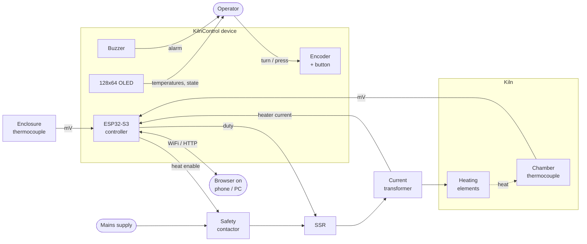
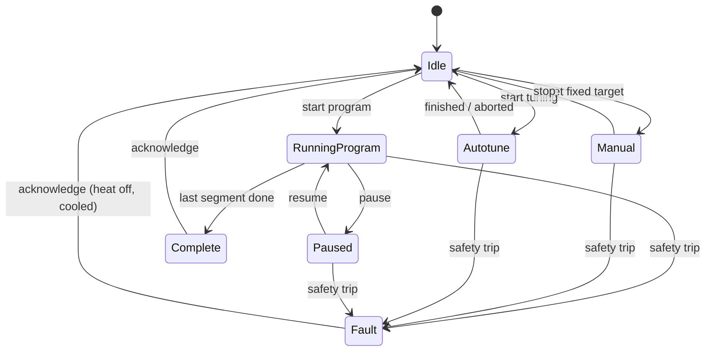

<!--
SPDX-FileCopyrightText: 2026 Bitcrush Testing
SPDX-License-Identifier: GPL-3.0-or-later
-->

# KilnControl, Requirements Specification

| | |
|---|---|
| **Document** | Requirements Specification |
| **Project** | KilnControl, PID kiln controller |
| **Version** | 0.1 (draft) |
| **Date** | 2026-09-26 |
| **Status** | For review |
| **License** | GPL-3.0-or-later |

---

## 1. Introduction

### 1.1 Purpose

This document specifies the requirements for **KilnControl**, an open-source
temperature controller for electric ceramic / glass kilns. It is the reference
for implementation, verification and review. The software architecture derived
from this document is [`architecture.md`](architecture.md).

### 1.2 Scope

KilnControl replaces the mechanical or simple on/off controller of an electric
kiln with a closed-loop PID controller that follows a user-defined
**firing curve** (a time/temperature program). The operator interacts with the
device through a small local display and, over WiFi, through a built-in web
interface that also visualises logged temperature data.

In scope:

- Temperature acquisition from a type-K thermocouple in the kiln chamber, plus a
  second thermocouple for enclosure/electronics temperature.
- Time-proportional PID control of a solid-state relay switching the heating
  elements, with an independent safety contactor.
- Measurement of heater current with a current transformer (Stromwandler), for
  direct electrical detection of a failed relay, contactor or heating element.
- Automatic PID tuning against the real kiln.
- Storage and execution of multi-segment firing programs.
- Local display of current and target temperature plus program state.
- A self-hosted web interface for program editing, live monitoring, historical
  temperature charts and configuration.
- On-device logging of every firing run without an SD card or external database.
- Safety supervision: thermal runaway, sensor failure, relay failure,
  over-temperature.

Out of scope: see [§12](#12-out-of-scope).

### 1.3 Definitions and abbreviations

| Term | Meaning |
|---|---|
| **Firing program** | Ordered list of segments describing a complete firing. Also "curve", "profile", "schedule". |
| **Segment** | One element of a program: ramp to a target temperature at a given rate, then dwell (hold) for a given time. |
| **Setpoint (SP)** | The instantaneous temperature the controller is aiming for. Produced by the setpoint generator from the active program; it is *not* the segment target except at the end of a ramp. |
| **Process value (PV)** | The measured kiln temperature. |
| **Control output (CV)** | PID output, 0–100 % heating duty. |
| **Dwell / soak** | Holding the temperature constant for a defined time. |
| **Ramp rate** | Rate of change of the setpoint, in °C/h. |
| **Hold-back** | Suspension of setpoint advance while PV lags SP beyond a threshold, so a slow kiln cannot silently fall behind its curve. |
| **SSR** | Solid-state relay. Modulates heater power. |
| **Contactor / EMR** | Electromechanical relay or contactor in series with the SSR. Provides a galvanic break independent of the SSR. |
| **TC** | Thermocouple. |
| **CJC** | Cold-junction compensation. |
| **Stromwandler / CT** | Current transformer. A split-core clip-on transformer around one heater conductor giving a galvanically isolated signal proportional to heater current. |
| **Burden** | The resistor across a CT secondary that turns its output current into a voltage. A current-output CT whose burden is removed while primary current flows develops dangerous open-circuit voltages. |
| **RMS** | Root mean square: the heating-equivalent value of an alternating waveform. |
| **Fail-on / fail-off** | A switching device stuck conducting (fail-on) or stuck open (fail-off). A shorted SSR and a welded contactor are both fail-on faults. |
| **Weld discrimination** | Determining whether unexpected current is due to a shorted SSR or a welded contactor, by dropping the contactor and re-measuring. |
| **Time-proportional control** | Converting a 0–100 % duty into on/off intervals within a fixed window, since an SSR cannot be driven at an analogue level. |
| **Relay autotune** | Åström–Hägglund method: force a bounded limit cycle with on/off control, measure its amplitude and period, derive PID gains. |
| **HAL** | Hardware abstraction layer. |
| **HIL** | Hardware in the loop. |
| **SUT** | System under test. |
| **NVS** | ESP-IDF Non-Volatile Storage (key/value store in flash). |

### 1.4 Requirement conventions

Each requirement has a stable identifier, a **shall** statement, and a
verification method:

| Code | Method | Meaning |
|---|---|---|
| **T** | Test | Automated test (host unit test, target test, or HIL test). |
| **A** | Analysis | Calculation, model, static analysis or code metric. |
| **I** | Inspection | Review of code, schematic or document. |
| **D** | Demonstration | Operating the system and observing behaviour. |

Priority: **M** = mandatory for v1.0, **S** = should have, **C** = could have
(deferred without blocking release).

Identifier prefixes:

| Prefix | Area |
|---|---|
| `ASM` | Assumption |
| `CON` | Constraint |
| `FR-ACQ` | Temperature acquisition |
| `FR-CTL` | Control loop |
| `FR-TUN` | Automatic PID tuning |
| `FR-PRG` | Firing programs |
| `FR-RUN` | Run control and state machine |
| `FR-HMI` | Local display and input |
| `FR-WEB` | Web interface |
| `FR-LOG` | Data logging |
| `FR-CFG` | Configuration |
| `FR-NET` | Connectivity and time |
| `FR-UPD` | Firmware update |
| `SR` | Safety requirement |
| `NFR` | Non-functional requirement |
| `HR` | Hardware interface requirement |
| `TR` | Testability requirement |

### 1.5 References

| Ref | Document |
|---|---|
| [R1] | [PIDKiln](https://github.com/Saur0o0n/PIDKiln) by Adrian Siemieniak, ESP32 kiln controller, the functional inspiration for this project (GPL-3.0). |
| [R2] | Espressif, *ESP-IDF Programming Guide*, v5.x. |
| [R3] | Analog Devices, *MAX31856 Precision Thermocouple to Digital Converter with Linearization*, datasheet. |
| [R4] | IEC 60584-1, *Thermocouples, Part 1: EMF specifications and tolerances*. |
| [R5] | K. J. Åström, T. Hägglund, *PID Controllers: Theory, Design and Tuning*, 2nd ed., 1995. |
| [R6] | IEC 60519-1, *Safety in installations for electroheating and electromagnetic processing*. |
| [R7] | GNU General Public License version 3, [`../LICENSE`](../LICENSE). |

### 1.6 Relationship to PIDKiln

PIDKiln [R1] demonstrates that a ~40 USD ESP32 board can run a real kiln, and
this project adopts its proven ideas: a segment-based program model
(`target / ramp / dwell`), dual display and web control, on-device storage with
no external services, a redundant SSR + contactor output stage, and safety
supervision covering runaway, probe failure, SSR failure and insulation
degradation.

KilnControl deliberately diverges in the following respects, and these
divergences drive many requirements below:

| Aspect | PIDKiln | KilnControl | Driver |
|---|---|---|---|
| Framework | Arduino-ESP32 | ESP-IDF v5.x ([CON-01](#8-constraints)) | Explicit requirement; better test tooling, partition/OTA control, watchdogs |
| MCU | ESP32-WROVER | ESP32-S3 ([HR-01](#6-hardware-interface-requirements)) | Explicit requirement |
| TC front-end | MAX31855 (K only, ≤1350 °C) | MAX31856 (K/N/S/R/B/E/J/T, richer fault detection) | Diagnosability, [SR-04](#5-safety-requirements) |
| PID gains | Manually tuned, documented by experiment | Automatic tuning on-device ([FR-TUN](#33-automatic-pid-tuning-fr-tun)) | Explicit requirement |
| Storage | SPIFFS on internal flash, microSD board recommended | LittleFS + dedicated raw log partition, no SD card ([CON-03](#8-constraints)) | Explicit requirement |
| Heater current | Optional 30 A/1 V power meter, not used for protection | **Mandatory** current transformer driving relay fail-on / fail-off detection and weld discrimination ([FR-CUR](#312-heater-current-measurement-fr-cur), [SR-25](#52-detection-requirements)–[SR-30](#52-detection-requirements)) | Explicit requirement; resolves [OQ-02](#11-open-questions) |
| Architecture | Arduino sketch, hardware access throughout | Layered, HAL-isolated, host-testable core ([TR](#7-testability-requirements)) | Explicit requirement: design for testability |

No PIDKiln source code is copied. KilnControl is licensed GPL-3.0-or-later, the
same licence as PIDKiln, so derivation remains possible in either direction.

---

## 2. System overview

### 2.1 Context

### 2.2 Operating modes

| Mode | Description |
|---|---|
| **Idle** | Heating disabled, temperature monitored and displayed. |
| **Running** | Executing a firing program under PID control. |
| **Paused** | Program suspended, heating off, elapsed time frozen; resumable. |
| **Manual** | PID holds a single operator-entered target temperature indefinitely. |
| **Autotune** | Automatic PID tuning procedure in progress. |
| **Complete** | Program finished normally; cooling, awaiting acknowledgement. |
| **Fault** | A safety condition tripped. Heating de-energised and latched off. |

### 2.3 Primary use cases

| UC | Actor | Description |
|---|---|---|
| UC-1 | Operator | Load a stored firing program, review it, start it, and walk away. |
| UC-2 | Operator | Watch current vs. target temperature on the local display. |
| UC-3 | Operator | Open the web interface on a phone to see live status and the curve traced so far. |
| UC-4 | Operator | Create or edit a firing program in the browser and save it on the device. |
| UC-5 | Operator | Change the target temperature or ramp of a *running* program. |
| UC-6 | Operator | Abort a running firing from either the device or the browser. |
| UC-7 | Operator | Run automatic PID tuning after installing the controller on a new kiln. |
| UC-8 | Operator | Review the logged temperature trace of a previous firing and export it. |
| UC-9 | System | Detect a failed element, shorted SSR, welded contactor or broken thermocouple, de-energise the kiln and alarm. |
| UC-12 | Operator | Fit a clip-on current transformer to a heater conductor and calibrate it against a reference meter. |
| UC-13 | Operator | See that this firing is drawing less current than usual and conclude an element is failing, before it ruins a load. |
| UC-10 | Installer | Provision WiFi credentials and configure kiln limits on first power-up. |
| UC-11 | Maintainer | Update firmware over WiFi. |

---

## 3. Functional requirements

### 3.1 Temperature acquisition (FR-ACQ)

| ID | Requirement | Pri | Ver |
|---|---|---|---|
| **FR-ACQ-01** | The system shall measure chamber temperature with a MAX31856 thermocouple front-end over SPI. | M | T |
| **FR-ACQ-02** | The system shall support a configurable thermocouple type from the set {K, N, S, R, B, E, J, T}, defaulting to **K**. | M | T |
| **FR-ACQ-03** | The system shall acquire chamber temperature at a rate of at least **4 Hz**, and the acquisition period shall be constant to within ±10 %. | M | T |
| **FR-ACQ-04** | The system shall apply cold-junction compensation using the MAX31856 internal cold-junction sensor. | M | T |
| **FR-ACQ-05** | The system shall report chamber temperature with a resolution of **0.1 °C** or finer and a usable range of **−20 °C to 1350 °C** for type K. | M | T |
| **FR-ACQ-06** | The system shall configure the front-end's line-frequency notch filter to **50 Hz or 60 Hz** according to configuration, defaulting to 50 Hz. | M | T |
| **FR-ACQ-07** | The system shall apply a configurable first-order low-pass filter to the measurement used for control, with a time constant of 0–30 s (default 2 s), and shall log the *unfiltered* value alongside it. | S | T |
| **FR-ACQ-08** | The system shall apply a configurable calibration offset of −50.0 … +50.0 °C and a gain factor of 0.90 … 1.10 to the chamber reading. | S | T |
| **FR-ACQ-09** | The system shall measure enclosure/electronics temperature with a second, independently configurable thermocouple channel. | M | T |
| **FR-ACQ-10** | The system shall read and expose the front-end fault register on every conversion, distinguishing at minimum: open circuit, short to VCC, short to GND, cold-junction out of range, thermocouple out of range, over/under-voltage. | M | T |
| **FR-ACQ-11** | The system shall compute the rate of temperature change (°C/h) from a regression over a configurable window of 10–300 s (default 60 s). | M | T |
| **FR-ACQ-12** | On a transient acquisition error the system shall retain the last valid reading for a configurable grace period of 1–30 s (default 5 s) before declaring a sensor fault ([SR-04](#5-safety-requirements)). | M | T |

### 3.2 Control loop (FR-CTL)

| ID | Requirement | Pri | Ver |
|---|---|---|---|
| **FR-CTL-01** | The system shall implement a PID controller producing a heating duty in the range 0–100 %. | M | T |
| **FR-CTL-02** | The controller shall execute at a fixed, configurable period of 0.25–5 s (default 1 s), independent of the acquisition rate. | M | T |
| **FR-CTL-03** | The controller shall use configurable gains Kp, Ki, Kd with the ranges and units defined in [FR-CFG-02](#39-configuration-fr-cfg). | M | T |
| **FR-CTL-04** | The controller shall compute the derivative term from the *measurement*, not the error, so that a setpoint step does not produce a derivative kick. | M | T |
| **FR-CTL-05** | The controller shall clamp its integral term and shall suspend integration while the output is saturated (conditional-integration anti-windup). | M | T |
| **FR-CTL-06** | On entering or leaving manual/automatic control the controller shall transfer bumplessly: the output shall not step by more than 1 % as a direct result of the mode change. | S | T |
| **FR-CTL-07** | The system shall convert duty to heater switching by **time-proportional control** over a configurable window of 0.5–30 s (default 2 s). | M | T |
| **FR-CTL-08** | The system shall enforce a configurable minimum on-time and minimum off-time (0–2000 ms, default 100 ms) and shall round a duty that cannot satisfy them to fully off or fully on. | M | T |
| **FR-CTL-09** | The system shall generate the setpoint from the active program by linear interpolation in time, so that the setpoint advances at the segment's ramp rate rather than stepping to the segment target. | M | T |
| **FR-CTL-10** | The system shall support a ramp rate of 1–9999 °C/h, where a configured rate of **0 means "as fast as the kiln allows"** (setpoint follows the segment target directly). | M | T |
| **FR-CTL-11** | The system shall implement **hold-back**: when \|SP − PV\| exceeds a configurable band (0–200 °C, default 0 disables), the setpoint shall stop advancing and the segment timer shall pause until PV re-enters the band. | M | T |
| **FR-CTL-12** | The system shall treat a dwell segment as complete only after the dwell time has elapsed *and* PV has been within a configurable tolerance band of the target (0.5–50 °C, default 5 °C) for that duration, subject to [FR-CTL-11](#32-control-loop-fr-ctl). | M | T |
| **FR-CTL-13** | The system shall never command heating during a cooling segment; a segment whose target is below the current temperature shall be executed as a passive cooling ramp with the setpoint tracked only as an upper bound. | M | T |
| **FR-CTL-14** | The system shall support a manual mode in which the PID holds a single operator-supplied target temperature. | M | T |
| **FR-CTL-15** | The system shall expose PID internals (P, I, D contributions, error, duty, saturation flag) for diagnostics and logging. | S | T |
| **FR-CTL-16** | The system shall limit the commanded duty to a configurable maximum of 10–100 % (default 100 %), to allow derating an over-powered kiln. | C | T |

### 3.3 Automatic PID tuning (FR-TUN)

| ID | Requirement | Pri | Ver |
|---|---|---|---|
| **FR-TUN-01** | The system shall provide an automatic PID tuning procedure that determines Kp, Ki and Kd without operator calculation. | M | T |
| **FR-TUN-02** | Tuning shall use the **relay (Åström–Hägglund) method** [R5]: the controller drives a bounded on/off limit cycle about a tuning setpoint and measures the ultimate gain *Ku* and ultimate period *Tu* from the resulting oscillation. | M | T |
| **FR-TUN-03** | The operator shall specify the tuning setpoint; the system shall reject a setpoint above the configured maximum temperature or below ambient + 50 °C. | M | T |
| **FR-TUN-04** | The relay output shall be bounded by a configurable output amplitude *d* (10–100 % duty, default 50 %) and a configurable hysteresis (0.1–20 °C, default 1 °C). | M | T |
| **FR-TUN-05** | The system shall discard the first oscillation cycle and shall require at least **3** further cycles whose successive periods agree within 15 % and whose amplitudes agree within 20 % before accepting a result. | M | T |
| **FR-TUN-06** | The system shall derive gains using selectable rules, **Ziegler–Nichols** (classic, aggressive) and **Tyreus–Luyben** (conservative, default), and shall present both candidate gain sets to the operator. | M | T |
| **FR-TUN-07** | The system shall abort tuning and enter Fault if any safety requirement in [§5](#5-safety-requirements) trips, if no valid oscillation is identified within a configurable timeout (10–480 min, default 120 min), or if the operator cancels. | M | T |
| **FR-TUN-08** | Aborted tuning shall leave the previously stored gains unchanged. | M | T |
| **FR-TUN-09** | The system shall not store tuning results automatically; the operator shall explicitly accept a result before it replaces the active gains. | M | D |
| **FR-TUN-10** | The system shall report live tuning progress (phase, cycles captured, measured Ku/Tu, elapsed time) and shall record the tuning oscillation in the data log like any other run. | M | T |
| **FR-TUN-11** | The system shall store the provenance of the active gains: manual, or tuned (with rule, Ku, Tu, tuning setpoint and timestamp). | S | T |
| **FR-TUN-12** | The system shall warn the operator that the kiln must be loaded representatively and the lid closed before tuning, because the identified model includes the load. | S | I |
| **FR-TUN-13** | The system shall support storing up to **4** named gain sets (e.g. per firing range) and selecting one per program. | C | T |

### 3.4 Firing programs (FR-PRG)

| ID | Requirement | Pri | Ver |
|---|---|---|---|
| **FR-PRG-01** | A firing program shall consist of a name, an optional description, and an ordered list of **1–32 segments**. | M | T |
| **FR-PRG-02** | Each segment shall comprise: target temperature (0–1350 °C), ramp rate (0–9999 °C/h, 0 = maximum), and dwell time (0–5999 min). | M | T |
| **FR-PRG-03** | Each segment shall optionally carry a flag requiring **operator acknowledgement** before the program advances past it (e.g. to crack the lid for venting). | S | T |
| **FR-PRG-04** | The system shall store at least **20** programs in non-volatile storage, persisting across power loss and firmware update. | M | T |
| **FR-PRG-05** | The system shall validate a program on save and on start, rejecting it with a specific reason if: no segments; any target above the configured maximum temperature; any field out of range; total predicted duration above 168 h. | M | T |
| **FR-PRG-06** | The system shall compute and present the predicted total duration and the predicted end time of a program before it is started. | M | T |
| **FR-PRG-07** | The system shall allow creating, reading, updating, renaming, duplicating and deleting programs through the web interface. | M | T |
| **FR-PRG-08** | The system shall export and import a program as a documented, human-readable JSON file. | M | T |
| **FR-PRG-09** | The system shall ship with at least **3** example programs (e.g. bisque cone 06, glaze cone 6, glass fusing) marked read-only. | S | I |
| **FR-PRG-10** | The system shall permit editing the *remaining* segments of a running program; edits to the current or already-completed segments shall be rejected. | S | T |
| **FR-PRG-11** | The system shall record, for each run, the program content as executed, so that a later program edit does not invalidate the historical record. | M | T |

### 3.5 Run control (FR-RUN)

| ID | Requirement | Pri | Ver |
|---|---|---|---|
| **FR-RUN-01** | The system shall implement the state machine of [§2.2](#22-operating-modes), and every state transition shall be logged with a timestamp and cause. | M | T |
| **FR-RUN-02** | The system shall start a program only from Idle, and only after validation ([FR-PRG-05](#34-firing-programs-fr-prg)) and a self-check of sensor and output health has passed. | M | T |
| **FR-RUN-03** | The system shall support pause and resume; on pause, heating shall be disabled and all program timers frozen. | M | T |
| **FR-RUN-04** | The operator shall be able to abort a run at any time from the local display **and** from the web interface; abort shall de-energise heating within **1 s**. | M | T |
| **FR-RUN-05** | The system shall expose, while running: state, segment index and count, setpoint, process value, duty, rate of change, elapsed time, time remaining in segment, predicted end time, and hold-back status. | M | T |
| **FR-RUN-06** | On program completion the system shall disable heating, sound the alarm for a configurable duration (0–600 s, default 30 s), and enter Complete. | M | T |
| **FR-RUN-07** | The system shall record a **run record** for every run (program executed, gains used, start and end time, end reason, log extent, and the reference heater current established for the run, [FR-CUR-08](#312-heater-current-measurement-fr-cur)). | M | T |
| **FR-RUN-08** | On restart after an unexpected power loss during a run, the system shall apply the configured recovery policy: **abort** (default), or **resume** if the outage was shorter than a configurable limit (1–120 min, default 15 min) *and* PV is within a configurable band (5–200 °C, default 50 °C) of the setpoint at the time of interruption. | M | T |
| **FR-RUN-09** | The system shall persist enough run state at least every **10 s** to support [FR-RUN-08](#35-run-control-fr-run), without exceeding the flash endurance budget of [NFR-14](#4-non-functional-requirements). | M | A,T |
| **FR-RUN-10** | The system shall refuse to start a run while a fault is latched, while autotune is active, or while the enclosure temperature exceeds its limit. | M | T |

### 3.6 Local display and input (FR-HMI)

| ID | Requirement | Pri | Ver |
|---|---|---|---|
| **FR-HMI-01** | The system shall drive a 128×64 monochrome OLED (SSD1306/SH1106 class) over I²C. | M | T |
| **FR-HMI-02** | The default screen shall show, simultaneously and unambiguously, the **current chamber temperature** and the **target temperature**. | M | D |
| **FR-HMI-03** | The current temperature shall be rendered in the largest font on the screen, legible at 2 m. | M | D |
| **FR-HMI-04** | The default screen shall additionally show: operating state, segment index/count when running, rate of change, elapsed or remaining time, and a progress indication. | M | D |
| **FR-HMI-05** | The display shall refresh at least **twice per second**, and displayed values shall be no more than **1 s** stale. | M | T |
| **FR-HMI-06** | The system shall present a fault screen showing the fault code and a human-readable cause, which shall take precedence over all other screens and shall not be dismissible while the fault condition persists. | M | T |
| **FR-HMI-07** | The system shall display WiFi connection state and the address at which the web interface is reachable (hostname and IP). | M | D |
| **FR-HMI-08** | The system shall provide additional screens for: enclosure temperature and PID diagnostics; network details; program selection; and device information (version, uptime, gains). | S | D |
| **FR-HMI-09** | The system shall accept input from a rotary encoder with push button, distinguishing rotate, short press and long press (≥400 ms), with debouncing such that no physical detent produces more than one logical event. | M | T |
| **FR-HMI-10** | The operator shall be able to, from the local input alone: select and start a stored program, pause/resume, abort a run, acknowledge a fault, and read the WiFi address. | M | D |
| **FR-HMI-11** | Starting a program and aborting a run from the local input shall require a confirmation step. | M | D |
| **FR-HMI-12** | The system shall support a configurable display dim/blank timeout (0 = never, 10–3600 s) which shall be suspended while a fault is active. | C | T |
| **FR-HMI-15** | The local display shall render operator text in the language of `hmi.language` ([NFR-23](#4-non-functional-requirements)). Short labels shall fit the display in every language provided; a translation that does not fit is a defect in the translation, not a reason to truncate at runtime. | M | T |
| **FR-HMI-13** | Temperature shall be displayed in °C or °F according to configuration; all internal computation, storage and API values shall remain in °C. | S | T |
| **FR-HMI-14** | If the display fails to initialise or stops acknowledging on I²C, the system shall log the fault and continue controlling the kiln. | M | T |

### 3.7 Web interface (FR-WEB)

| ID | Requirement | Pri | Ver |
|---|---|---|---|
| **FR-WEB-01** | The system shall serve a web interface from an HTTP server on the device itself. | M | T |
| **FR-WEB-02** | All web assets shall be served from the device with **no runtime dependency on any external host** (no CDN, no external fonts, no telemetry). | M | I,T |
| **FR-WEB-03** | The interface shall be usable on a 360 px-wide phone screen and on a desktop browser, without horizontal scrolling of the page body. | M | D |
| **FR-WEB-04** | The interface shall present a live dashboard: state, current temperature, target temperature, duty, rate of change, segment progress, elapsed and remaining time, and active warnings. | M | D |
| **FR-WEB-05** | Live values shall update at least once per second without a page reload, via a push mechanism (Server-Sent Events or WebSocket) rather than polling. | M | T |
| **FR-WEB-06** | The interface shall plot **logged temperature data** as a time series chart showing at minimum the measured chamber temperature and the setpoint on a common time axis. | M | D |
| **FR-WEB-07** | The chart shall additionally offer heating duty, heater current and enclosure temperature as toggleable series, on a secondary axis where units differ. | S | D |
| **FR-WEB-08** | For a run in progress, the chart shall show the trace so far together with the **planned remainder** of the curve, so that actual and intended firing can be compared at a glance. | M | D |
| **FR-WEB-09** | The interface shall list completed runs and shall plot the logged data of any selected past run. | M | D |
| **FR-WEB-10** | The chart shall support zoom and pan over the time axis and shall read out the values at the cursor position. | S | D |
| **FR-WEB-11** | The interface shall render a chart of a **24 h run at 10 s resolution (≈8600 points)** within 2 s on a mid-range phone, decimating server-side as needed. | M | T |
| **FR-WEB-12** | The interface shall **display** a stored program as a graph and a segment table, and shall not edit one. Authoring is a local function ([FR-WEB-26](#37-web-interface-fr-web)); until a local editor exists, programs are the seeded examples of [FR-PRG-09](#34-firing-programs-fr-prg). See [OQ-09](#11-open-questions). | M | T |
| **FR-WEB-13** | ~~Client-side validation with server re-validation on save.~~ **Withdrawn 2026-10-06**: there is no save. Program validation remains in `kiln_core/profile` and runs wherever a program is stored. | M | I |
| **FR-WEB-14** | The interface shall **not** provide any means of starting, pausing, resuming or aborting a run. Run control is available only at the kiln ([FR-WEB-26](#37-web-interface-fr-web)). Run *state* shall remain fully readable. | M | T |
| **FR-WEB-15** | The interface shall **not** provide manual heating, nor adjustment of the remaining segments of a running program. Both are available only at the kiln ([FR-WEB-26](#37-web-interface-fr-web)). | M | T |
| **FR-WEB-16** | The interface shall allow **monitoring** an automatic PID tuning run. It shall not start, cancel or accept one: a tuning run drives the kiln through relay oscillation and is a firing by another name ([FR-WEB-26](#37-web-interface-fr-web)). | M | T |
| **FR-WEB-17** | The interface shall **display** all configuration items of [FR-CFG-01](#39-configuration-fr-cfg) with their units, ranges and defaults, and shall not write any of them. The configured maximum temperature and the safety thresholds live here ([FR-WEB-26](#37-web-interface-fr-web)). | M | T |
| **FR-WEB-18** | The interface shall allow downloading a run's log as **CSV** and as **JSON**. | M | T |
| **FR-WEB-19** | The system shall expose a documented JSON/REST API; the web UI shall use only that API, adding no privileged back channel. | M | I,T |
| **FR-WEB-20** | The API shall return errors as a JSON object with a machine-readable code and a human-readable message, using conventional HTTP status codes. | M | T |
| **FR-WEB-21** | The system shall serve at least **4** concurrent HTTP clients without the control loop missing a period ([NFR-02](#4-non-functional-requirements)). | M | T |
| **FR-WEB-22** | Web assets shall be pre-compressed and served with `Content-Encoding: gzip`, and static assets shall carry cache headers keyed to the firmware version. | S | T |
| **FR-WEB-23** | ~~Optional password protection of state-changing endpoints.~~ **Withdrawn 2026-10-06.** With the interface read-only there is no state-changing endpoint to protect, and the password could not be set from anywhere in any case: [FR-WEB-26](#37-web-interface-fr-web) had removed configuration writes and the local interface has no text entry. An authentication gate that can never be armed is worse than none, because it reads as protection. | M | I |
| **FR-WEB-24** | The interface shall display a clear, persistent banner whenever a fault is latched or a warning is active. | M | D |
| **FR-WEB-26** | **The web interface shall be read-only.** No endpoint reachable over the network shall change any device state: not the run, not manual heating, not tuning, not configuration, not a latched fault, not the current-transformer calibration, and not the stored programs. Every request other than `GET` shall return `403` with the code `read_only` and shall name where the control actually is. Everything the interface can do, it can do by reading. | M | T |
| **FR-WEB-25** | The interface shall remain functional with a lost connection, showing stale-data and reconnection state rather than silently displaying old values as current. | S | T |
| **FR-WEB-26** | The interface shall be operable in light and dark colour schemes following the browser preference. | C | D |

### 3.8 Data logging (FR-LOG)

| ID | Requirement | Pri | Ver |
|---|---|---|---|
| **FR-LOG-01** | The system shall log a temperature sample record during every run and during autotune. | M | T |
| **FR-LOG-02** | A sample record shall contain at minimum: timestamp, chamber temperature (raw and filtered), setpoint, heating duty, **heater current**, enclosure temperature, segment index, state, and a flags field. | M | T |
| **FR-LOG-03** | The sample interval shall be configurable from **1 s to 300 s**, default **10 s**. | M | T |
| **FR-LOG-04** | The system shall additionally log an out-of-band record on every state transition, fault, warning, configuration change and operator action. | M | T |
| **FR-LOG-05** | Logs shall be stored **on the device's internal flash**. The system shall not require an SD card and shall not require any external database or network service ([CON-03](#8-constraints)). | M | I,T |
| **FR-LOG-06** | Sample logs shall be stored in a fixed-size **circular** store; when full, the oldest data shall be overwritten, and the system shall never fail a run because the log is full. | M | T |
| **FR-LOG-07** | The log store shall retain at least **150 h** of samples at the default 10 s interval. | M | A,T |
| **FR-LOG-08** | The log store shall be append-structured so that a power loss can corrupt at most the record being written, and the reader shall detect and skip a torn record. | M | T |
| **FR-LOG-09** | The system shall retain the run records ([FR-RUN-07](#35-run-control-fr-run)) of at least the **20** most recent runs, including those whose samples have been overwritten, and shall mark such runs as having truncated data. | M | T |
| **FR-LOG-10** | The system shall expose logged data through the API with selection by run and time range, and with server-side decimation to a caller-specified maximum point count. | M | T |
| **FR-LOG-11** | Decimation shall preserve visible extrema (min/max per bucket), so that a short temperature excursion is not hidden by downsampling. | M | T |
| **FR-LOG-12** | Every record shall carry a monotonic device timestamp; where wall-clock time is known ([FR-NET-06](#310-connectivity-and-time-fr-net)) records shall additionally carry UTC, and records logged before time sync shall be marked as such. | M | T |
| **FR-LOG-13** | The operator shall be able to erase all logs, and shall be warned that the action is irreversible. | S | T |
| **FR-LOG-14** | Logging shall never block the control loop; if the log store is unavailable the system shall continue controlling and raise a warning. | M | T |
| **FR-LOG-15** | The system shall report log store health: used and free capacity, oldest and newest record time, and write error count. | S | T |

### 3.9 Configuration (FR-CFG)

| ID | Requirement | Pri | Ver |
|---|---|---|---|
| **FR-CFG-01** | The system shall hold all tunable parameters in a single versioned configuration structure in non-volatile storage, each item having a type, unit, range and default. | M | T |
| **FR-CFG-02** | The configuration shall include at minimum: **safety**: maximum chamber temperature, maximum enclosure temperature, runaway detection parameters, power-loss recovery policy; **control**: Kp, Ki, Kd, loop period, PWM window, minimum on/off time, maximum duty, hold-back band, dwell tolerance; **sensing**: TC types, line filter frequency, filter time constant, calibration offset and gain for both channels; **tuning**: amplitude, hysteresis, rule, timeout; **current**: CT ratio and output type, nominal heater current, mains voltage, fail-on and fail-off thresholds and settle times, deviation bands, over-current limit, relay life limits, monitoring enable; **logging**: sample interval; **HMI**: units, dim timeout, alarm duration; **network**: WiFi mode and credentials, hostname, AP SSID and passphrase, NTP server, timezone; **security**: none, since [FR-WEB-26](#37-web-interface-fr-web) left nothing reachable over the network to authenticate. | M | I |
| **FR-CFG-03** | The system shall validate every configuration write against its declared range and shall reject the whole write atomically if any item is invalid. | M | T |
| **FR-CFG-04** | The system shall apply a configuration change without a reboot wherever physically possible, and shall clearly mark items that require a reboot. | S | T |
| **FR-CFG-05** | On reading a configuration written by an older firmware version, the system shall migrate it, filling new items with defaults; on reading an unreadable or corrupt configuration it shall fall back to defaults and raise a warning. | M | T |
| **FR-CFG-06** | The system shall support restoring all configuration to defaults, and shall support exporting and importing configuration as JSON (excluding secrets). | S | T |
| **FR-CFG-07** | The system shall never return stored passwords or passphrases through the API; it shall return only whether a secret is set. | M | T |
| **FR-CFG-08** | The system shall reject changes to safety-relevant configuration while a run is in progress. | M | T |

### 3.10 Connectivity and time (FR-NET)

| ID | Requirement | Pri | Ver |
|---|---|---|---|
| **FR-NET-01** | The system shall connect to a WiFi network as a station using stored credentials. | M | T |
| **FR-NET-02** | If no credentials are stored, or if the station connection fails for a configurable period (30–600 s, default 60 s), the system shall start its own access point and serve a provisioning page on it. | M | T |
| **FR-NET-03** | The system shall retry the station connection with exponential backoff indefinitely, without interfering with control or safety functions. | M | T |
| **FR-NET-04** | The system shall advertise itself over mDNS under a configurable hostname (default `kiln`), so the interface is reachable as `kiln.local`. | M | T |
| **FR-NET-05** | The AP fallback shall require a passphrase of at least 8 characters, with a device-unique default derived from the MAC address and shown on the local display. | M | T |
| **FR-NET-06** | The system shall synchronise wall-clock time by SNTP when a route to the internet exists, and shall apply a configurable timezone with daylight-saving rules. | M | T |
| **FR-NET-07** | Loss of WiFi, of the internet, or of time sync shall not interrupt, pause or otherwise alter a running firing. | M | T |
| **FR-NET-08** | The system shall maintain a monotonic time base for all control, safety and log timing that is unaffected by wall-clock adjustments. | M | T |
| **FR-NET-09** | The system shall expose WiFi diagnostics: mode, SSID, IP, RSSI, uptime, disconnect count, and last disconnect reason. | S | T |
| **FR-NET-10** | The system shall support optional remote logging of events to a syslog server over UDP. | C | T |

### 3.11 Firmware update (FR-UPD)

| ID | Requirement | Pri | Ver |
|---|---|---|---|
| **FR-UPD-01** | The system shall **not** accept a firmware image over the network ([FR-WEB-26](#37-web-interface-fr-web)): an update path is total and persistent control of the heater, and the web interface is an observation surface. A local update path (USB/serial, or an update initiated at the kiln) shall be specified before release, see [OQ-08](#11-open-questions). Until then the device has **no field update path**, which is a known and accepted gap. | M | I |
| **FR-UPD-02** | The system shall use dual OTA application partitions and shall fall back to the previous firmware if the new image fails to confirm itself as bootable. | M | T |
| **FR-UPD-03** | The system shall verify the integrity of an uploaded image before marking it bootable, and shall reject an image that is not a valid application for this target. | M | T |
| **FR-UPD-04** | The system shall refuse a firmware update while a run or autotune is in progress. | M | T |
| **FR-UPD-05** | A firmware update shall preserve configuration, stored programs and run records; loss of sample log data across an update is acceptable if the log partition layout changes, and shall be stated in release notes. | M | T |
| **FR-UPD-06** | The system shall report the running firmware version, build time, git revision and target in the interface and via the API. | M | T |
| **FR-UPD-07** | The system shall report update progress and a clear success or failure result. | S | D |
| **FR-UPD-08** | No client, authenticated or otherwise, shall be able to initiate a firmware update over the network ([FR-UPD-01](#311-firmware-update-fr-upd), [FR-WEB-26](#37-web-interface-fr-web)). | M | T |

### 3.12 Heater current measurement (FR-CUR)

> Measuring the current actually flowing in the heating elements turns three
> safety detections from slow thermal *inferences* into fast electrical *facts*.
> [SR-07](#52-detection-requirements) needs 15 minutes of missing temperature
> rise to conclude the elements are not heating; a current measurement says so in
> one switching window.

| ID | Requirement | Pri | Ver |
|---|---|---|---|
| **FR-CUR-01** | The system shall measure the current in the heater circuit using a current transformer (Stromwandler) fitted around one heater conductor, downstream of both the safety contactor and the SSR, so that the measurement reflects current actually reaching the elements. | M | T |
| **FR-CUR-02** | The system shall measure true RMS current over a configurable nominal range of **0–60 A**, with a resolution of **0.1 A** and an accuracy of **±3 % of reading or ±0.3 A, whichever is greater**, after calibration. | M | T |
| **FR-CUR-03** | RMS shall be computed from samples taken at **≥ 1 kHz** over a whole number of mains cycles, so that the result is independent of sampling phase. | M | T |
| **FR-CUR-04** | Measurement shall be **gated to the commanded output state**: the system shall measure conduction current only within a commanded-on interval and leakage current only within a commanded-off interval, in each case after a configurable settle delay (0–200 ms, default 20 ms) that allows for zero-cross turn-on and CT settling. | M | T |
| **FR-CUR-05** | The system shall not attempt a conduction measurement when the commanded on-interval is shorter than the settle delay plus one full mains cycle; such windows shall be skipped rather than reported as zero current. | M | T |
| **FR-CUR-06** | The system shall apply a configurable CT ratio, a gain calibration of 0.50–2.00 and a zero offset, and shall support a one-point calibration against a known load or reference meter. | M | T |
| **FR-CUR-07** | The system shall derive and expose apparent power and cumulative energy per run from the measured current and a configured mains voltage, stating that a resistive load is assumed. | S | T |
| **FR-CUR-08** | On each run the system shall establish a **reference current**: the median conduction current measured while the elements are cold and fully on, recorded in the run record ([FR-RUN-07](#35-run-control-fr-run)) and used as the baseline for [SR-28](#52-detection-requirements). | M | T |
| **FR-CUR-09** | The system shall log heater current in every sample record ([FR-LOG-02](#38-data-logging-fr-log)). | M | T |
| **FR-CUR-10** | The system shall present heater current live in the web interface, as a chart series, and on a local diagnostics screen. | M | D |
| **FR-CUR-11** | The system shall detect an absent, disconnected or shorted current transformer, distinguishing it from a genuine zero-current reading by the absence of any signal at all including noise floor. | M | T |
| **FR-CUR-12** | The system shall refuse to start a run when current monitoring is unavailable, **unless** current monitoring has been explicitly disabled in configuration; while it is disabled the system shall raise a persistent warning and shall rely solely on the thermal detections of [SR-07](#52-detection-requirements) and [SR-08](#52-detection-requirements). | M | T |
| **FR-CUR-13** | The system shall count and persist the number of switching operations of the contactor and of each SSR, for the wear warning of [SR-30](#52-detection-requirements). | M | T |
| **FR-CUR-14** | Current measurement shall not delay or block the control or safety cycles ([NFR-02](#4-non-functional-requirements)). | M | T |

---

## 4. Non-functional requirements

| ID | Requirement | Pri | Ver |
|---|---|---|---|
| **NFR-01** | The temperature control loop shall execute at its configured period with a jitter not exceeding **±5 %** of the period, under all supported load conditions including active web clients, OTA-idle, and WiFi reconnection. | M | T |
| **NFR-02** | No non-safety activity (HTTP serving, log writing, display update, WiFi management) shall be able to delay a control or safety cycle by more than **50 ms**. | M | T |
| **NFR-03** | The safety supervisor shall evaluate its conditions at least **4 times per second**. | M | T |
| **NFR-04** | Heating shall be de-energised within **500 ms** of a safety condition being detectable, and the contactor shall open within **1 s**. | M | T |
| **NFR-05** | The system shall control temperature to within **±5 °C** of setpoint during a dwell, on a kiln whose PID has been tuned by the procedure of [FR-TUN](#33-automatic-pid-tuning-fr-tun). | M | T |
| **NFR-06** | The system shall follow a ramp within **±15 °C** of the commanded setpoint, given a ramp rate the kiln is physically capable of. | S | T |
| **NFR-07** | Steady-state offset during dwell shall be less than **2 °C** after settling. | S | T |
| **NFR-08** | Temperature overshoot after a ramp-to-dwell transition shall not exceed **10 °C** with Tyreus–Luyben gains. | S | T |
| **NFR-09** | The firmware shall boot to a state where temperature is measured and heating is safely off within **3 s** of reset. | M | T |
| **NFR-10** | The system shall operate unattended for a **168 h** continuous run without restart, memory exhaustion, or degradation of loop timing. | M | T |
| **NFR-11** | The system shall show no net growth in free heap over a 24 h soak with an active web client, beyond a documented allocator noise band. | M | T |
| **NFR-12** | Static RAM plus peak dynamic allocation shall leave at least **48 kB** of free internal heap at all times. | M | A,T |
| **NFR-13** | The application image shall fit an OTA partition of **2 MB**; the design shall target ≤ **8 MB** total flash and shall not require PSRAM. | M | A |
| **NFR-14** | Flash write patterns shall keep every erase block below **50 000** erase cycles over a 10-year life at the default configuration, assuming 100 000-cycle endurance. | M | A |
| **NFR-15** | A watchdog reset, brownout or panic shall leave heating de-energised and shall be recorded in non-volatile storage with the reset cause. | M | T |
| **NFR-16** | The system shall recover from any unexpected reset into a defined state within [NFR-09](#4-non-functional-requirements), applying the recovery policy of [FR-RUN-08](#35-run-control-fr-run). | M | T |
| **NFR-17** | Every error path shall be handled explicitly; an unchecked failing call in control, safety or storage code shall be treated as a defect. | M | I,A |
| **NFR-18** | All source files shall carry an SPDX licence identifier of `GPL-3.0-or-later`, and the distribution shall include the full licence text and third-party notices. | M | I |
| **NFR-19** | The HTTP server shall treat every request body and parameter as untrusted: bounded lengths, no unbounded allocation, no format-string or path-traversal exposure. Authentication shall use a constant-time comparison and shall rate-limit failed attempts. | M | T |
| **NFR-20** | The device is designed for a **trusted local network**. It shall not be exposed directly to the internet, and the documentation shall state this. | M | I |
| **NFR-21** | The system shall not transmit any data to any third party. | M | I |
| **NFR-22** | The system shall have no hardcoded credentials, no default-enabled remote access other than the documented local interface, and no undocumented service ports. | M | I |
| **NFR-23** | Operator-facing text shall be held in a **single resource location**, indexed by language, with no text embedded at its point of use. **English and German** shall both be provided, selected by the `hmi.language` configuration item and offered on the local display and in the web interface. A language with no entry for a string shall fall back to English rather than showing nothing. Diagnostic output, the event log and requirement identifiers shall remain English regardless of the setting, so that a fault quoted in a report reads the same whoever filed it. | M | T |
| **NFR-24** | The system shall log internally at selectable verbosity, and production builds shall not emit debug output on the pins used by any peripheral. | M | I |
| **NFR-25** | Code shall build warning-free with `-Wall -Wextra -Werror` and shall pass the project's static analysis configuration. | M | A |
| **NFR-26** | Documentation shall cover: assembly and wiring, mains safety, commissioning, autotuning, program authoring, the REST API, the log record format, and current-transformer fitting and calibration. | M | I |
| **NFR-27** | Uncommanded heater current ([SR-25](#52-detection-requirements)) shall de-energise heating within **1 s** of the offending measurement window, and the weld discrimination of [SR-27](#52-detection-requirements) shall reach its verdict within a further **3 s**. | M | T |

---

## 5. Safety requirements

> A kiln is a multi-kilowatt mains-powered heater that reaches temperatures at
> which its own wiring, the enclosure and the building are at risk. The
> requirements in this section are the reason this project exists in the form it
> does, and take precedence over every functional requirement. They are all
> mandatory.

### 5.1 Safety principles

| ID | Requirement | Ver |
|---|---|---|
| **SR-01** | The system shall be **fail-safe**: any single failure of software, MCU, sensor, or SSR shall result in heating being de-energised, never in uncontrolled heating. | A,T |
| **SR-02** | Heating shall be enabled only by the *active and continuous* assertion of software; no static condition, boot state, hung task or crashed firmware shall be capable of holding heating on. | A,T |
| **SR-03** | The heating output stage shall consist of an SSR for modulation **in series with** an electromechanical contactor that provides an independent break, each controlled by a separate output. | I |

### 5.2 Detection requirements

> **Defence in depth.** The current-based rules ([SR-25](#52-detection-requirements)–[SR-30](#52-detection-requirements))
> are the *primary* detection of a failed relay, contactor or element, because
> they are fast and unambiguous. The thermal rules ([SR-07](#52-detection-requirements),
> [SR-08](#52-detection-requirements)) are **retained unchanged** as an
> independent backstop: they use a different sensor and a different physical
> principle, so they still cover the case where the current transformer itself
> has failed or been left unfitted ([FR-CUR-12](#312-heater-current-measurement-fr-cur)).
> Neither may be removed on the grounds that the other exists.

| ID | Requirement | Ver |
|---|---|---|
| **SR-04** | **Thermocouple failure.** The system shall detect open circuit, short circuit, out-of-range reading, cold-junction fault, and front-end communication failure. A fault persisting beyond the grace period of [FR-ACQ-12](#31-temperature-acquisition-fr-acq) shall de-energise heating and latch a fault. | T |
| **SR-05** | **Reversed thermocouple.** The system shall detect a thermocouple connected with reversed polarity, indicated by the reading falling while heating is commanded at high duty, and shall latch a fault. | T |
| **SR-06** | **Stuck sensor.** The system shall detect a reading that does not change by more than a configurable threshold (default 2 °C) while heating is commanded above a configurable duty (default 50 %) for a configurable period (default 10 min), and shall latch a fault. | T |
| **SR-07** | **Thermal runaway / heating failure.** The system shall latch a fault if heating is commanded above a configurable duty (default 80 %) for longer than a configurable period (default 15 min) while the measured rate of rise remains below a configurable threshold (default 10 °C/h). This covers a failed element, an open contactor, an open safety chain and an open kiln lid. | T |
| **SR-08** | **Shorted SSR / uncommanded heating.** The system shall latch a fault, open the contactor and alarm if the temperature rises by more than a configurable threshold (default 5 °C) over a configurable period (default 3 min) while commanded duty is zero. | T |
| **SR-09** | **Over-temperature.** The system shall de-energise heating whenever the chamber temperature exceeds the configured maximum chamber temperature, and shall latch a fault if it exceeds it by a configurable margin (default 10 °C). | T |
| **SR-10** | **Setpoint excursion.** The system shall latch a fault if PV exceeds SP by more than a configurable band (default 50 °C) for longer than a configurable period (default 2 min). | T |
| **SR-11** | **Enclosure over-temperature.** The system shall latch a fault if the enclosure/electronics temperature exceeds the configured maximum (default 70 °C), protecting the controller and its wiring. | T |
| **SR-12** | **Insulation degradation.** The system shall record, per firing, the heating energy (duty × time) required to reach reference temperatures, and shall raise a warning when it exceeds the established baseline by a configurable factor (default 1.3), indicating failing insulation or ageing elements. | T |
| **SR-13** | **Loss of control.** The system shall latch a fault if the control loop fails to complete a cycle within twice its configured period, or if the safety supervisor fails to run within its deadline. | T |
| **SR-14** | **Watchdog.** The system shall enable the hardware watchdog and a per-task watchdog covering the control and safety tasks; a watchdog expiry shall de-energise heating through the mechanism of [SR-02](#51-safety-principles) and reset the device. | T |
| **SR-15** | **Brownout.** The system shall enable brownout detection, and a brownout reset shall leave heating de-energised. | T |
| **SR-25** | **Relay fail-on (uncommanded current).** The system shall latch a fault when measured heater current exceeds a configurable threshold (default 0.5 A) during a commanded-off interval, after the settle delay of [FR-CUR-04](#312-heater-current-measurement-fr-cur), for a configurable number of consecutive measurement windows (default 2). This is the direct electrical counterpart of [SR-08](#52-detection-requirements) and shall act on it rather than waiting for a temperature rise. | T |
| **SR-26** | **Relay or element fail-off (no current when commanded).** The system shall latch a fault when measured conduction current remains below a configurable threshold (default 20 % of the reference current) during commanded-on intervals for a configurable period (default 30 s). This covers a failed SSR, an open contactor, an open safety chain, a blown heater fuse and fully open elements, and shall act long before the thermal detection of [SR-07](#52-detection-requirements). | T |
| **SR-27** | **Weld discrimination.** On detecting uncommanded current ([SR-25](#52-detection-requirements)) the system shall de-assert heat enable so the contactor opens, wait a configurable interval (contactor drop-out time plus margin, default 2 s), and re-measure. If current has ceased it shall latch **SSR shorted**; if current persists it shall latch **contactor welded**, which is the more severe fault and whose operator instruction shall be to isolate the kiln at its supply, because the controller has no remaining means of interrupting the current. | T |
| **SR-28** | **Partial element failure / current deviation.** The system shall compare conduction current against the reference current of [FR-CUR-08](#312-heater-current-measurement-fr-cur), corrected for the known positive temperature coefficient of the elements where configured, and shall raise a warning at a configurable deviation (default 10 %) and latch a fault at a configurable deviation (default 25 %). Losing one of several element groups is a step change of a known fraction and shall be detected as such. | T |
| **SR-29** | **Over-current.** The system shall latch a fault when measured current exceeds a configurable maximum (default 120 % of nominal), indicating a shorted element, incorrect wiring or a failed SSR passing excessive current. | T |
| **SR-30** | **Relay wear / incipient failure.** The system shall raise a warning when the switching-operation count of the contactor or an SSR reaches a configurable life limit, and shall additionally raise a warning when current mismatches of the kind described in [SR-25](#52-detection-requirements) or [SR-26](#52-detection-requirements) occur intermittently and self-clear, an early indication that a relay is becoming defective before it fails outright. | T |

| **SR-31** | **Door / lid interlock.** Where a door interlock switch is fitted, the system shall de-energise heating and open the contactor **immediately**: within one safety cycle, with no confirmation delay, whenever the switch indicates the door is open, and shall latch a fault if it remains open for a configurable confirmation period (0–0.5 s, default 0.2 s) while a heating state is active. The switch shall be **normally closed**, so that an open circuit, a disconnected plug or a failed switch all read as "door open". Where no interlock is fitted the rule shall stand down and a warning shall be raised; it shall not be possible for an unread input to be interpreted as a closed door. | T |

### 5.3 Reaction and recovery requirements

| ID | Requirement | Ver |
|---|---|---|
| **SR-16** | On any fault the system shall, in this order: command zero duty, de-assert heat enable so the contactor opens, assert the alarm output, latch the fault with its code and a snapshot of relevant values, log it, and enter Fault state. | T |
| **SR-17** | A latched fault shall persist across power loss, and shall require an explicit operator acknowledgement to clear. The system shall not silently self-recover. | T |
| **SR-18** | The system shall refuse to clear a fault while its triggering condition is still present. | T |
| **SR-19** | Each fault shall have a unique, stable numeric code and a human-readable cause, presented on both the display and the web interface, and documented. | T,I |
| **SR-20** | The on-board buzzer ([HR-09](#6-hardware-interface-requirements)) shall sound on any fault and on program completion, and the two shall be audibly distinguishable by their pattern. | D |
| **SR-21** | Heating outputs shall be de-energised during reset, boot, firmware update and any transition through an undefined software state. | T,I |
| **SR-22** | Every safety detection threshold shall be configurable within a bounded range, and no range shall permit disabling a detection entirely except where explicitly stated ([SR-12](#52-detection-requirements) warning only). | I,T |
| **SR-23** | The maximum chamber temperature shall be configurable only up to an absolute compile-time ceiling of **1350 °C**, and every temperature setpoint, program target and tuning setpoint shall be clamped to the configured maximum. | T |
| **SR-24** | The documentation shall state that KilnControl is **not** a safety-certified device, that an independent hardware over-temperature cutout is required ([HR-13](#6-hardware-interface-requirements)), and that mains wiring must be performed by a competent person in accordance with local regulation [R6]. | I |

---

## 6. Hardware interface requirements

> This section constrains the firmware's view of the hardware. The board design
> itself is documented in `hardware/`.

| ID | Requirement | Pri | Ver |
|---|---|---|---|
| **HR-01** | The controller shall be an **ESP32-S3** with at least 8 MB flash; PSRAM shall not be required. | M | I |
| **HR-02** | The chamber and enclosure thermocouple front-ends shall be MAX31856 devices on a shared SPI bus with individual chip selects. | M | I |
| **HR-03** | The thermocouple front-end SPI bus shall be separate from, or arbitrated independently of, any bus shared with a peripheral that can stall it. | M | I |
| **HR-04** | The display shall be a 128×64 monochrome OLED on I²C, at a configurable address (default 0x3C). | M | I |
| **HR-05** | The operator input shall be a quadrature rotary encoder with a push button, read by hardware (pulse counter unit) rather than by polling in software. | M | I |
| **HR-06** | The heater modulation output shall drive a zero-cross-switching SSR rated for the kiln's current with a documented margin. | M | I |
| **HR-07** | The heat-enable output shall drive the safety contactor through a circuit that requires a **periodic software refresh** to hold the contactor closed, so that a hung or crashed MCU releases it ([SR-02](#51-safety-principles)). | M | I,T |
| **HR-08** | All heater and contactor control outputs shall have external pull-downs to the de-energised state, and shall not use pins that are strapping pins or that glitch during reset or boot on the ESP32-S3. | M | I,T |
| **HR-09** | The system shall carry an **on-board** audible alarm: a 5 V active (self-driving) magnetic buzzer switched low-side from the alarm GPIO, so that annunciation needs no external component or field wiring. | M | I |
| **HR-19** | Every test point shall be a surface pad on the **top copper layer only**, so the whole board can be probed without turning it over or removing it from its enclosure. No test point shall be placed on the bottom layer. | M | I |
| **HR-20** | Test-point pads shall be small enough not to drive the board area, and shall carry no drilled hole. 1.5 mm square is the design value. | S | I |
| **HR-10** | Pin assignments shall be defined in one place per board variant and shall not be duplicated across the codebase. | M | I |
| **HR-11** | The design shall include a **current transformer (Stromwandler)** around one heater conductor, downstream of the safety contactor and the SSR, sized for the kiln's rated current with headroom, and preferably split-core so it can be fitted without breaking the heater wiring. | M | I |
| **HR-16** | The current transformer shall be a **voltage-output type with an integral burden resistor**, or shall have a burden resistor permanently fitted at the board. A current-output CT whose burden can be disconnected shall not be used, because an open secondary carrying primary current develops dangerous voltages. | M | I |
| **HR-17** | The CT input shall be conditioned for a single-supply ADC: mid-rail bias, anti-alias filtering matched to the sample rate of [FR-CUR-03](#312-heater-current-measurement-fr-cur), and clamping to the ADC supply rails. | M | I |
| **HR-18** | The CT provides the only galvanic isolation between the heater circuit and the controller electronics; its insulation rating and the creepage and clearance around its input shall be appropriate to the mains voltage in use. | M | I |
| **HR-12** | The design shall support an optional second SSR channel for a kiln with independently switched element groups. | C | I |
| **HR-13** | The installation shall include a hardware over-temperature cutout in the safety chain that operates independently of this controller. | M | I |
| **HR-24** | The thermocouple front ends' **`FAULT` outputs shall interrupt the contactor coil in hardware**, each through its own series switching element, so that a reported sensor fault removes the heater without the firmware taking part. Each `FAULT` net shall retain its own test point. The limits of this interlock shall be documented: the outputs are open-drain, so an **unpowered or absent** front end leaves the path closed, and the MAX31856 detects an open circuit only once its fault mask has been configured. The hardware interlock therefore covers faults the device actively reports, and [SR-04](#52-detection-requirements) in firmware remains the cover for a dead or unconfigured front end. | M | I,T |
| **HR-21** | Where a door or lid interlock is fitted, its switch shall be **normally closed** and shall be wired **both** into a controller input ([SR-31](#52-detection-requirements)) **and** in series with the safety contactor coil, so that opening the door de-energises the heater through hardware whether or not the firmware is working. The controller input provides annunciation, latching and logging; it is not the interlock. | S | I,T |
| **HR-25** | The contactor coil's freewheel diode shall be connected **across the coil itself**, on the kiln side of every series interrupting element of [HR-21](#6-hardware-interface-requirements) and [HR-24](#6-hardware-interface-requirements), so that opening any of them leaves the coil current a path to decay through. A freewheel path referenced to the raw supply instead would put the inductive transient across the opening contacts, eroding the lid switch and stressing the sense divider. | M | I |
| **HR-14** | The controller electronics shall be supplied from a regulated source able to power the MCU, display and contactor coil simultaneously, and shall not rely on a USB host for operating power. | M | I |
| **HR-15** | Thermocouple inputs shall be filtered and protected at the hardware level against the electrical noise of a switching multi-kilowatt load. | M | I |

---

## 7. Testability requirements

> "Designed for testability" is a stated goal of this project, so it is specified
> as requirements rather than left to implementation taste. The architecture in
> [`architecture.md`](architecture.md) is structured to satisfy this section.

### 7.1 Design for test

| ID | Requirement | Pri | Ver |
|---|---|---|---|
| **TR-01** | The control, safety, setpoint-generation, autotune, program, and log-encoding logic shall be implemented in components that contain **no reference to any hardware peripheral, ESP-IDF driver, or RTOS primitive**, and shall be compilable and runnable on a development host. | M | A,I |
| **TR-02** | All hardware access shall be reached through explicit HAL interfaces that can be substituted at link or construction time by a test double. | M | I |
| **TR-03** | No logic component shall read a clock directly; time shall be supplied through an injected time source, so that a 24 h firing can be simulated in milliseconds. | M | A,I |
| **TR-04** | Logic components shall be free of global mutable state: each shall operate on an explicit context passed by the caller, so that multiple independent instances can coexist in one test process. | M | I |
| **TR-05** | Logic components shall perform no dynamic allocation after initialisation, and their memory footprint shall be statically determinable. | S | A |
| **TR-06** | Every component shall have a declared, minimal public interface; no test shall need access to a private symbol to verify required behaviour. | M | I |
| **TR-07** | Component dependencies shall be acyclic and shall respect the layering of [`architecture.md`](architecture.md); a violation shall fail the build. | M | A |
| **TR-08** | The state of the run controller and the safety supervisor shall be fully observable through a query interface, so that tests assert on state rather than on side effects. | M | I |
| **TR-09** | Every fault condition of [§5.2](#52-detection-requirements) shall be reachable in a test through a documented stimulus, without physical hardware. | M | T |
| **TR-10** | Test-only interfaces (fault injection, state forcing, time warping) shall be compiled out of production builds, verified by a build-time check. | M | A |

### 7.2 Test infrastructure

| ID | Requirement | Pri | Ver |
|---|---|---|---|
| **TR-11** | The project shall provide a **kiln plant simulator**: a first-order-plus-dead-time thermal model with configurable gain, time constant, dead time, ambient temperature and noise, capable of injected faults (open element, shorted SSR, open TC, drifting TC, lid opened). | M | I,T |
| **TR-12** | The simulator shall be deterministic and reproducible from a seed, so that a failing test can be replayed exactly. | M | T |
| **TR-13** | The project shall provide host-executed unit tests for every logic component, runnable with a single command and without hardware. | M | D |
| **TR-14** | The project shall provide closed-loop integration tests that run the real control, setpoint, safety and autotune code against the simulator, verifying the performance requirements [NFR-05](#4-non-functional-requirements) to [NFR-08](#4-non-functional-requirements) and the safety reactions of [§5](#5-safety-requirements). | M | T |
| **TR-15** | The project shall provide on-target tests for the HAL drivers, run on real hardware or an emulator, covering front-end configuration and fault decoding, display output, encoder decoding, storage and the time-proportional output. | M | T |
| **TR-16** | The project shall provide API-level tests that exercise the HTTP interface end-to-end against a firmware instance, including malformed and hostile input. | M | T |
| **TR-17** | The project shall provide a documented HIL procedure using a low-power resistive load and a thermocouple simulator, for the tests that cannot be virtualised. | S | I |
| **TR-18** | Timing requirements [NFR-01](#4-non-functional-requirements) to [NFR-04](#4-non-functional-requirements) shall be verified on target by instrumented measurement of cycle period, jitter and worst-case latency, reported as numbers rather than asserted by inspection. | M | T |
| **TR-19** | The project shall measure line and branch coverage of host tests and shall achieve at least **90 % line coverage** of the control, safety, setpoint, program and autotune components, and **100 % of safety decision branches**. | M | A |
| **TR-20** | The build shall support address and undefined-behaviour sanitisers for host test runs. | S | A |
| **TR-21** | Long-duration behaviour ([NFR-10](#4-non-functional-requirements), [NFR-11](#4-non-functional-requirements)) shall be verifiable both by accelerated simulation and by an automated soak test on target. | M | T |

### 7.3 Process

| ID | Requirement | Pri | Ver |
|---|---|---|---|
| **TR-22** | Every requirement in this document shall be traceable to at least one verification artefact, and the traceability shall be maintained as a machine-checkable file in the repository. | M | A |
| **TR-23** | Every requirement in [§5](#5-safety-requirements) shall be covered by at least one **automated** test; inspection alone shall not be sufficient. | M | A |
| **TR-24** | Continuous integration shall, on every push and pull request: build the firmware, run all host unit and integration tests with coverage, run static analysis, run the emulated target and API tests, and lint the web assets. A failure in any of these shall block merge. | M | I |
| **TR-25** | A defect fix shall be accompanied by a regression test that fails before the fix and passes after it. | M | I |
| **TR-26** | Test names shall reference the requirement identifiers they verify. | S | I |
| **TR-27** | The kiln plant simulator ([TR-11](#72-test-infrastructure)) shall model heater current as well as temperature, and shall inject the electrical faults that [SR-25](#52-detection-requirements)–[SR-30](#52-detection-requirements) detect: relay fail-on, relay fail-off, welded contactor (current persisting after the contactor is commanded open), partial element failure, over-current, and a disconnected current transformer. | M | T |
| **TR-28** | The HIL jig ([TR-17](#72-test-infrastructure)) shall be able to present a known current to the transformer and to emulate a welded contactor, so that the discrimination sequence of [SR-27](#52-detection-requirements) is verified against real hardware and not only in simulation. | M | I |

---

## 8. Constraints

| ID | Constraint |
|---|---|
| **CON-01** | The firmware shall be built with **ESP-IDF v5.x** and its native build system. The Arduino framework shall not be used. |
| **CON-02** | The target is the **ESP32-S3**. Nothing in the design shall depend on a feature absent from that part. |
| **CON-03** | Logged data and programs shall live on internal flash. **No SD card** shall be required, and **no external database** or network service shall be required for any function. |
| **CON-04** | The project shall be licensed **GPL-3.0-or-later**, and every third-party component shall carry a licence compatible with distribution under GPL-3.0. Web assets shall be vendored, not fetched at build time from an unpinned source. |
| **CON-05** | Implementation language shall be C or C++ as supported by ESP-IDF; the logic components of [TR-01](#71-design-for-test) shall be written so as to be compilable by a host toolchain without ESP-IDF headers. |
| **CON-06** | The web interface shall run in current versions of Firefox, Chrome and Safari, including on mobile, without a build step that requires a network connection at build time. |
| **CON-07** | Total bill of materials for the controller electronics should remain comparable to the reference design of [R1] (order of 40 EUR), excluding the SSR, contactor and enclosure. |

## 9. Assumptions

| ID | Assumption |
|---|---|
| **ASM-01** | The kiln is a resistively heated electric kiln whose thermal response is adequately described by a first-order-plus-dead-time model over the operating range. |
| **ASM-02** | The kiln has a single thermal zone. Multi-zone kilns are out of scope for v1.0 but the architecture shall not preclude them. |
| **ASM-03** | The heating elements are switched by a zero-cross SSR; the controller does not perform phase-angle control. |
| **ASM-04** | A competent person performs the mains installation, and an independent over-temperature cutout is fitted ([HR-13](#6-hardware-interface-requirements)). |
| **ASM-05** | The device is on a trusted local network ([NFR-20](#4-non-functional-requirements)). |
| **ASM-06** | The operator is present in the building during firing, as kiln manufacturers require. Unattended firing is not a design goal. |
| **ASM-07** | Wall-clock time may be unavailable; all timing-critical behaviour uses the monotonic time base ([FR-NET-08](#310-connectivity-and-time-fr-net)). |
| **ASM-08** | Internal flash endurance is at least 100 000 erase cycles per block. |
| **ASM-09** | The heater load is resistive and switched as a single group, so the current in the monitored conductor is proportional to total heater power. |
| **ASM-10** | The kiln is **single phase**. Three-phase kilns are out of scope ([§12](#12-out-of-scope), [OQ-06](#11-open-questions)), so there is no unmonitored phase for a fault to hide on: there is one phase and one current transformer on it ([HR-11](#6-hardware-interface-requirements)). |

---

## 10. Verification strategy summary

| Level | What it covers | Where it runs |
|---|---|---|
| **Unit** | Individual logic components: PID maths, setpoint generator, program validation, autotune identification, safety rules, log codec, config validation. | Host |
| **Integration (simulated)** | Closed-loop behaviour of the real firmware logic against the kiln simulator ([TR-11](#72-test-infrastructure)): control performance, full program execution, every fault scenario, autotune convergence, power-loss recovery. | Host |
| **Driver / on-target** | HAL against real silicon: MAX31856 configuration and fault decode, OLED, encoder, flash log store, time-proportional output timing. | Target / emulator |
| **API** | HTTP endpoints, authentication, input validation, push updates, decimation correctness, hostile input. | Target / emulator |
| **Timing** | Loop period, jitter, safety latency, boot time, under load. | Target, instrumented |
| **Soak** | 168 h run, heap stability, log wraparound, WiFi reconnection. | Target |
| **Current / relay fault** | Every rule of [SR-25](#52-detection-requirements)–[SR-30](#52-detection-requirements) against the simulator's electrical fault injections, including the full weld-discrimination sequence. | Host |
| **HIL** | Output stage, contactor watchdog release, real thermocouple, real SSR with resistive load, real CT with a known current, emulated welded contactor. | Bench jig |
| **Commissioning** | Autotune and a full firing on a real kiln. | Real kiln |

## 11. Open questions

| ID | Question |
|---|---|
| **OQ-01** | Should cone-based targets (Orton cone numbers with heatwork/rate correction) be offered in addition to plain temperature targets? |
| ~~**OQ-02**~~ | **Resolved 2026-09-28: yes.** The current transformer is mandatory ([HR-11](#6-hardware-interface-requirements)) and drives [FR-CUR](#312-heater-current-measurement-fr-cur) and [SR-25](#52-detection-requirements)–[SR-30](#52-detection-requirements). The thermal detections are retained as an independent backstop. |
| ~~**OQ-06**~~ | **Resolved 2026-10-06: single phase only.** Three-phase kilns are out of scope ([§12](#12-out-of-scope)). A three-phase kiln monitored on one phase is worse than one not supported at all: a fault on an unmonitored phase would be caught only by the thermal rules, slowly, and the power and energy figures would cover a third of the load while looking like a whole-kiln number. This reverses the resolution of 2026-10-05 and reinstates [ASM-10](#9-assumptions) in a narrower form. |
| **OQ-08** | What replaces the removed over-the-web firmware update ([FR-UPD-01](#311-firmware-update-fr-upd))? USB/serial via `esptool`, an image staged over the network but applied only after a physical confirmation at the kiln, or no field update at all? The device currently has **no update path**, so this blocks release rather than merely being open. |
| **OQ-09** | Where are firing programs authored, now that [FR-WEB-26](#37-web-interface-fr-web) has made the web interface read-only? A local editor on a rotary encoder and a 128x64 display is possible but unpleasant; importing from a file on first boot, or shipping only the examples of [FR-PRG-09](#34-firing-programs-fr-prg), are the alternatives. Until this is answered a user cannot create a curve of their own, which is a real functional gap rather than a nicety. |
| **OQ-07** | Should the element positive temperature coefficient used to correct the [SR-28](#52-detection-requirements) baseline be measured automatically during the first firing, or entered by the installer from the element datasheet? |
| **OQ-03** | Should the log store be sized for whole-life retention of run summaries in a separate, non-circular area? |
| **OQ-04** | Which small charting approach for [FR-WEB-06](#37-web-interface-fr-web), a vendored MIT-licensed micro-library, or hand-written canvas rendering? Decided in the architecture, revisit if asset budget is exceeded. |
| **OQ-05** | Is a 3-zone variant ([ASM-02](#9-assumptions)) a v1.1 goal? It affects whether the control component is written for one zone or N from the start. |

## 12. Out of scope

- Phase-angle or PWM mains modulation; only zero-cross SSR switching.
- Multi-zone control in v1.0 ([ASM-02](#9-assumptions)).
- **Three-phase kilns.** Decided 2026-10-06 ([OQ-06](#11-open-questions)). Monitoring one phase of three would leave a fault on either of the others to the thermal rules alone, and would report a third of the load as though it were the whole, so partial support is worse than none.
- Cloud connectivity, remote access outside the local network, mobile apps.
- Safety certification, or replacement of the hardware over-temperature cutout.
- Atmosphere, damper, oxygen or gas control; kiln venting hardware.
- Kiln power wiring, contactor sizing and enclosure design (documented in `hardware/`, not specified here).
- Firing-recipe advice; the device executes curves, it does not author them.

---

## Appendix A, Fault code allocation

Codes are stable and shall not be reused. Detail in [§5.2](#52-detection-requirements).

| Code | Fault | Requirement |
|---|---|---|
| 1 | Chamber thermocouple open circuit | SR-04 |
| 2 | Chamber thermocouple short circuit | SR-04 |
| 3 | Chamber reading out of range | SR-04 |
| 4 | Cold-junction fault | SR-04 |
| 5 | Front-end communication failure | SR-04 |
| 6 | Chamber thermocouple reversed | SR-05 |
| 7 | Chamber sensor stuck | SR-06 |
| 8 | Thermal runaway / heating failure | SR-07 |
| 9 | Uncommanded heating (SSR shorted) | SR-08 |
| 10 | Over-temperature | SR-09 |
| 11 | Setpoint excursion | SR-10 |
| 12 | Enclosure over-temperature | SR-11 |
| 13 | Control loop deadline missed | SR-13 |
| 14 | Safety supervisor deadline missed | SR-13 |
| 15 | Watchdog reset during run | SR-14 |
| 16 | Enclosure thermocouple fault | SR-04, SR-11 |
| 17 | Operator abort | FR-RUN-04 |
| 18 | Autotune failed to converge | FR-TUN-07 |
| 19 | Power-loss recovery refused | FR-RUN-08 |
| 20 | Configuration invalid / storage failure | FR-CFG-05 |
| 21 | Uncommanded heater current (relay fail-on) | SR-25 |
| 22 | Contactor welded, isolate at the supply | SR-27 |
| 23 | No heater current when commanded (relay/element fail-off) | SR-26 |
| 24 | Heater current deviation (partial element failure) | SR-28 |
| 25 | Heater over-current | SR-29 |
| 26 | Current transformer fault or disconnected | FR-CUR-11 |
| 27 | Door opened during a firing | SR-31 |

Warnings (non-latching, do not stop a firing):

| Code | Warning | Requirement |
|---|---|---|
| 101 | Insulation degradation suspected | SR-12 |
| 102 | Hold-back active, firing behind schedule | FR-CTL-11 |
| 103 | Log store unavailable | FR-LOG-14 |
| 104 | Display unavailable | FR-HMI-14 |
| 105 | Time not synchronised | FR-LOG-12 |
| 106 | WiFi disconnected | FR-NET-07 |
| 107 | Duty saturated for extended period | FR-CTL-15 |
| 108 | Gains are untuned defaults | FR-TUN-11 |
| 109 | Relay switching-operation life limit reached | SR-30 |
| 110 | Intermittent current mismatch, a relay may be failing | SR-30 |
| 111 | Current monitoring disabled | FR-CUR-12 |
| 112 | Heater current deviating from the run reference | SR-28 |
| 113 | No door interlock fitted | SR-31 |
