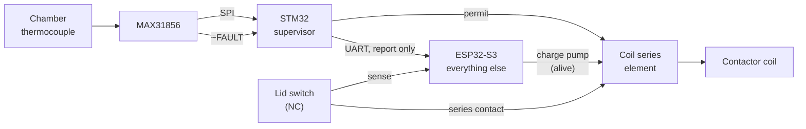

<!--
SPDX-FileCopyrightText: 2026 Bitcrush Testing
SPDX-License-Identifier: GPL-3.0-or-later
-->

# The independent safety supervisor

A second microcontroller, an STM32, that reads the chamber temperature, the
thermocouple front end's fault output and the lid switch, and removes the
heater on a hard-coded absolute over-temperature. It reports temperature and
status to the ESP32 over a serial link and takes no instruction from it. Every
other function of the product stays in the ESP32.

**Status: accepted, not yet designed to the point of a schematic.** This
document is the design and the open questions. Section 12 lists what must be
answered before hardware changes.

---

## 1. What this changes about the safety case

[`safety.md` §6](safety.md#6-independence) is honest about where the present
concept is weakest. Layers L1 to L4 all run on the ESP32:

> **L2+L3 vs. L4 watchdogs, partly independent.** Same MCU and same power rail.

and the only row in that table claiming full independence is L5, the external
over-temperature cutout, which is explicitly *outside this project*
([`SYS-HW-13`](02_system_req.sdoc)) and which the requirements place out of scope to
replace.

So today the product's claim to MCU-independent protection rests entirely on a
part someone else fits. This change brings an independent protection layer
inside the product boundary for the first time: its own silicon, its own
firmware, its own clock, its own watchdog, its own authority over the coil. A
defect anywhere in the ESP32 firmware, including in the safety supervisor task,
no longer reaches the trip.

What it does **not** do is replace L5. Two MCUs from one vendor family on one
power rail are not a substitute for a thermostat with its own contacts, and
`SYS-HW-13` stays mandatory.

## 2. The split

**The supervisor owns**, and the ESP32 cannot reach:

- the chamber MAX31856, over its own SPI, including configuring the fault mask
- that device's `~FAULT` output as a discrete input
- one series interrupting element in the contactor coil path
- its own independent watchdog

**The ESP32 keeps** everything else: the PID and the setpoint generator, the
programs, logging, the current transformer and all the electrical detection
rules (`SWR-SAF-25` to `SWR-SAF-30`), the enclosure channel and `SWR-SAF-11`, **the lid switch
and `SWR-SAF-31`**, the HMI, WiFi,
the web API, the charge pump of L3, and its own thermal rules.

The ESP32's thermal rules are **not** removed. They keep their own detections
that the supervisor does not attempt: runaway (`SWR-SAF-07`), shorted SSR
(`SWR-SAF-08`), reversed couple (`SWR-SAF-05`), stuck sensor (`SWR-SAF-06`). The supervisor is
a backstop with one job, not a replacement for a layer that reasons.

## 3. What the supervisor trips on

Two conditions, both hard-coded, both latching:

| | Condition | Why it is here and not in the ESP32 |
|---|---|---|
| 1 | Chamber temperature above the absolute backstop | The one condition that must survive any ESP32 defect |
| 2 | A thermocouple fault reported by the front end, or `~FAULT` asserted, persisting beyond a short grace period | Without a trustworthy reading, condition 1 cannot be evaluated, so the absence of a reading must itself be a trip |

**The lid is not one of them.** Its switch breaks the contactor coil in
hardware (`SYS-HW-21`), so it is already safe with no firmware involved, and
`SWR-SAF-31`'s latch is gated on "while a heating state is active", which only the
ESP32 knows. A supervisor latching on lid open regardless would trip every time
the kiln was loaded cold: a nuisance trip, and `HZ-10` names nuisance trips as
how protections come to be disabled. So the lid sense goes to the ESP32, which
has the context, and the supervisor is not given a third path that duplicated
the hardware one while adding a failure mode of its own.

Condition 2 has one qualification worth stating, because it is the same trap in
a different place. Staleness only latches once a usable reading has been seen.
"The front end never started" and "the front end was working and stopped" are
different, and only the second is a fault to acknowledge; without the
distinction, a front end whose first conversion takes longer than the grace
would demand a button press at every power-on with nothing wrong. A front end
*reporting* a fault latches either way, because then it is telling us
something.

### How a latched trip is cleared

**Decided: a local button.** Held for 0.5 s, and **edge triggered, not level
triggered**, which is not a detail. A latch cleared on the level of a pin is
not a latch: a button shorted to ground, or one wedged down, would clear it on
every cycle, and the supervisor would then permit heat whenever the
instantaneous condition happened to be good. That is a safety latch defeated by
one solder bridge.

So the input must be seen *released* before it can clear anything, and
clearing disarms it until it is released again. A line stuck low never arms at
all, including at power-on, so it fails towards the latch holding. The logic is
in the trip core with the rest of the safety function, not in the board layer,
because it is behaviour and behaviour gets tested.

Clearing cannot override a live condition. The latch drops and the next cycle
re-establishes it if the kiln is still too hot, so the button cannot be held
down to keep firing. A failed start-up self-test is not clearable by an
operator at all.

**The supervisor's latch does not survive a power cycle**, and that is a
decision rather than an oversight. It lives in RAM: persisting it would mean a
flash write on the trip path, which is more firmware, more wear and another
failure mode in the one component whose argument is its simplicity. The system
level obligation of `SWR-SAF-17`, that a latched fault survives power loss and needs
an explicit acknowledgement, is met by the ESP32, which has non-volatile
storage and already does it.

The gap that leaves, stated plainly: a transient over-temperature that has
since cooled would be cleared by switching the controller off and on, without
anyone pressing the button. What stops that mattering is the ESP32's own
latched fault, which does persist. If the supervisor's latch is ever wanted to
persist independently, that is a change to `SWR-SAF-17` and to this paragraph, not a
small firmware edit.

Condition 2 is what fixes the defect `K1` records. The present discrete chain
is open-drain and therefore closed when the front end is unpowered or absent,
and the MAX31856 does not report an open circuit until its fault mask has been
configured, so the interlock is inert out of reset. A supervisor does not have
that problem: it starts in the de-energised state and only permits heat after
it has configured the device and seen good conversions. **Absence of evidence
becomes a trip rather than a permission.**

## 4. Two limits, and why `SWR-SAF-23` has to move

A hard-coded limit and a configurable one are different things and both are
needed. The configurable `safety.max_temp_c` is the working limit for this kiln
and this firing. The supervisor's limit is "this must never happen whatever the
ESP32 believes".

The backstop must therefore sit **above** the highest legitimately configurable
limit, with enough margin that normal operation never approaches it.

**Decided: configurable ceiling 1300 °C, supervisor trip 1350 °C.**

It did not fit before. [`SWR-SAF-23`](03_software_req.sdoc) set the configurable
ceiling at 1350 °C, which is also the top of type K's usable range
(`SWR-ACQ-05`), leaving no room above it. The ceiling moved down rather than the
backstop up, because raising the backstop would put the trip outside the
thermocouple's specified range and make it depend on an extrapolation.

1300 °C is above cone 10 (about 1285 °C), so no real ceramic firing is lost,
and the separation is 50 °C.

The two numbers are stated together in `kiln/types.h`, with the margin as the
reason and a `static_assert` that the backstop is above the ceiling, because
two limits that can be edited independently will eventually cross. The API
reports both for the same reason: a client showing one without the other
invites exactly that confusion.

## 5. The interface

**UART, not I²C.** Point-to-point, so a wedged supervisor cannot take a bus
down with it, which matters because the I²C bus already carries the display and
[`SYS-HW-03`](02_system_req.sdoc) already records a concern about a peripheral
stalling a shared bus. A UART also lets the supervisor **push**, so silence is
itself a detectable event, where an I²C slave that has stopped answering is
only discovered by polling it.

The two expansion pins (`KILN_PIN_EXP_IO2`, `KILN_PIN_EXP_IO42`) are free and
sufficient. `UART0` is the console and must not be used.

| | |
|---|---|
| **Direction** | Supervisor to ESP32. Report only. |
| **Rate** | 10 Hz, unsolicited. `SWR-ACQ-03` wants 4 Hz and `SWR-NFR-03` wants 4 Hz; 10 Hz matches the existing safety cycle and leaves margin for lost frames. |
| **Frame** | Fixed length, CRC checked, carrying: chamber temperature, cold-junction temperature, front-end fault bits, lid state, the supervisor's own trip state and reason, and a monotonic sequence number. |
| **On silence** | The ESP32 treats a stale link exactly as it treats a sensor fault today, under `SWR-ACQ-12`'s grace period, and withholds heat. |
| **ESP32 to supervisor** | **Nothing at all.** The link is simplex, one wire. With the thermocouple type fixed (section 8) the supervisor needs no configuration, so it is given no receive path: it cannot be told anything, rather than being trusted not to listen. |

The sequence number matters: it distinguishes "the link is quiet" from "the
supervisor is repeating a stale frame", which are different failures.

Note what the rate requirement now means. `SWR-ACQ-03`'s 4 Hz acquisition
becomes a property of the *link*, because the ESP32 no longer reads the
thermocouple itself. The supervisor's own trip is unaffected by the link and
remains local, so `SWR-NFR-04`'s 500 ms budget gets easier, not harder.

## 6. Failure modes

| Failure | Result |
|---|---|
| ESP32 firmware defect, hang, crash, or a wrong safety rule | Supervisor trips on temperature regardless. Charge pump also stops, dropping the coil. |
| Supervisor firmware defect or hang | Its own watchdog resets it; it comes up de-energised and does not permit heat until it has valid conversions. The ESP32 sees the link go quiet and withholds heat. |
| Link fails, either direction or the cable | ESP32 loses its process value and withholds heat. Supervisor is unaffected and keeps protecting. |
| Supervisor unpowered or absent | Its series element is open, so no heat. This is the opposite of the present discrete chain, which is closed when the front end is absent. |
| Thermocouple open, shorted or reversed | Supervisor trips on condition 2. ESP32's `SWR-SAF-04` to `SWR-SAF-06` also act. |
| Both MCUs lose the 3V3 rail | Everything de-energises. Shared, and safe by construction. |
| Chamber thermocouple reads plausibly but wrongly | **Defeats both.** See section 9. |

## 7. What this deletes

The supervisor subsumes the discrete interlock chain of tasklist section K,
which exists to put the front ends' fault outputs in series with the coil
([`SYS-HW-24`](02_system_req.sdoc)):

- `Q5`, `Q6` and `R28` to `R31` are no longer needed for thermocouple faults.
  The supervisor reads the fault pin and decides.
- `K1`, which records that the chain is not firmware-independent, is answered
  rather than mitigated.
- `K2`, which asks whether an enclosure thermocouple fault should stop a
  firing, is dissolved: the enclosure channel is not in the supervisor's remit
  at all, so `SWR-SAF-11` stays an ESP32 rule and can never cause this trip.
- `SYS-HW-24` is superseded and should be rewritten rather than deleted, because
  the property it was reaching for is now delivered differently.

The lid's **series contact** stays. `SYS-HW-21` wants the switch wired both to a
controller input and in series with the coil, and the series contact is the one
element in the whole design that depends on no firmware at all. It costs
nothing and it is kept.

This also changes the conclusion of
[`bom-optimisation.md` §1](bom-optimisation.md): see section 9.

## 8. The thermocouple type problem

This is the sharpest open question, and it is not obvious.

[`SWR-ACQ-02`](03_software_req.sdoc) allows any of {K, N, S, R, B, E, J, T}. The
MAX31856 linearises in hardware according to a type register, so whoever
configures that register determines what the reported temperature *means*. If
the supervisor hard-codes type K and a type S couple is fitted, the supervisor
reads far too low at high temperature and its backstop never fires. A type S
couple at 1300 °C produces roughly a quarter of type K's output.

Tripping on raw thermovoltage instead does not escape this: a threshold set in
microvolts for the least sensitive type never fires for the most sensitive, and
one set for the most sensitive fires at a few hundred degrees for the rest.

So the supervisor must know the type. The options:

1. **Type K only for the supervised product.** Simplest, and defensible: K is
   the default and covers ceramic firing. The other types become a documented
   limitation rather than a silent hazard.
2. **Build-time per variant.** The supervisor's firmware is built per type.
   Honest, but it makes the type a manufacturing attribute, and a mismatched
   pairing is undetectable from outside.
3. **Commissioned once into the supervisor's own flash**, over the link, then
   locked. Keeps one product, but it is a path from the ESP32 into the safety
   function, which is the thing this whole change exists to remove.
4. **Strap pins read at reset.** Three pins encode eight types. No firmware
   path, no manufacturing variant, and the strap is inspectable. Costs pins and
   board area.

**Decided: option 1, type K only.** The chamber thermocouple is type K and its
type is not configurable; [`SWR-ACQ-02`](03_software_req.sdoc) now says so. The
other types are a documented limitation of the supervised product rather than a
silent hazard. The enclosure channel's type stays configurable, that channel
not being in the supervisor's remit.

This has a consequence worth taking: with the type fixed, **the supervisor
needs nothing at all from the ESP32**. There is no configuration to send, so
the link can be simplex, one wire, supervisor to ESP32 only. The supervisor
then has no receive path to be confused by, and is physically incapable of
being told anything. See section 5.

## 9. The remaining common cause: one thermocouple

**Decided: one chamber couple, owned by the supervisor, relayed to the ESP32
over the link.** The option below of giving the supervisor a second couple is
declined.

So the independence this buys is against **software and MCU failure**, which
was the point, and is explicitly *not* independence against a sensor that reads
plausibly but wrongly. `safety.md` §6 names that as `HZ-03`, and it stays
covered the way it is covered today: by `SWR-SAF-04` to `SWR-SAF-06` interrogating the
measurement rather than trusting it, and by the electrical rules reasoning from
a different sensor entirely.

Two consequences are worth stating rather than discovering.

**The ESP32 no longer has any independent view of temperature.** It does not
read a thermocouple at all now; `SWR-SAF-05` (reversed couple), `SWR-SAF-06` (stuck
sensor), `SWR-SAF-07` (runaway) and `SWR-SAF-08` (shorted SSR) all reason about a value
that arrived over the link. They still work, and the front end's fault bits
arrive with it, but they are no longer a second opinion about the measurement.
They are a second opinion about the *kiln*.

**The current transformer is therefore the only physically independent
detection channel left in the system.** `safety.md` §6 already records
"L2 thermal rules vs. L2 current rules: yes, physically, different sensor,
different quantity, different front end". That row was defence in depth before.
It is now load-bearing, and `SWR-CUR-12`'s refusal to start a firing without a
fitted CT carries more weight than it did when it was written. Anyone proposing
to make the CT optional should be sent here first.

### The option that was declined

For the record, since it may come up again. The enclosure channel `TC2` is, on
the analysis in [`bom-optimisation.md` §1](bom-optimisation.md), a MAX31856
bought for a `FAULT` pin it no longer needs. Repurposed as a second chamber
couple read only by the supervisor, the two MCUs could have been made to
disagree, and a disagreement beyond a band is a detection neither can make
alone, which would have covered `HZ-03` by comparison rather than only by
interrogation.

It was declined because it changes the sensor count in the chamber, and that is
an installation question as much as an electrical one: a second couple means a
second penetration, a second probe to fit correctly, and a second thing to get
wrong in the field. One well-fitted couple reporting to a supervisor that
cannot be talked out of tripping is the simpler product.

## 10. Part selection

Requirements on the part: one SPI, one UART, four or five GPIO, an independent
watchdog clocked from its own oscillator rather than the system clock, and
separate programming access so its firmware is built, reviewed and flashed as
its own artefact.

STM32G031 or STM32C031 both fit and both are inexpensive. The G0 family's
`IWDG` runs from the LSI, so a system clock failure does not stop the watchdog,
which is the property that matters. A package with an SWD header brought out to
a test point is required, not optional, because the whole argument rests on
this firmware being independently reviewable and independently updatable.

The supervisor's firmware should be small enough to read in one sitting. That
is a design constraint, not an aspiration: if it grows a scheduler, a parser,
or a configuration model, the independence claim starts to rot.

## 11. Requirement and document deltas

New requirements:

| Area | What it must say |
|---|---|
| `SR` | An independent supervisor, on its own MCU, shall de-energise the heater above a hard-coded absolute chamber temperature and on a persistent thermocouple fault, independently of the main controller. |
| `SR` | The supervisor's trip shall latch, and shall be clearable only by power cycle or a local action, never by a command over the link. |
| `HR` | The supervisor shall be a separate microcontroller with its own watchdog, its own series interrupting element in the coil path, and its own programming interface. |
| `HR` | The link shall be point-to-point serial, report only, and shall carry no message able to raise the supervisor's trip threshold or clear its latch. |
| `FR-ACQ` | Chamber temperature shall be acquired by the supervisor and reported at not less than 4 Hz; a stale report shall be treated as a sensor fault. |
| `NFR` | The supervisor's trip shall act within one acquisition period, independently of the link. |

Changed:

- `SWR-SAF-23`, the 1350 °C ceiling, per section 4
- `SWR-ACQ-01`, which says the system reads the MAX31856 over SPI, since it is
  now the supervisor that does
- `SWR-ACQ-02`, per section 8
- `SYS-HW-02`, two MAX31856 on a shared bus with individual chip selects
- `SYS-HW-24`, superseded per section 7
- `SWA-04`, the safety supervisor as a task, which is now one of two supervisors
- `SWA-05`, the charge pump, which remains but is no longer the only hardware
  path to the coil
- `SWR-SAF-31` and `SYS-HW-21` are **unchanged**: the lid stays the ESP32's input and the
  hardware contact stays in the coil. The supervisor does not touch either.
- `safety.md` §5 and §6: a new layer and a new row in the independence table,
  which is the point of the exercise
- `SG-01` and `SG-03`, which are about single failures and series devices

## 12. Open questions, in the order they block work

1. ~~Thermocouple type~~ **decided: type K only**, section 8.
2. ~~The two limits~~ **decided: ceiling 1300 °C, trip 1350 °C**, section 4.
3. ~~Second chamber couple~~ **declined: one couple, the supervisor's**,
   section 9.
4. ~~How a latched trip is cleared~~ **decided: a local button, edge triggered
   and held**, section 3. Its wording against `SWR-SAF-17` is still to write, since
   the supervisor's latch deliberately does not survive a power cycle.
5. **Does the ESP32 need to distinguish "supervisor tripped" from "link
   dead"?** It can, via the frame's trip reason, but only while the link
   works. If the display must explain the trip to an operator, that is an
   argument for the supervisor driving its own indicator.
