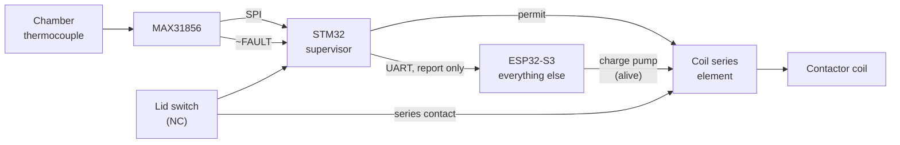

<!--
SPDX-FileCopyrightText: 2026 Bitcrush Testing
SPDX-License-Identifier: GPL-3.0-or-later
-->

# The independent safety supervisor

A second microcontroller, an STM32, that reads the chamber temperature, the
thermocouple front end's fault output and the lid switch, and removes the
heater on a hard-coded absolute over-temperature. It reports temperature and
status to the ESP32 over a serial link and takes no instruction from it. Every
other function of the product stays in the ESP32.

**Status: accepted, not yet designed to the point of a schematic.** This
document is the design and the open questions. Section 12 lists what must be
answered before hardware changes.

---

## 1. What this changes about the safety case

[`safety.md` §6](safety.md#6-independence) is honest about where the present
concept is weakest. Layers L1 to L4 all run on the ESP32:

> **L2+L3 vs. L4 watchdogs, partly independent.** Same MCU and same power rail.

and the only row in that table claiming full independence is L5, the external
over-temperature cutout, which is explicitly *outside this project*
([`HR-13`](requirements.sdoc)) and which the requirements place out of scope to
replace.

So today the product's claim to MCU-independent protection rests entirely on a
part someone else fits. This change brings an independent protection layer
inside the product boundary for the first time: its own silicon, its own
firmware, its own clock, its own watchdog, its own authority over the coil. A
defect anywhere in the ESP32 firmware, including in the safety supervisor task,
no longer reaches the trip.

What it does **not** do is replace L5. Two MCUs from one vendor family on one
power rail are not a substitute for a thermostat with its own contacts, and
`HR-13` stays mandatory.

## 2. The split

**The supervisor owns**, and the ESP32 cannot reach:

- the chamber MAX31856, over its own SPI, including configuring the fault mask
- that device's `~FAULT` output as a discrete input
- the lid switch as a discrete input
- one series interrupting element in the contactor coil path
- its own independent watchdog

**The ESP32 keeps** everything else: the PID and the setpoint generator, the
programs, logging, the current transformer and all the electrical detection
rules (`SR-25` to `SR-30`), the enclosure channel and `SR-11`, the HMI, WiFi,
the web API, the charge pump of L3, and its own thermal rules.

The ESP32's thermal rules are **not** removed. They keep their own detections
that the supervisor does not attempt: runaway (`SR-07`), shorted SSR
(`SR-08`), reversed couple (`SR-05`), stuck sensor (`SR-06`). The supervisor is
a backstop with one job, not a replacement for a layer that reasons.

## 3. What the supervisor trips on

Three conditions, all hard-coded, all latching:

| | Condition | Why it is here and not in the ESP32 |
|---|---|---|
| 1 | Chamber temperature above the absolute backstop | The one condition that must survive any ESP32 defect |
| 2 | A thermocouple fault reported by the front end, or `~FAULT` asserted, persisting beyond a short grace period | Without a trustworthy reading, condition 1 cannot be evaluated, so the absence of a reading must itself be a trip |
| 3 | Lid switch open | Fast, and it needs no reasoning |

Condition 2 is what fixes the defect `K1` records. The present discrete chain
is open-drain and therefore closed when the front end is unpowered or absent,
and the MAX31856 does not report an open circuit until its fault mask has been
configured, so the interlock is inert out of reset. A supervisor does not have
that problem: it starts in the de-energised state and only permits heat after
it has configured the device and seen good conversions. **Absence of evidence
becomes a trip rather than a permission.**

## 4. Two limits, and why `SR-23` has to move

A hard-coded limit and a configurable one are different things and both are
needed. The configurable `safety.max_temp_c` is the working limit for this kiln
and this firing. The supervisor's limit is "this must never happen whatever the
ESP32 believes".

The backstop must therefore sit **above** the highest legitimately configurable
limit, with enough margin that normal operation never approaches it.

It does not fit today. [`SR-23`](requirements.sdoc) sets the configurable
ceiling at 1350 °C, which is also the top of type K's usable range
(`FR-ACQ-05`). There is no room above it for a backstop, so one of the two has
to move:

- **Preferred: lower the configurable ceiling.** `SR-23` becomes 1300 °C, the
  supervisor trips at 1350 °C. 1300 °C is above cone 10 (about 1285 °C), so no
  real ceramic firing is lost, and the separation is 50 °C.
- Alternatively raise the backstop above 1350 °C, which puts the trip outside
  the thermocouple's specified range and makes it depend on an extrapolation.
  This is worse.

Either way the two numbers must be stated together, in one place, with the
margin between them given as the reason. Two limits that can be edited
independently will eventually cross.

## 5. The interface

**UART, not I²C.** Point-to-point, so a wedged supervisor cannot take a bus
down with it, which matters because the I²C bus already carries the display and
[`HR-03`](requirements.sdoc) already records a concern about a peripheral
stalling a shared bus. A UART also lets the supervisor **push**, so silence is
itself a detectable event, where an I²C slave that has stopped answering is
only discovered by polling it.

The two expansion pins (`KILN_PIN_EXP_IO2`, `KILN_PIN_EXP_IO42`) are free and
sufficient. `UART0` is the console and must not be used.

| | |
|---|---|
| **Direction** | Supervisor to ESP32. Report only. |
| **Rate** | 10 Hz, unsolicited. `FR-ACQ-03` wants 4 Hz and `NFR-03` wants 4 Hz; 10 Hz matches the existing safety cycle and leaves margin for lost frames. |
| **Frame** | Fixed length, CRC checked, carrying: chamber temperature, cold-junction temperature, front-end fault bits, lid state, the supervisor's own trip state and reason, and a monotonic sequence number. |
| **On silence** | The ESP32 treats a stale link exactly as it treats a sensor fault today, under `FR-ACQ-12`'s grace period, and withholds heat. |
| **ESP32 to supervisor** | Nothing that can affect the trip. See section 8 for the one unresolved exception. |

The sequence number matters: it distinguishes "the link is quiet" from "the
supervisor is repeating a stale frame", which are different failures.

Note what the rate requirement now means. `FR-ACQ-03`'s 4 Hz acquisition
becomes a property of the *link*, because the ESP32 no longer reads the
thermocouple itself. The supervisor's own trip is unaffected by the link and
remains local, so `NFR-04`'s 500 ms budget gets easier, not harder.

## 6. Failure modes

| Failure | Result |
|---|---|
| ESP32 firmware defect, hang, crash, or a wrong safety rule | Supervisor trips on temperature regardless. Charge pump also stops, dropping the coil. |
| Supervisor firmware defect or hang | Its own watchdog resets it; it comes up de-energised and does not permit heat until it has valid conversions. The ESP32 sees the link go quiet and withholds heat. |
| Link fails, either direction or the cable | ESP32 loses its process value and withholds heat. Supervisor is unaffected and keeps protecting. |
| Supervisor unpowered or absent | Its series element is open, so no heat. This is the opposite of the present discrete chain, which is closed when the front end is absent. |
| Thermocouple open, shorted or reversed | Supervisor trips on condition 2. ESP32's `SR-04` to `SR-06` also act. |
| Both MCUs lose the 3V3 rail | Everything de-energises. Shared, and safe by construction. |
| Chamber thermocouple reads plausibly but wrongly | **Defeats both.** See section 9. |

## 7. What this deletes

The supervisor subsumes the discrete interlock chain of tasklist section K,
which exists to put the front ends' fault outputs in series with the coil
([`HR-24`](requirements.sdoc)):

- `Q5`, `Q6` and `R28` to `R31` are no longer needed for thermocouple faults.
  The supervisor reads the fault pin and decides.
- `K1`, which records that the chain is not firmware-independent, is answered
  rather than mitigated.
- `K2`, which asks whether an enclosure thermocouple fault should stop a
  firing, is dissolved: the enclosure channel is not in the supervisor's remit
  at all, so `SR-11` stays an ESP32 rule and can never cause this trip.
- `HR-24` is superseded and should be rewritten rather than deleted, because
  the property it was reaching for is now delivered differently.

The lid's **series contact** stays. `HR-21` wants the switch wired both to a
controller input and in series with the coil, and the series contact is the one
element in the whole design that depends on no firmware at all. It costs
nothing and it is kept.

This also changes the conclusion of
[`bom-optimisation.md` §1](bom-optimisation.md): see section 9.

## 8. The thermocouple type problem

This is the sharpest open question, and it is not obvious.

[`FR-ACQ-02`](requirements.sdoc) allows any of {K, N, S, R, B, E, J, T}. The
MAX31856 linearises in hardware according to a type register, so whoever
configures that register determines what the reported temperature *means*. If
the supervisor hard-codes type K and a type S couple is fitted, the supervisor
reads far too low at high temperature and its backstop never fires. A type S
couple at 1300 °C produces roughly a quarter of type K's output.

Tripping on raw thermovoltage instead does not escape this: a threshold set in
microvolts for the least sensitive type never fires for the most sensitive, and
one set for the most sensitive fires at a few hundred degrees for the rest.

So the supervisor must know the type. The options:

1. **Type K only for the supervised product.** Simplest, and defensible: K is
   the default and covers ceramic firing. The other types become a documented
   limitation rather than a silent hazard.
2. **Build-time per variant.** The supervisor's firmware is built per type.
   Honest, but it makes the type a manufacturing attribute, and a mismatched
   pairing is undetectable from outside.
3. **Commissioned once into the supervisor's own flash**, over the link, then
   locked. Keeps one product, but it is a path from the ESP32 into the safety
   function, which is the thing this whole change exists to remove.
4. **Strap pins read at reset.** Three pins encode eight types. No firmware
   path, no manufacturing variant, and the strap is inspectable. Costs pins and
   board area.

Preference is **1** for the first revision and **4** if the other types are
genuinely wanted, because it keeps the ESP32 out of the decision entirely. If
**3** is chosen, the supervisor must default to the most conservative type and
must refuse to raise its own trip threshold on the ESP32's word.

## 9. The remaining common cause: one thermocouple

With a single chamber couple, the supervisor and the ESP32 share a sensor. The
independence won is against **software and MCU failure**, which is what was
asked for and is the larger risk. It is not independence against a sensor that
reads plausibly but wrongly, which `safety.md` §6 already names as `HZ-03` and
which `SR-04` to `SR-06` exist to interrogate.

There is an option here that was not available before. The enclosure channel
`TC2` is, on the analysis in
[`bom-optimisation.md` §1](bom-optimisation.md), a MAX31856 bought for a
`FAULT` pin it no longer needs, measuring a band a cent part would measure
better. Rather than deleting it, **give the supervisor its own chamber
couple**: a second element in the chamber, its own front end, read only by the
supervisor. Then:

- the supervisor and the ESP32 agree on temperature or they do not, and a
  disagreement beyond a band is itself a detection neither could make alone
- `HZ-03` is covered by comparison rather than only by interrogation
- the enclosure measurement moves to `cj_c` or a cheap I²C part as that
  document recommends

That is a stronger safety argument than the one being bought here, for roughly
the cost of the part already on the board. It is offered as an option, not
folded into the decision, because it changes the sensor count in the chamber
and that is an installation question as much as an electrical one.

## 10. Part selection

Requirements on the part: one SPI, one UART, four or five GPIO, an independent
watchdog clocked from its own oscillator rather than the system clock, and
separate programming access so its firmware is built, reviewed and flashed as
its own artefact.

STM32G031 or STM32C031 both fit and both are inexpensive. The G0 family's
`IWDG` runs from the LSI, so a system clock failure does not stop the watchdog,
which is the property that matters. A package with an SWD header brought out to
a test point is required, not optional, because the whole argument rests on
this firmware being independently reviewable and independently updatable.

The supervisor's firmware should be small enough to read in one sitting. That
is a design constraint, not an aspiration: if it grows a scheduler, a parser,
or a configuration model, the independence claim starts to rot.

## 11. Requirement and document deltas

New requirements:

| Area | What it must say |
|---|---|
| `SR` | An independent supervisor, on its own MCU, shall de-energise the heater above a hard-coded absolute chamber temperature, on a persistent thermocouple fault, and on lid open, independently of the main controller. |
| `SR` | The supervisor's trip shall latch, and shall be clearable only by power cycle or a local action, never by a command over the link. |
| `HR` | The supervisor shall be a separate microcontroller with its own watchdog, its own series interrupting element in the coil path, and its own programming interface. |
| `HR` | The link shall be point-to-point serial, report only, and shall carry no message able to raise the supervisor's trip threshold or clear its latch. |
| `FR-ACQ` | Chamber temperature shall be acquired by the supervisor and reported at not less than 4 Hz; a stale report shall be treated as a sensor fault. |
| `NFR` | The supervisor's trip shall act within one acquisition period, independently of the link. |

Changed:

- `SR-23`, the 1350 °C ceiling, per section 4
- `FR-ACQ-01`, which says the system reads the MAX31856 over SPI, since it is
  now the supervisor that does
- `FR-ACQ-02`, per section 8
- `HR-02`, two MAX31856 on a shared bus with individual chip selects
- `HR-24`, superseded per section 7
- `AD-04`, the safety supervisor as a task, which is now one of two supervisors
- `AD-05`, the charge pump, which remains but is no longer the only hardware
  path to the coil
- `safety.md` §5 and §6: a new layer and a new row in the independence table,
  which is the point of the exercise
- `SG-01` and `SG-03`, which are about single failures and series devices

## 12. Open questions, in the order they block work

1. **Thermocouple type**, section 8. Blocks the supervisor's firmware and
   possibly its pin count.
2. **The two limits**, section 4. Blocks `SR-23` and the supervisor's constant.
3. **Second chamber couple?**, section 9. Blocks the schematic and the decision
   in `bom-optimisation.md` §1.
4. **How a latched trip is cleared**, section 3. Power cycle alone, or a
   dedicated local button. Blocks the panel and `SR-17`'s wording.
5. **Does the ESP32 need to distinguish "supervisor tripped" from "link
   dead"?** It can, via the frame's trip reason, but only while the link
   works. If the display must explain the trip to an operator, that is an
   argument for the supervisor driving its own indicator.
