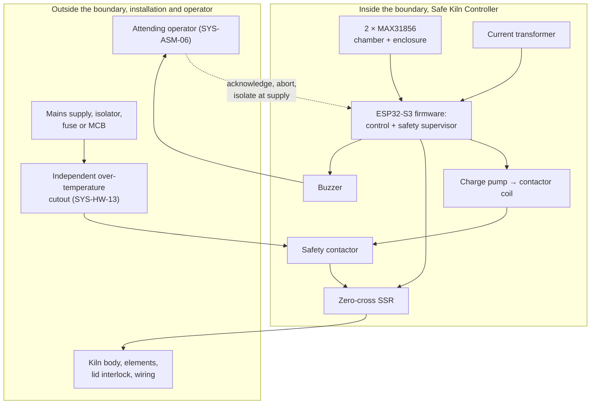
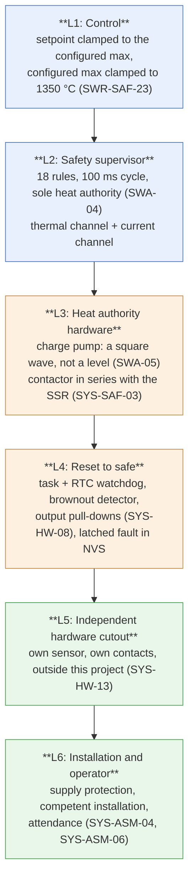

<!--
SPDX-FileCopyrightText: 2026 Bitcrush Testing
SPDX-License-Identifier: GPL-3.0-or-later
-->

# Safe Kiln Controller, Safety Concept

| | |
|---|---|
| **Document** | Safety Concept |
| **Project** | Safe Kiln Controller, PID kiln controller |
| **Version** | 0.1 (draft) |
| **Date** | 2026-10-05 |
| **Status** | For review |
| **Derives from** | [`03_software_req.sdoc`](03_software_req.sdoc) v0.1, [`architecture.md`](architecture.md) v0.1 |
| **License** | GPL-3.0-or-later |

---

> **Safe Kiln Controller is not a safety-certified device.** This document explains the
> reasoning behind its protective measures; it is not a declaration of
> conformity, a functional-safety assessment to IEC 61508 or ISO 13849, and it
> does not assign a SIL or a performance level. An **independent hardware
> over-temperature cutout is required** in every installation
> ([SYS-HW-13](02_system_req.sdoc)), mains wiring must
> be carried out by a competent person in accordance with local regulation [R6],
> and the kiln must not be fired unattended
> ([SYS-ASM-06](02_system_req.sdoc)). See [§9](#9-limitations-and-obligations).

## 1. Purpose and scope

[`02_system_req.sdoc` §5](03_software_req.sdoc) states *what* the
system must detect and do. [`architecture.md` §8](architecture.md#8-safety-subsystem)
states *how* the software is built to do it. This document and its companion
[`safety.sdoc`](safety.sdoc) supply the layer between them: the hazards being
defended against, the safety goals derived from those hazards, the protection
layers that meet each goal, the independence claimed between those layers, and,
explicitly, the risk that remains.

The split between the two follows the one between
[`architecture.md`](architecture.md) and
[`04_software_arch.sdoc`](04_software_arch.sdoc). The hazards, the safety goals and the
residual risks are in `safety.sdoc`, because they have identity: a stable ID
each, and a chain between them that is now built out of checked relations rather
than maintained by hand. The reasoning is here: the boundary, the layers, the
independence analysis, the coverage and timing, the reaction sequence, the
obligations, and the verification status.

It exists so that a reviewer can answer three questions without reading the
code:

1. What can go wrong, and how badly?
2. For each of those, what stops it, and what stops it if the first thing fails?
3. What is left over, and who is responsible for it?

Identifiers introduced by this concept extend the scheme of
[requirements §1.4](03_software_req.sdoc), and are defined as nodes in
[`safety.sdoc`](safety.sdoc):

| Prefix | Meaning |
|---|---|
| `HZ` | Hazard |
| `SG` | Safety goal |
| `RR` | Residual risk |

Requirement identifiers (`SWR-SAF-07`, `SYS-HW-13`, `SWR-NFR-04`, `SYS-ASM-06`) are cited as
defined in the requirements specification and are not restated here.

## 2. System boundary

The *equipment under control* is an electric resistance kiln: a multi-kilowatt
mains heater whose chamber reaches up to 1350 °C and whose outer surfaces,
wiring and surroundings are at risk when control is lost.

**Inside the boundary.** The firmware, the two switching devices and their
drive circuits, the two thermocouple front ends, the current transformer and
its conditioning, and the annunciation.

**Outside the boundary, but relied upon.** The supply protection, the
independent cutout, the kiln's own construction and the operator. Each is the
subject of an assumption in
[requirements §9](03_software_req.sdoc), and every assumption that is
load-bearing for a safety goal is identified as such in [§6](#6-independence)
and [§9](#9-limitations-and-obligations). An assumption that is wrong in the
field is a defeated protection layer, which is why they are listed rather than
left implicit.

## 3. Hazard analysis

The thirteen hazards live in [`safety.sdoc`](safety.sdoc), not here.

Each carries its credible causes, its worst credible consequence, a severity and
the fault codes it is detected by. Severity is the worst credible outcome, not
the typical one, and no probability figures are given: the project has no field
population from which to derive them, and inventing them would make the analysis
look more rigorous than it is.

`HZ-07` (shock and arc exposure) and `HZ-11` (hot surfaces) are the two with no
safety goal between them and their requirements. Both are predominantly
installation and operating hazards, discharged through construction requirements
and documentation rather than through detection, so each names the requirements
that address it directly. They are listed because omitting them from a safety
concept would misrepresent where the risk in a kiln actually lies.

## 4. Safety goals

The thirteen safety goals live in [`safety.sdoc`](safety.sdoc), not here.

Each goal is the inversion of one or more hazards into something the design can
be held to, so each one names the hazards it mitigates and the requirements that
realise it. In StrictDoc those are `Mitigates` and `Realised by` relations,
checked when the document is built, which is what retired the traceability
appendix this document used to carry: a goal can no longer cite a requirement
that does not exist, and [`03_software_req.sdoc`](03_software_req.sdoc) can be read in
the other direction, from a safety requirement to the goal it realises and the
hazard behind it.

Each goal also names the protection layers that meet it. The layers themselves
stay here, in the section below.

## 5. The protection layers

The concept is layered, and the layers are ordered by how little they depend on
software being correct. Nothing below is a substitute for anything above it.

### 5.1 L1, Control

The control path can only *request* a duty. It holds no authority and is not a
protection layer in its own right; it is listed because its clamping behaviour
removes the commonest route to HZ-02. Every setpoint, program target and tuning
setpoint is clamped to the configured maximum chamber temperature, and the
configured maximum is itself bounded by a compile-time ceiling of 1350 °C that
no configuration value can raise (`SWR-SAF-23`).

### 5.2 L2, The safety supervisor

A separate task at higher priority than control, pinned to the core that
networking cannot reach (`SWA-15`), running at 10 Hz against a requirement of
4 Hz (`SWR-NFR-03`). It is the **only** holder of heat authority: in the whole
firmware there is exactly one assignment that grants it, in the safety cycle of
`kiln_app`, and the control, HMI and web paths cannot reach it.

Each rule is a pure function of an immutable input snapshot plus its own timer
state, no globals, injected time (`SWA-02`, `SWA-03`), which is what allows a
15-minute runaway timer and a 168-hour firing to be exercised in milliseconds
on a development host. The rules and their thresholds are tabulated in
[architecture §8.2](architecture.md#82-rule-table); they are not duplicated
here, because a threshold that appears in two documents eventually disagrees
with itself.

Two detection channels run inside this layer, and their separation is the point
of [§6](#6-independence):

- **Thermal** (`SWR-SAF-04`–`SWR-SAF-13`), reasoning about temperature, its rate of
  change and the commanded duty, via the MAX31856 channels.
- **Electrical** (`SWR-SAF-25`–`SWR-SAF-30`), reasoning about current measured by the CT,
  gated to the commanded output state (`SWA-17`) so that the measurement is a
  statement about the *relay*, not an average over a mostly-off window.

### 5.3 L3, The heat authority hardware

This is the layer that does not depend on the firmware being correct, only on
it running, and it is the central safety property of the design.

Heat enable is **a software-generated square wave into a hardware charge pump**
(`SWA-05`, `SYS-HW-07`), not a GPIO level. The supervisor toggles it once per cycle;
stop toggling, crash, hang, deadlock, deadline miss, panic, power loss, and
the coil de-energises within about a second with no code involved. This is what
discharges SG-02, and it is why `SWR-SAF-14`'s watchdog requirement costs nothing
extra: a watchdog expiry removes heat by the same mechanism as any other way of
failing to run.

> **The toggle must never be delegated to a hardware PWM peripheral**, and the
> circuit must never be "simplified" to a static GPIO. Either change leaves the
> board working and silently destroys the property. The schematic marks the
> circuit as safety-critical, and the HIL suite verifies contactor release by
> halting the safety task.

**Four independent things now break the coil, three of them without firmware.**
The coil circuit is a series chain, and any element opening drops the contactor:

| Element | Opens when | Firmware involved? |
|---|---|---|
| Lid switch contacts (`SYS-HW-21`) | the door opens | **No.** Mechanical, in the coil circuit. |
| `Q6`, gated by the chamber `FAULT` output (`SYS-HW-24`) | the chamber front end reports a fault | No, once configured. See the limit below. |
| `Q5`, gated by the enclosure `FAULT` output (`SYS-HW-24`) | the enclosure front end reports a fault | As above. |
| `Q3`, gated by the charge pump (`SWA-05`) | the supervisor stops toggling | Only in that it must keep running. |

The freewheel diode sits **across the coil**, on the kiln side of all four
(`SYS-HW-25`), so opening any of them leaves the coil current somewhere to decay
and does not put the transient across the opening contacts.

The limit of the two `FAULT` elements is worth stating rather than discovering:
the outputs are open-drain, so an **unpowered or absent** front end leaves its
transistor on and the path closed, and the MAX31856 detects an open circuit
only after its fault mask has been configured. They interrupt on faults the
device actively *reports*. A dead or unconfigured front end is covered by
`SWR-SAF-04` in firmware (fault 5, front-end communication failure), not here. The
lid switch carries no such caveat: it is a contact in the circuit.

In series with the charge-pump-driven contactor sits the SSR, modulating under
the supervisor's duty command (`SYS-SAF-03`). Two devices, two drive circuits, two
failure modes. All heater and contactor control outputs carry external
pull-downs to the de-energised state and avoid strapping pins and pins that
glitch during reset (`SYS-HW-08`), so the safe state holds through the window before
the firmware's first instruction (`SG-11`).

### 5.4 L4, Reset to the safe state

The hardware watchdog and a per-task watchdog cover the control and safety tasks
(`SWR-SAF-14`); the brownout detector is enabled (`SWR-SAF-15`). Any of them firing leaves
heating de-energised through L3 and records the reset cause in non-volatile
storage (`SWR-NFR-15`). The boot path brings outputs to the safe state first, starts
the supervisor before networking, the HMI or the web server, and reaches a state
where temperature is measured and heating is safely off within 3 s of reset
(`SWR-NFR-09`), so there is no window in which heating could be enabled without
supervision.

### 5.5 L5, The independent hardware cutout

Outside this project entirely: its own sensor, its own contacts, in the safety
chain ahead of everything the controller drives (`SYS-HW-13`). It is **mandatory**,
not advisory, and it is the only layer that is unaffected by a design error
anywhere in L1–L4. The project does not propose to replace it, and
[requirements §12](03_software_req.sdoc) places doing so explicitly
out of scope.

### 5.6 L6, Installation and operator

Supply protection and competent mains installation (`SYS-ASM-04`), and operator
attendance during firing (`SYS-ASM-06`), as kiln manufacturers themselves require.
Annunciation exists to make this layer effective: an on-board buzzer sounds on
any fault, with a pattern audibly distinguishable from program completion
(`SWR-SAF-20`, `SYS-HW-09`), and it sounds *after* the fault is in non-volatile storage,
because `SWR-SAF-17` is explicit that an immediate power loss must not lose it and
the alarm is the moment the operator starts reacting.

## 6. Independence

Layering is only worth what the independence between the layers is worth. This
section states where the claim is genuine and where it is not.

| Pair | Independent? | Shared element, what defeats both |
|---|---|---|
| L1 control vs. L2 thermal rules | **No** | The same chamber thermocouple. A plausible-but-wrong reading (HZ-03) misleads both. This is the entire reason `SWR-SAF-04`–`SWR-SAF-06` exist: they do not measure temperature, they interrogate the *measurement*, fault bits, polarity, and whether the number moves at all. |
| L2 thermal rules vs. L2 current rules | **Yes, physically** | Different sensor (CT vs. thermocouple), different quantity (amps vs. degrees), different front end, different failure modes. They share the supervisor task and the MCU. |
| L2 vs. L3 | **Yes, for the failure class that matters** | L3 does not depend on L2 being *correct*, only on it *running*. A logic error in a rule does not stop the toggle; a hang, crash or overrun stops it immediately. The converse is also true: L3 cannot detect anything, so a subtly wrong rule is L2's problem alone. |
| L3 SSR vs. L3 contactor | **Yes** | Separate devices on separate outputs. A shorted SSR leaves the contactor able to interrupt; this is what `SWR-SAF-27`'s weld discrimination tests, and what makes "SSR shorted" a recoverable fault and "contactor welded" not. |
| L2+L3 vs. L4 watchdogs | **Partly** | Same MCU and same power rail. A supply fault defeats all three, and is then safe by construction, since every one of them fails towards de-energised. |
| L1–L4 vs. L5 cutout | **Yes, fully** | Nothing is shared: separate sensor, separate contacts, separate failure modes. This is why L5 is mandatory and why no amount of software may be offered as a substitute. |

**Defence in depth, stated as a rule rather than an aspiration.** The current
rules are the *primary* detection of a failed relay, contactor or element,
because they are fast and unambiguous. The thermal rules are retained
**unchanged** as a backstop, because they use a different sensor and a different
physical principle and so still cover the kiln whose current monitoring is
disabled, whose transformer has failed or was never fitted (`SWR-CUR-12`), or
whose fault is on an unmonitored phase (`SYS-ASM-10`). **Neither may be removed on
the grounds that the other exists**: this is a standing constraint on future
changes, not a description of the present state.

## 7. Detection and reaction

### 7.1 Coverage by failure mode

Read this table as: for each way the equipment can fail dangerously, which
independent things notice, and how fast.

| Failure | Primary detection | Independent backstop | Last line | Codes |
|---|---|---|---|---|
| SSR shorted (conducting uncommanded) | `SWR-SAF-25`: current in an off-window, **≤ 1 s** (`SWR-NFR-27`) | `SWR-SAF-08`: +5 °C over 3 min at zero duty; see the caveat in [§7.3](#73-why-two-rules-carry-a-confirmation-window) | Contactor opens; L5 cutout | 21 → 9 |
| Contactor welded | `SWR-SAF-27`: discrimination after `SWR-SAF-25`, verdict within a further 3 s |, | **L5 cutout and the operator only** | 22 |
| Element open or partially open | `SWR-SAF-26` (no conduction current), `SWR-SAF-28` (deviation from the run reference) | `SWR-SAF-07`: runaway: high duty, no rise |, | 23, 24, warning 112 |
| Shorted element / over-current | `SWR-SAF-29`: > 120 % of nominal | Supply fuse or MCB (outside the boundary) | L6 | 25 |
| Thermocouple open, shorted, out of range, cold-junction fault, comms failure | MAX31856 fault bits + `SWR-SAF-04`, after the `SWR-ACQ-12` grace period |, | L5 cutout | 1–5, 16 |
| Thermocouple reversed | `SWR-SAF-05`: a *persistent* fall while duty is high | `SWR-SAF-07` | L5 cutout | 6 |
| Sensor stuck at a plausible value | `SWR-SAF-06`: < 2 °C of movement over 10 min at > 50 % duty | `SWR-SAF-07`; `SWR-SAF-12` on energy-to-temperature | L5 cutout | 7 |
| Heating with no temperature response (open lid, open safety chain, dead element) | `SWR-SAF-26`: electrically, in seconds | `SWR-SAF-07`: thermally, in 15 min |, | 23, 8 |
| Door opened during a firing | `SWR-SAF-31`: heat off and contactor dropped on the first open sample, latched after 0.2 s | **`SYS-HW-21`'s series wiring into the contactor coil**: hardware, independent of this firmware | L5 cutout | 27 |
| Over-temperature | `SWR-SAF-09`: heat off at the limit, latch at +10 °C | `SWR-SAF-10` setpoint excursion | L5 cutout | 10, 11 |
| Enclosure over-temperature | `SWR-SAF-11`: > 70 °C | `SWR-SAF-12` insulation-degradation warning |, | 12, warning 101 |
| Control or safety task overrun | `SWR-SAF-13`: cycle not completed within 2 × period | Task watchdog (`SWR-SAF-14`) | Charge-pump decay (L3) | 13, 14 |
| MCU hang, deadlock or panic | Task + RTC watchdog |, | **Charge-pump decay, no code involved** | 15 |
| Brownout or power loss | Brownout detector (`SWR-SAF-15`) | Pull-downs (`SYS-HW-08`) | Charge-pump decay |, |
| Configuration corrupt or storage failure | `SWR-CFG-05` | Defaults, and refusal to run |, | 20 |
| CT disconnected or failed | `SWR-CUR-11` after its grace window | Thermal rules carry the load alone, warning 111 raised | L5 cutout | 26, warning 111 |
| Relay becoming intermittent before outright failure | `SWR-SAF-30`: self-clearing mismatch episodes, switching-operation life limits |, |, | warnings 109, 110 |

Two entries deserve to be read twice:

- **Contactor welded has no backstop inside the boundary.** Once both series
  devices conduct, the controller has no remaining means of interrupting the
  current. This is why `SWR-SAF-27` separates the welded verdict from the
  SSR-shorted one at all, why fault 22 is the more severe of the pair, and why
  its operator instruction is to **isolate the kiln at its supply**. It is
  carried as [RR-01](#8-residual-risk).
- **A hung MCU is handled by the only layer that needs no code.** This is the
  single strongest property in the design, and [§5.3](#53-l3--the-heat-authority-hardware)'s
  warning about preserving it should be treated as binding.

### 7.2 Timing

| Path | Budget | Source |
|---|---|---|
| Safety supervisor evaluation cadence | ≥ 4 Hz required; **10 Hz implemented** | `SWR-NFR-03` |
| Detectable condition → zero duty | ≤ 500 ms; **110 ms worst case** (one 100 ms safety period + one 10 ms window tick) | `SWR-NFR-04`, [architecture §6.3](architecture.md#63-fault-reaction) |
| Detectable condition → contactor open | ≤ 1 s (charge-pump decay) | `SWR-NFR-04`, `SWA-05` |
| Uncommanded current → de-energised | ≤ 1 s from the offending measurement window | `SWR-NFR-27` |
| `SWR-SAF-27` weld verdict | a further ≤ 3 s | `SWR-NFR-27` |
| Any non-safety activity delaying a safety cycle | ≤ 50 ms | `SWR-NFR-02`, `SWA-13`, `SWA-15` |
| Reset → measuring and safely off | ≤ 3 s | `SWR-NFR-09` |

The 50 ms figure is architectural, not aspirational: the control and safety
tasks sit on core 1 while WiFi, lwIP, the HTTP server and the HMI sit on core 0
(`SWA-15`), and tasks communicate by queues and immutable snapshots with no mutex
on the control path (`SWA-13`), which removes priority inversion and unbounded
blocking as a class.

### 7.3 Why two rules carry a confirmation window

SG-10 is a safety goal, not a usability one: **a rule that stops a healthy
firing is worse than no rule, because it gets switched off** (HZ-10). Two rules
are therefore deliberately slower than they could be, and both cases are
documented here rather than left as a surprising constant in the source.

- **`SWR-SAF-08` (uncommanded heating) arms only after a 60 s settle.** After a spell
  at high duty the measured temperature keeps climbing as heat soaks inward from
  the elements; arming immediately reads that as a shorted SSR. The consequence
  must be stated plainly: during a normal firing duty is rarely zero for a full
  minute, so **`SWR-SAF-08` is effectively inactive while running**. That is exactly
  why `SWR-SAF-25`, which sees the same failure in amps inside a second, is the
  primary detection and `SWR-SAF-08` the backstop for a kiln whose current monitoring
  is off or whose transformer has failed.
- **`SWR-SAF-05` (reversed thermocouple) requires the fall to persist for 30 s.** A
  kiln with transport lag and imperfect gains overshoots and then coasts down
  several degrees while the controller is already pushing duty back up; an
  instantaneous test reads that as a reversed probe and stops a healthy firing.
  A genuinely reversed couple falls monotonically and does not come back, so the
  confirmation costs it nothing.

The same reasoning drives `fail_off_min_windows` and `deviation_min_windows` in
the current rules: a rule decided purely on a timer can be tipped over by one
unrepresentative measurement that happens to be the last before the window
expires, the first on-window of a run, caught while the contactor is still
closing. Requiring both elapsed time and a count of consecutive confirming
windows is strictly more evidence for the same conclusion, and costs a fraction
of a second.

### 7.4 Reaction and recovery

On any fault, in this order (`SWR-SAF-16`):

1. **Command zero duty**: before anything that could take time.
2. **De-assert heat enable**, so the contactor opens; for `SWR-SAF-27` this happens
   *ahead of any verdict*, because dropping the contactor is the measurement.
3. **Latch the fault** with its code and a snapshot, and write it to
   non-volatile storage.
4. **Sound the alarm**: after step 3, deliberately (`SWR-SAF-17`).
5. **Enter Fault state**, de-energised and latched; log the event; present the
   cause on the display and in the web interface.

Recovery is deliberately obstructive, because HZ-08 is a catastrophic hazard
reached by convenience:

- A latched fault **persists across power loss** and requires an explicit
  operator acknowledgement. The system never silently self-recovers (`SWR-SAF-17`).
- Acknowledgement is **refused while the triggering condition is still
  observably present** (`SWR-SAF-18`), and the refusal reuses the same rule function
  as the detector, so there is no second implementation to disagree with it.
- Clearability is an **allow-list**: a fault code that is not explicitly listed
  as clearable is not clearable. A newly added fault therefore defaults to
  requiring a deliberate decision rather than inheriting "acknowledge and carry
  on" by omission.
- After a power loss mid-run, recovery follows the configured policy
  (`SWR-RUN-08`) reconstructed from the log tail (`SWA-09`); a recovery that
  cannot be justified is refused and raised as fault 19 rather than guessed at.
- Safety-relevant configuration cannot be changed while a run is in progress
  (`SWR-CFG-08`), and no detection threshold range permits disabling a detection
  (`SWR-SAF-22`).

Every fault carries a unique, stable numeric code with a human-readable cause,
presented on both the display and the web interface and documented in
[requirements appendix A](03_software_req.sdoc)
(`SWR-SAF-19`). Codes are never reused.

## 8. Residual risk

The ten residual risks live in [`safety.sdoc`](safety.sdoc), not here.

Each states what remains after L1 to L6 without softening, why it remains, **who
carries it**, and what mitigation is in place, and relates to the safety goal
whose layers leave it, or to the hazard directly where there is no goal. The two
that bear on the heaviest claims in this document are `RR-01`, the welded
contactor with a shorted SSR, which has no backstop inside the boundary, and
`RR-04`, a systematic error in the safety rules themselves, against which L5 is
the only genuinely independent protection.

## 9. Limitations and obligations

### 9.1 What Safe Kiln Controller is not

- **Not a safety-certified device.** No SIL, no performance level, no
  third-party assessment. This document is engineering reasoning, not evidence
  of conformity.
- **Not a replacement for the independent over-temperature cutout.** Explicitly
  out of scope ([requirements §12](03_software_req.sdoc)).
- **Not a substitute for competent mains installation**, correct supply
  protection, or correctly sized contactors and conductors.
- **Not designed for unattended firing.**

### 9.2 Obligations on the installer

| | Requirement |
|---|---|
| Fit an independent hardware over-temperature cutout in the safety chain | `SYS-HW-13`, `SYS-ASM-04` |
| Have the mains installation performed by a competent person per local regulation [R6] | `SYS-SAF-24`, `SYS-ASM-04` |
| Fit a door interlock if the kiln's door furniture allows it, wired **normally closed** and in series with the contactor coil as well as to the controller input | `SWR-SAF-31`, `SYS-HW-21`, RR-10 |
| Fit the CT around **one** heater conductor, downstream of both the contactor and the SSR | `SWR-CUR-01`, `SYS-HW-11`, and see RR-03 |
| Use a voltage-output CT with an integral burden, or fit the burden permanently at the board, never a current-output CT whose burden can be disconnected | `SYS-HW-16` |
| Verify a plausible reference current at commissioning, before the first firing | RR-03 |
| Configure the maximum chamber temperature to the **kiln's** rating, not the controller's ceiling | `SWR-SAF-23`, RR-06 |
| Keep the device on a trusted local network; do not expose it to the internet | `SYS-ASM-05`, `SWR-NFR-20`, RR-07 |

### 9.3 Obligations on anyone changing this design

| | Constraint |
|---|---|
| The heat-enable charge pump must stay a **software-generated** square wave. Never a static GPIO, never a hardware PWM peripheral. | `SWA-05`, `SYS-HW-07`, [§5.3](#53-l3--the-heat-authority-hardware) |
| Heat authority stays in one place, the safety supervisor, and no other code path may grant it. | `SWA-04` |
| A door interlock is hardware first and software second: `SWR-SAF-31` latches and annunciates, `SYS-HW-21`'s series wiring is what actually interrupts. Do not let the software rule become the justification for dropping the wiring. | `SYS-HW-21`, `SWA-05` |
| The thermal rules and the current rules are both load-bearing. Neither may be removed because the other exists. | [§6](#6-independence), [requirements §5.2](03_software_req.sdoc) |
| A new fault code must be given an explicit clearability decision; it does not inherit one. | [§7.4](#74-reaction-and-recovery) |
| **No part of this project may be described as MISRA-compliant.** `clang-tidy` implements no MISRA checks in any release; the `hicpp-*` module that approximated High Integrity C++ is gone from LLVM; cppcheck's free addon is MISRA **C** 2012 only and needs non-redistributable rule texts. Real MISRA C++:2023 checking is commercial. What `.clang-tidy` enforces is a high-integrity profile, which is a different and more honest claim. | `SWA-20`, `.clang-tidy` |
| A change to a safety rule requires a host test that fails before it and passes after. | `SWR-TST-25` |
| Safety decision branches stay at 100 % coverage; the gate is CI-blocking, not advisory. | `SWR-TST-19`, `SWR-TST-24` |
| The core stays free of hardware, RTOS and IDF references, so every rule remains host-testable. | `SWR-TST-01`, `SWA-01`, `SWA-14`, enforced by `tools/layercheck` |

## 10. Verification of this concept

The safety concept is verified by the strategy of
[requirements §10](03_software_req.sdoc) and
[architecture §14](architecture.md#14-build-and-test-architecture). The parts
that bear specifically on the claims made above:

| Claim | How it is verified | Status |
|---|---|---|
| Every rule behaves as specified at its boundaries | Host unit tests driving each rule as a pure function, with injected time (`SWR-TST-09`, `SWR-TST-23`); `test_safety_thermal.c` and `test_safety_current.c` | Implemented |
| 100 % of safety decision branches are exercised | Coverage gate in CI (`SWR-TST-19`) | Implemented, CI-blocking |
| Rules behave correctly against a plant, not only in isolation | Closed-loop integration tests against `kiln_sim`, with thermal **and** electrical fault injection, relay fail-on, fail-off, welded contactor, partial element failure, over-current, disconnected CT (`SWR-TST-14`, `SWR-TST-27`) | Implemented |
| Latched faults survive power loss at an arbitrary instant | Host tests that cut power mid-write against a fake flash (`SWA-19`), plus the persistence suite | Implemented |
| The firmware boots safe and fires correctly on the real image | QEMU job on every push, booting the real `esp32s3` image and watching it fire | Implemented |
| **The contactor releases when the safety task stops**: the central claim of L3 | **HIL: halt the safety task on a bench jig and observe the coil** | **Not yet performed** (M4 exit criterion) |
| **`SWR-SAF-27` discriminates a real weld** | **HIL against an emulated welded contactor** | **Not yet performed** (M4b exit criterion) |
| Safety latency, jitter and boot time on real silicon | Instrumented timing tests on target (`SWR-NFR-02`–`SWR-NFR-04`, `SWR-NFR-09`) | Not yet performed |

The three unperformed items are all claims about **hardware**, and they are the
ones this concept leans on most heavily. Until the HIL suite has run, L3 is
verified by design review and simulation only, which is to say that the
project's strongest safety property is also, today, its least empirically
confirmed one. The M4 and M4b milestones exist to close exactly that gap, and
[`tasklist.md`](../tasklist.md) tracks the work.

## 11. Open questions affecting safety

| | Question | Effect if deferred |
|---|---|---|
| `OQ-06` | Per-phase current monitoring on a three-phase kiln, or one phase plus the thermal backstop? | RR-02 stands. To be settled before the `current` component is frozen, since it changes the ADC channel count and the rule structure. |
| `OQ-07` | Is the element positive temperature coefficient used to correct the `SWR-SAF-28` baseline measured automatically on the first firing, or entered from the datasheet? | `SWR-SAF-28`'s deviation bands are less discriminating across the temperature range, trading sensitivity against nuisance trips (HZ-10). |
| `OQ-05` | Is a multi-zone variant a v1.1 goal (`SYS-ASM-02`)? | A multi-zone kiln run by a single-zone controller would place zones outside the supervised path. Out of scope for v1.0 and must stay so until answered. |

---

## Appendix, Traceability

The traceability tables that were here, hazard to safety goal to requirement, and
safety goal to protection layer to residual risk, are gone. They are relations in
[`safety.sdoc`](safety.sdoc) now, and the trace and matrix screens of the
StrictDoc export generate the same views from the relations themselves, in both
directions, without anyone maintaining a table by hand.

What the tables could not do, and the relations do, is fail the build. A goal
that cites a requirement which does not exist, or a residual risk hanging off no
goal, is now an error in the `requirements` CI job rather than a stale row.
