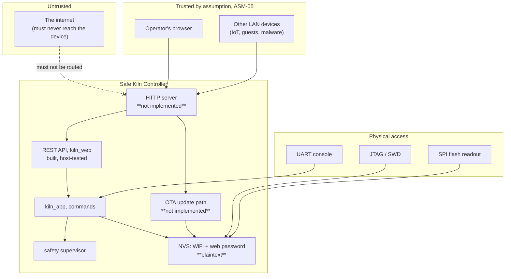

<!--
SPDX-FileCopyrightText: 2026 Bitcrush Testing
SPDX-License-Identifier: GPL-3.0-or-later
-->

# Safe Kiln Controller, Security Concept

| | |
|---|---|
| **Document** | Security Concept |
| **Project** | Safe Kiln Controller, PID kiln controller |
| **Version** | 0.1 (draft) |
| **Date** | 2026-10-05 |
| **Status** | For review |
| **Derives from** | [`requirements.sdoc`](requirements.sdoc) v0.1, [`architecture.md`](architecture.md) v0.1, [`safety.md`](safety.md) v0.1 |
| **License** | GPL-3.0-or-later |

---

> **Safe Kiln Controller is designed for a trusted local network and nothing else**
> ([`NFR-20`](requirements.sdoc),
> [`ASM-05`](requirements.sdoc)). It must not be exposed to the
> internet, port-forwarded, or placed on a network it shares with untrusted
> devices. There is **no transport encryption**: everything, the web password
> included, crosses the LAN in cleartext.
>
> This matters more here than on an ordinary appliance, because **a security
> compromise of this device is a safety event**. An attacker who can issue
> commands can start a multi-kilowatt heater. [§7](#7-security-as-a-safety-concern)
> is the part of this document that distinguishes it from a generic threat
> model, and it should be read before the controls.

## 1. Purpose and scope

[`safety.md`](safety.md) analyses what happens when the equipment *fails*. This
document analyses what happens when somebody *attacks* it, and the two meet at
one hazard: [`HZ-12`](safety.md#3-hazard-analysis), a remote command putting the
kiln into a dangerous state.

It covers the firmware's network-facing surfaces, its stored secrets, its
update path, and physical access to the board. It does not cover the security of
the user's own network, their browser, or their WiFi infrastructure, except to
say where Safe Kiln Controller depends on them.

Identifiers introduced here extend the scheme of
[requirements §1.4](requirements.sdoc) and of
[`safety.md` §1](safety.md#1-purpose-and-scope):

| Prefix | Meaning |
|---|---|
| `TH` | Threat |
| `SEC` | Security goal |
| `SRR` | Security residual risk |

**Status honesty.** Every control below is marked with what is actually true
today, and the marks are not decoration, most of this is **not built yet**:

| Mark | Meaning |
|---|---|
| **[built]** | Implemented and covered by an automated test |
| **[partial]** | Implemented in the host-testable core, but the piece that would enforce it on a device does not exist |
| **[spec]** | Required or designed, no implementation at all |
| **[absent]** | Not required, not designed, not present, a gap, named as one |

At the time of writing there is **no HTTP transport on the target**. The REST
API ([`kiln_web`](../firmware/components/kiln_web)) is complete and host-tested,
but the `esp_http_server` adapter that would terminate TCP, parse headers, check
a password and apply rate limiting **is not started**
([README status table](../README.md#status)). Nearly every network control in
this document therefore reads `[spec]`, and that is the single most important
fact in it.

## 2. Assets

What is worth attacking, in the order an attacker would care about.

| ID | Asset | Why it matters |
|---|---|---|
| **A-1** | **Control of the heater** | The kiln is a multi-kilowatt mains heater reaching 1350 °C. This is the asset; everything else is a means to it. |
| **A-2** | **The safety configuration** | Maximum chamber temperature, runaway thresholds, current limits. Loosening these does not start a fire by itself, but it removes the layer that would stop one. |
| **A-3** | **The latched-fault state** | A latched fault is the mechanism that keeps a failed kiln off ([`SR-17`](requirements.sdoc)). Clearing one remotely re-arms a kiln that something has already gone wrong with. |
| **A-4** | **WiFi credentials** | `net.wifi_pass` is the user's network password, stored on the device. Its loss is a breach of their network, not merely of this device. |
| **A-5** | **The web password** | `security.web_password`, guarding A-1 to A-3. |
| **A-6** | **The firmware image** | Write access to it is total and persistent control of A-1. |
| **A-7** | **Firing programs and run history** | Commercially meaningful to a production potter; the lowest-value asset here, and the only one whose loss is purely a privacy matter. |

## 3. Attack surface and trust boundaries

The trust boundaries, named:

| # | Boundary | Crossed by | Enforced by |
|---|---|---|---|
| **B-1** | Internet → LAN | Nothing, by assumption | The user's router. Safe Kiln Controller has no control here and no defence if it is wrong. |
| **B-2** | LAN → device | Every HTTP request | The HTTP transport, **which does not exist**. |
| **B-3** | Unauthenticated → authenticated | State-changing requests | [`kiln_api_needs_auth`](../firmware/components/kiln_web/include/kiln_web/api.h) decides *which*; the transport would decide *whether*. |
| **B-4** | Request data → parser | Bodies, query strings, JSON | Bounded buffers in `kiln_web` **[built]**. |
| **B-5** | API → control | Commands | `kiln_app`; the safety supervisor holds heat authority regardless ([`AD-04`](architecture.md#3-key-decisions)). |
| **B-6** | Physical → device | UART, JTAG, flash | **Nothing.** No secure boot, no flash encryption. |

## 4. Adversaries

| ID | Adversary | Capability | Realistic? |
|---|---|---|---|
| **ADV-1** | **Another device on the LAN**: a compromised IoT gadget, a guest laptop, malware on a household machine | Full IP access to the device; no credentials | **Yes.** This is the normal case and the one `ASM-05` quietly assumes away. |
| **ADV-2** | **A malicious web page** the operator visits while on the same LAN | Can make cross-origin requests from the operator's browser; can attempt DNS rebinding to defeat the same-origin policy | **Yes**, and it needs no LAN foothold at all. |
| **ADV-3** | **Someone with brief physical access**: a shared studio, a classroom, a workshop | UART, JTAG, flash readout, reflash | **Yes**, given where kilns live. |
| **ADV-4** | **A later owner** of a second-hand or disposed device | Everything in flash | **Yes**, and nobody thinks about it. |
| **ADV-5** | **An attacker from the internet** | Only if the user port-forwards or the router is compromised | Only through a user error that the documentation must argue against. |
| **ADV-6** | **A supply-chain attacker** on a dependency | Code execution in the image | Low: no package manager at build time, assets vendored (`CON-04`), dependencies are ESP-IDF itself. |

## 5. Threats

Rated by consequence, not likelihood. "Safety" in the last column means the
threat reaches [`HZ-12`](safety.md#3-hazard-analysis) and therefore the hazards
behind it.

| ID | Threat | Via | Consequence | Safety? |
|---|---|---|---|---|
| **TH-01** | ~~**Unauthenticated command execution**~~, **closed by `FR-WEB-26`.** No network route can start a firing, abort one or command manual duty; the handlers are deleted, not disabled. |, |, | **Closed** |
| **TH-02** | ~~**Loosening the safety configuration**~~, **closed by `FR-WEB-26`.** `/api/config` is read-only; the maximum temperature and every safety threshold are writable only at the kiln. |, |, | **Closed** |
| **TH-03** | ~~**Clearing a latched fault remotely**~~, **closed by `FR-WEB-26`.** Acknowledgement happens in front of the kiln. The fault stays readable, which is what the banner needs. |, |, | **Closed** |
| **TH-04** | ~~**Hostile firmware upload**~~, **closed by `FR-UPD-01`.** No image is accepted over the network. Note the cost: the device now has **no field update path at all** (`OQ-08`), so a security fix needs a physical visit. |, |, | **Closed, at a price** |
| **TH-05** | **Cross-site request forgery / DNS rebinding** | ADV-2, the operator's own browser is the confused deputy | Reduced with TH-01..TH-04: the worst a forged request can now do is **edit a stored firing program**, which takes effect only if an operator starts it at the kiln | Indirect |
| **TH-06** | **Credential disclosure from flash** | ADV-3, ADV-4, plaintext NVS, no flash encryption | A-4 (the user's WiFi password) and A-5 | No, but it breaches the user's network |
| **TH-07** | **Credential disclosure on the wire** | No TLS; the password crosses the LAN in cleartext on every authenticated request | A-5, observable by ADV-1 | No |
| **TH-08** | **Password brute force** | Repeated requests against the auth check | A-5 | No |
| **TH-09** | **Denial of service**: socket exhaustion, oversized bodies, slow clients | B-2, B-4 | Loss of the web interface. Crucially **not** loss of control: the safety supervisor is a separate task on the other core (`AD-15`), and `NFR-02` bounds non-safety interference at 50 ms | No |
| **TH-10** | **Information disclosure through unauthenticated reads** | Every `GET` is unauthenticated by design | Telemetry, logs, programs, run history, network status (A-7) | No |
| **TH-11** | **Open provisioning access point** | `FR-NET-02` AP fallback; if `net.ap_pass` is empty the AP is open | Anyone in radio range reaches the provisioning page and can supply their own credentials | **Yes** |
| **TH-12** | **Physical console access** | UART console | The simulator build exposes fault injection and direct commands | **Yes**, on a sim build |
| **TH-13** | **mDNS/network reconnaissance** | `kiln.local` advertised on the LAN | Makes the device trivially discoverable; a precondition for the rest rather than a threat alone | No |

## 6. Security goals and the controls behind them

| ID | Security goal | Addresses | Controls, with honest status |
|---|---|---|---|
| **SEC-00** | **No network request shall change any device state at all.** | TH-01 to TH-05 | `FR-WEB-26`. **[built]** and tested: every request other than `GET` returns `403 read_only`, program authoring included since 2026-10-06, and the handlers are **deleted from the image** rather than gated by a flag. This is the strongest control in this document, and the only one that does not depend on the unwritten HTTP transport, because it is enforced in the API layer that *is* written. |
| ~~**SEC-01**~~ | ~~Only an authenticated client may change state~~ **Dissolved 2026-10-06**: no client may change state, authenticated or not. | TH-01, TH-02, TH-03 | `FR-WEB-23`. Route selection is **[built]**: [`kiln_api_needs_auth`](../firmware/components/kiln_web/src/api.cpp) returns true for every non-`GET` method, so a route added later is protected *by default* rather than by somebody remembering to list it. Enforcement is **[spec]**: `req->authenticated` is an input the API trusts, and nothing on the target sets it. |
| **SEC-02** | Credentials are never disclosed through the API | TH-06 | `FR-CFG-07`. **[built]** and tested: `net.wifi_pass`, `net.ap_pass` and `security.web_password` carry `KILN_CFG_F_SECRET`, and the config endpoint returns only whether a secret *is set*, never its value. There is no mode in which it returns one. |
| **SEC-03** | Every byte from the network is treated as hostile | TH-09, and memory-safety bugs generally | `NFR-19`. **[built]**: a declared maximum body per handler (2048 B), a bounded token budget (192), a bounded point budget (2000), caller-owned buffers, no allocation proportional to input, and responses streamed in bounded chunks rather than accumulated. Exercised by a fuzz suite and by ASan/UBSan in CI. |
| ~~**SEC-04**~~ | ~~Authentication resists guessing and timing analysis~~ **Dissolved 2026-10-06** with `FR-WEB-23`: there is no authentication, because there is nothing left to authenticate. This also closes [SRR-02](#9-residual-risk), which asked whether the password was stored as a salted hash or in plaintext. The password is gone. | none | none |
| **SEC-05** | Only a valid image for this target can be installed, and never mid-firing | TH-04 | `FR-UPD-03` (validity), `FR-UPD-04` (refused during a run or autotune), `FR-UPD-08` (authentication required), `FR-UPD-02` (rollback if it will not confirm). All **[spec]**. Note what is *not* required anywhere: a **signature**. See [SRR-04](#9-residual-risk). |
| **SEC-06** | The device reveals and transmits nothing to third parties |, | `NFR-21`, `CON-03`. **[built]** structurally: there is no cloud client, no telemetry, no analytics and no outbound connection in the codebase. This is a property of what was never written. |
| **SEC-07** | No hidden access |, | `NFR-22`: no hardcoded credentials, no undocumented ports, no default-enabled remote access. **[built]** by inspection; `AD-16` reinforces it, the UI uses only the public API, so there is no privileged back channel to find. |
| **SEC-08** | A compromised or overloaded web stack cannot affect control | TH-09 | **[built]**: `AD-15` pins control and safety to core 1 and networking to core 0; `AD-13` uses queues and immutable snapshots with no mutex on the control path; `NFR-02` bounds interference at 50 ms; `AD-04` keeps heat authority in the safety supervisor alone. This is the strongest security property the design has, and it came from the safety work. |
| **SEC-09** | Secrets at rest are protected from physical access | TH-06 | **[absent]**. No flash encryption, no secure boot, neither appears in `sdkconfig.defaults`. |
| **SEC-10** | Browser-originated requests cannot be forged | TH-05 | **Not needed.** CSRF matters because a forged request can act; with the interface read-only a forged request can only read, and the reads are public anyway (SRR-07). This is the one gap the read-only decision closed without any code. |
| **SEC-11** | Traffic is confidential and integrity-protected in transit | TH-07 | **[absent]** by decision, not oversight, see [SRR-03](#9-residual-risk). |

## 7. Security as a safety concern

This is the part that makes a kiln controller different from a thermostat.

[`safety.md` §5](safety.md#5-the-protection-layers) layers the protections by how
little each depends on software being correct. An attacker does not defeat those
layers by breaking them, **they defeat them by using them as designed**, from
the wrong side of the trust boundary:

| Protection layer | What an attacker does to it |
|---|---|
| **L1 control**: setpoint clamped to the configured maximum | Raise the configured maximum (TH-02). Still bounded by `SR-23`'s compile-time 1350 °C ceiling, which no configuration and therefore no attacker can raise. |
| **L2 safety supervisor**: 18 detection rules | Widen the thresholds (TH-02). `SR-22` bounds every range and forbids disabling a detection outright, so this degrades detection rather than removing it, a bound that was written for a careless operator and happens to hold against a hostile one. |
| **L3 charge pump and contactor** | **Nothing.** It is hardware, and it does not care who asked. An attacker commanding heat gets heat, but a hung or crashed MCU still drops the contactor. |
| **L4 watchdogs, brownout** | Nothing. |
| **L5 independent hardware cutout** | **Nothing, and this is the point.** It has its own sensor and its own contacts, and it is reachable from no network. Against TH-01 to TH-05 it is the only layer that holds unconditionally. |
| **L6 operator attendance** | Everything, if the operator is not there. `ASM-06` requires attendance during firing; an attack that starts a firing *when nobody expects one* removes L6 by surprise rather than by negligence. |

Three consequences worth stating plainly:

1. **`HR-13`'s independent cutout is a security control, not only a safety one.**
   It is the one protection in the entire design that no network attacker can
   reach, degrade, or reason about. Every argument for it in `safety.md` is
   strengthened, not duplicated, here.

2. **The bounded ranges of `SR-22` and the ceiling of `SR-23` do real security
   work.** They were written so an operator could not disable a detection; the
   effect is that TH-02 degrades the safety envelope within known limits instead
   of removing it. A future change that relaxes a bound "because the operator
   knows what they are doing" would also be widening an attack.

3. **`SR-18` blunts TH-03.** A latched fault cannot be cleared while its
   triggering condition is still observably true, and the check reuses the
   detector's own rule function. An attacker can clear a *stale* fault; they
   cannot clear a *live* one and then heat.

## 8. What the implementation already gets right

Recorded because a security document that lists only gaps misrepresents the
design, and because each of these is a property worth not losing.

- **Auth by method, not by list.** `kiln_api_needs_auth` protects every non-`GET`
  route. A new state-changing endpoint is protected the moment it exists; the
  failure mode of the usual approach, an enumerated allow-list somebody forgets
  to update, cannot occur.
- **Secrets cannot be read back.** `FR-CFG-07` is implemented and tested, and the
  config endpoint is generated from the same table that declares the flag, so a
  new secret field is redacted by construction rather than by a second edit.
- **No allocation proportional to input, anywhere.** The whole firmware contains
  zero `malloc`/`free`. An attacker cannot exhaust a heap that does not exist.
- **The dev harness binds to loopback only.** `host/webhost` listens on
  `INADDR_LOOPBACK`, not `INADDR_ANY`, and sets `authenticated = true`
  unconditionally, which is safe *precisely because* it is unreachable from the
  network. Worth never "fixing" into `INADDR_ANY` for convenience.
- **Fault injection is compile-gated.** The UART console that can inject relay
  and sensor faults exists only under `CONFIG_KILN_PLANT_SIM`, not in a
  production image.
- **Control is isolated from the network by construction** (SEC-08), which means
  the worst realistic DoS is a lost web interface, not a lost kiln.

## 9. Residual risk

| ID | Residual risk | Why it stands | Carried by | Mitigation today |
|---|---|---|---|---|
| **SRR-01** | **There is no authentication on a device, because there is no HTTP server on a device.** Every network control is a specification. | M6 is not implemented. | The project. | None. It is not a *live* exposure, an unimplemented server accepts no connections, but it must not be read as "the controls exist". **Nothing in this document may be cited as evidence of a deployed control.** |
| ~~**SRR-02**~~ | ~~The design and the data model disagree about the password.~~ **Closed 2026-10-06.** `security.web_password` is removed from the configuration schema. There is no password, no hash, and nothing to disagree about. |
| **SRR-03** | **No TLS.** The web password and every command cross the LAN in cleartext, readable by ADV-1. | A self-signed certificate on a `.local` name trains users to click through browser warnings, costs flash and RAM against a 2 MB OTA slot, and still cannot be verified. The honest trade was plaintext on a network already assumed trusted. | The owner of the network (`ASM-05`). | `NFR-20`'s "trusted LAN only", stated in the README, in `safety.md` and here. It is a real limitation, not a solved problem. |
| **SRR-04** | **Firmware images are validated but not authenticated.** `FR-UPD-03` requires checking an image is *valid for this target*; no requirement anywhere asks for a **signature**, and secure boot is not enabled. | Signing was never specified. | The project. | Only `FR-UPD-08`'s authentication stands between an attacker and TH-04, and that is `[spec]`. With secure boot absent, physical reflash (ADV-3) bypasses it entirely. |
| **SRR-05** | **Secrets are plaintext in flash.** No flash encryption. Anyone with the board reads the user's WiFi password. | Not specified; flash encryption also complicates development and field recovery. | The owner, and anyone who disposes of a device. | None. ADV-4 is the under-considered case: a device sold on or thrown out carries the credentials with it. |
| **SRR-06** | **No CSRF defence.** A page the operator visits can issue cross-origin requests to `kiln.local`, and DNS rebinding defeats the same-origin policy. | Not specified or designed. | The project. | None. Cheap to fix, validating `Origin`/`Host` costs almost nothing, and it should land *with* the transport rather than after it. |
| **SRR-07** | **All reads are unauthenticated**, and reads are now all there is. | `FR-WEB-23` is withdrawn; the interface is read-only. | The design, deliberately. | Defensible: the dashboard is meant to be glanceable and the data is low-value (A-7). But it is a decision, and `security.web_password` being set does **not** make the device private. |
| **SRR-11** | **No field update path.** Removing OTA closed TH-04 completely and left the device with no way to receive a fix, including a security fix, without physical access. | `FR-UPD-01` was inverted deliberately; the replacement is `OQ-08` and is not yet specified. | The project. **This blocks release**, not merely an open question. | None. A vulnerability found after shipping currently requires visiting every device. |
| **SRR-08** | **The AP fallback may be open.** `FR-NET-02` starts an access point with a provisioning page; nothing requires `net.ap_pass` to be non-empty. | No minimum-passphrase rule exists. | The installer. | None. The provisioning page is the most security-sensitive surface the device has, and it is the one most likely to be reachable without credentials. |
| **SRR-09** | **`ASM-05` is the assumption everything rests on, and it is usually false.** Home and studio LANs routinely carry compromised IoT devices and guest traffic. | A single-purpose controller cannot police its own network. | The owner. | VLAN or a dedicated network segment is the real answer; the documentation should say so rather than only saying "trusted". |

## 10. Obligations

### 10.1 On the owner and installer

| | Requirement |
|---|---|
| Do not expose the device to the internet; do not port-forward to it | `NFR-20`, SRR-03 |
| Prefer an isolated network segment or VLAN over a flat home LAN | SRR-09 |
| Set a web password; it is optional (`FR-WEB-23`) and the device ships without one | SEC-01 |
| Set an AP passphrase before relying on the provisioning fallback | SRR-08 |
| Treat physical access to the controller as equivalent to knowing the WiFi password | SRR-05 |
| **Erase flash before disposing of or selling a device** | SRR-05, ADV-4 |
| Fit the independent hardware over-temperature cutout; it is the only protection no attacker can reach | `HR-13`, [§7](#7-security-as-a-safety-concern) |

### 10.2 On anyone implementing the HTTP transport

This is the component that turns most of this document from specification into
fact. These are not suggestions.

| | Constraint |
|---|---|
| Resolve [SRR-02](#9-residual-risk) **first**: store a salted hash, never the password. Decide it before writing the comparison, not during. | `NFR-19` |
| Constant-time comparison; increasing delay after repeated failures. | `NFR-19`, SEC-04 |
| Validate `Origin`/`Host` on every state-changing request. The cost is trivial and SRR-06 is otherwise permanent. | SRR-06 |
| Set `req.authenticated` **only** after a successful check. It is an input the API trusts absolutely. | SEC-01 |
| Never add a back channel for the UI. `AD-16` is a security property, not a tidiness preference. | `FR-WEB-19`, `AD-16` |
| Enforce the declared body maximum *before* parsing, not during. | `NFR-19`, SEC-03 |
| Keep the server on core 0. Heat authority stays with the safety supervisor. | `AD-15`, `AD-04`, SEC-08 |
| Do not bind the dev harness to anything but loopback. | [§8](#8-what-the-implementation-already-gets-right) |

### 10.3 On the project

| | Constraint |
|---|---|
| A new state-changing route must not bypass `kiln_api_needs_auth`'s method rule. | SEC-01 |
| A new configuration field holding a credential must carry `KILN_CFG_F_SECRET`. | `FR-CFG-07`, SEC-02 |
| No dependency may be fetched at build time; assets stay vendored. | `CON-04`, ADV-6 |
| No telemetry, no analytics, no outbound connection, ever. | `NFR-21`, SEC-06 |
| Relaxing a bound in `SR-22` or the ceiling in `SR-23` widens an attack surface, not just a safety envelope. | [§7](#7-security-as-a-safety-concern) |

## 11. Verification

| Claim | How it is verified | Status |
|---|---|---|
| Secrets are never serialised outward | Host unit test over every `SECRET`-flagged field, plus the API suite | **Verified** |
| Parsers survive hostile input | `test_fuzz_logrec`, the JSON and API suites, all under ASan/UBSan in CI | **Verified** for the codec and API; the HTTP layer does not exist to fuzz |
| No allocation proportional to input | Structural, zero `malloc`/`free` in the firmware; `tools/tidy.sh` enforces the check set | **Verified** |
| Control is unaffected by web load | `NFR-02` timing tests | **Not performed**: needs the transport and on-target instrumentation |
| Authentication is constant-time and rate-limited |, | **Not performed**: nothing to test |
| OTA rejects an invalid or unauthenticated image |, | **Not performed**: nothing to test |
| CSRF defences |, | **None designed** |

The pattern is the same one `safety.md` §10 reports: what exists in the
host-testable core is tested well, and what needs a device is untested because
it is unbuilt.

## 12. Open questions

| | Question |
|---|---|
| ~~**OQ-S1**~~ | ~~Salted hash or plaintext for the web password?~~ **Answered 2026-10-06 by removing the question.** The interface is read-only, so there is no password. |
| **OQ-S2** | Should firmware images be signed (`FR-UPD-03` requires validity, not authenticity), and should secure boot be enabled? Both have real field-recovery costs for an open-source device users are expected to build themselves. |
| **OQ-S3** | Should flash encryption be enabled by default, given it complicates self-builders and field debugging but is the only answer to SRR-05? |
| **OQ-S4** | Should `net.ap_pass` have an enforced minimum, or should the AP refuse to start open? |
| ~~**OQ-S5**~~ | ~~Should read endpoints require authentication when a password is set?~~ **Moot 2026-10-06**: there is no password to set. The question of whether the dashboard should be private at all remains, as [SRR-07](#9-residual-risk). |
| Threat | Security goals | Requirements | Safety hazard |
|---|---|---|---|
| TH-01 Unauthenticated commands | SEC-01, SEC-08 | `FR-WEB-23`, `NFR-19` | `HZ-12` |
| TH-02 Loosened safety config | SEC-01 | `FR-CFG-08`, `SR-22`, `SR-23` | `HZ-02`, `HZ-10` |
| TH-03 Remote fault clear | SEC-01 | `SR-17`, `SR-18` | `HZ-08` |
| TH-04 Hostile firmware | SEC-05 | `FR-UPD-02`–`FR-UPD-04`, `FR-UPD-08` | `HZ-01` |
| TH-05 CSRF / DNS rebinding | SEC-10 |, (gap) | `HZ-12` |
| TH-06 Secrets from flash | SEC-02, SEC-09 | `FR-CFG-07` |, |
| TH-07 Secrets on the wire | SEC-11 | `NFR-20` |, |
| TH-08 Brute force | SEC-04 | `NFR-19` |, |
| TH-09 Denial of service | SEC-03, SEC-08 | `NFR-02`, `NFR-19`, `AD-13`, `AD-15` |, |
| TH-10 Unauthenticated reads | SEC-07 | `FR-WEB-23` |, |
| TH-11 Open provisioning AP | SEC-01 | `FR-NET-02` | `HZ-12` |
| TH-12 Physical console | SEC-09 | `NFR-24` | `HZ-12` |
| TH-13 Reconnaissance |, | `FR-NET-05` |, |

| Security goal | Status | Residual risk |
|---|---|---|
| SEC-01 Authenticated state change | [partial], routing built, enforcement absent | SRR-01 |
| SEC-02 No credential disclosure via API | **[built]** |, |
| SEC-03 Hostile input handling | **[built]** |, |
| SEC-04 Resistant authentication | [spec] | SRR-01, SRR-02 |
| SEC-05 Trustworthy updates | [spec] | SRR-04 |
| SEC-06 No third-party transmission | **[built]** |, |
| SEC-07 No hidden access | **[built]** | SRR-07 |
| SEC-08 Control isolated from network | **[built]** |, |
| SEC-09 Secrets at rest | **[absent]** | SRR-05 |
| SEC-10 CSRF resistance | **[absent]** | SRR-06 |
| SEC-11 Transport security | **[absent]** by decision | SRR-03 |
