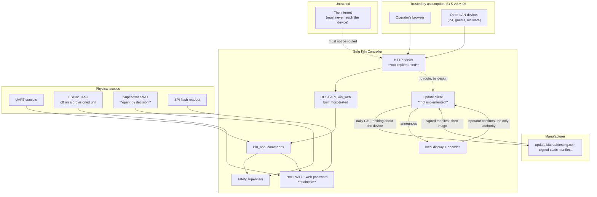

<!--
SPDX-FileCopyrightText: 2026 Bitcrush Testing
SPDX-License-Identifier: GPL-3.0-or-later
-->

# Safe Kiln Controller, Security Concept

| | |
|---|---|
| **Document** | Security Concept |
| **Project** | Safe Kiln Controller, PID kiln controller |
| **Version** | 0.1 (draft) |
| **Date** | 2026-10-09 |
| **Status** | For review |
| **Derives from** | [`03_software_req.sdoc`](03_software_req.sdoc) v0.1, [`architecture.md`](architecture.md) v0.1, [`safety.md`](safety.md) and [`safety.sdoc`](safety.sdoc) v0.1 |
| **License** | GPL-3.0-or-later |

---

> **Safe Kiln Controller is designed for a trusted local network and nothing else**
> ([`SWR-NFR-20`](03_software_req.sdoc),
> [`SYS-ASM-05`](02_system_req.sdoc)). It must not be exposed to the
> internet, port-forwarded, or placed on a network it shares with untrusted
> devices. There is **no transport encryption**: everything, the web password
> included, crosses the LAN in cleartext.
>
> This matters more here than on an ordinary appliance, because **a security
> compromise of this device is a safety event**. An attacker who can issue
> commands can start a multi-kilowatt heater. [§7](#7-security-as-a-safety-concern)
> is the part of this document that distinguishes it from a generic threat
> model, and it should be read before the controls.

## 1. Purpose and scope

[`safety.md`](safety.md) analyses what happens when the equipment *fails*. This
document analyses what happens when somebody *attacks* it, and the two meet at
one hazard: [`HZ-12`](safety.sdoc), a remote command putting the
kiln into a dangerous state.

It covers the firmware's network-facing surfaces, its stored secrets, its
update path, and physical access to the board. It does not cover the security of
the user's own network, their browser, or their WiFi infrastructure, except to
say where Safe Kiln Controller depends on them.

The split between this document and [`security.sdoc`](security.sdoc) follows the
one between [`safety.md`](safety.md) and [`safety.sdoc`](safety.sdoc). The
assets, adversaries, threats, security goals, residual risks and open questions
are nodes in `security.sdoc`, because they have identity and a chain between
them that is now checked when the document is built. The reasoning is here: the
scope, the trust boundaries, section 7 on why a security compromise is a safety
event, what the implementation already gets right, the obligations and the
verification status.

Identifiers introduced by this concept extend the scheme of
[requirements §1.4](03_software_req.sdoc) and of
[`safety.md` §1](safety.md#1-purpose-and-scope), and are defined as nodes in
[`security.sdoc`](security.sdoc):

| Prefix | Meaning |
|---|---|
| `A` | Asset |
| `ADV` | Adversary |
| `TH` | Threat |
| `SEC` | Security goal |
| `SRR` | Security residual risk |
| `OQ-S` | Open question, security |

The trust boundaries `B-1` to `B-7` are **not** nodes, and that is deliberate:
they are the legend of the diagram in [§3](#3-attack-surface-and-trust-boundaries)
and carry no chain through them, so splitting them from the picture would help
nobody.

Note for anyone reading `03_software_req.sdoc` alongside this: its section anchors
used to be `SEC-n`, which collided with the security goals here once both became
StrictDoc documents. They are `SECT-n` now. `SEC` means security goal.

**Status honesty.** Every control below is marked with what is actually true
today, and the marks are not decoration, most of this is **not built yet**:

| Mark | Meaning |
|---|---|
| **[built]** | Implemented and covered by an automated test |
| **[partial]** | Implemented in the host-testable core, but the piece that would enforce it on a device does not exist |
| **[spec]** | Required or designed, no implementation at all |
| **[absent]** | Not required, not designed, not present, a gap, named as one |

At the time of writing there is **no HTTP transport on the target**. The REST
API ([`kiln_web`](../firmware/components/kiln_web)) is complete and host-tested,
but the `esp_http_server` adapter that would terminate TCP, parse headers, check
a password and apply rate limiting **is not started**
([README status table](../README.md#status)). Nearly every network control in
this document therefore reads `[spec]`, and that is the single most important
fact in it.

## 2. Assets

The seven assets live in [`security.sdoc`](security.sdoc), not here, each with
what it is and why it matters. `A-1`, control of the heater, is the asset;
everything else is a means to it.

## 3. Attack surface and trust boundaries

The trust boundaries, named:

| # | Boundary | Crossed by | Enforced by |
|---|---|---|---|
| **B-1** | Internet → LAN | Nothing, by assumption | The user's router. Safe Kiln Controller has no control here and no defence if it is wrong. |
| **B-2** | LAN → device | Every HTTP request | The HTTP transport, **which does not exist**. |
| **B-3** | Unauthenticated → authenticated | State-changing requests | [`kiln_api_needs_auth`](../firmware/components/kiln_web/include/kiln_web/api.h) decides *which*; the transport would decide *whether*. |
| **B-4** | Request data → parser | Bodies, query strings, JSON | Bounded buffers in `kiln_web` **[built]**. |
| **B-5** | API → control | Commands | `kiln_app`; the safety supervisor holds heat authority regardless ([`SWA-04`](architecture.md#3-key-decisions)). |
| **B-6** | Physical → device | UART, JTAG, SWD, flash | **Asymmetric, and [§6.1](#61-the-physical-boundary-and-what-each-mcu-can-do-about-it) is why.** On the ESP32, Secure Boot V2 and JTAG disable exist as a provisioning step and are **not** applied by a default build. On the supervisor, **nothing, by decision**. No flash encryption anywhere. |
| **B-7** | Device → manufacturer's update service | One daily outbound HTTPS GET, originated by the device | Authenticity comes from an **offline** signing key, not from the connection ([§6.2](#62-the-update-path-and-why-it-points-outwards)); the install needs a person at the display. Nothing inbound crosses this boundary, and nothing about the device goes out across it. **[spec]** |

## 4. Adversaries

The six adversaries live in [`security.sdoc`](security.sdoc), each with its
capability and an honest answer to whether it is realistic. `ADV-1`, another
device on the same LAN, is the normal case and the one `SYS-ASM-05` quietly assumes
away.

## 5. Threats

The fifteen threats live in [`security.sdoc`](security.sdoc), rated by
consequence rather than likelihood. Each names the asset it is aimed at, the
adversary who can mount it, and, where it gets there, the **safety hazard** it
reaches: that last relation is the claim this document exists to make, and it is
now a link to a node in [`safety.sdoc`](safety.sdoc) rather than a sentence.

Three of them, `TH-01` to `TH-03`, are `Resolved`, closed outright by the
read-only decision of 2026-10-06. They are kept rather than deleted, because why
a threat is closed is the most useful thing about it.

`TH-04`, hostile firmware, was the fourth until 2026-10-09 and is **`Active`
again**. It was closed by the absence of an update path, and a threat closed by
an absence reopens when the feature arrives: see [§6.2](#62-the-update-path-and-why-it-points-outwards).
`TH-14` and `TH-15`, a hostile or impersonated update service and a downgrade to
a published vulnerability, are new with it, and are the honest price of the path.

## 6. Security goals and the controls behind them

The fifteen security goals live in [`security.sdoc`](security.sdoc), each with the
threats it addresses, the requirements that realise it, and an
`IMPLEMENTATION` field carrying what used to be a `[built]` / `[partial]` /
`[spec]` / `[absent]` mark in this table.

That field is the one to read first. At the time of writing it stands at **6
built, 1 partial, 5 spec, 2 absent, 1 not needed**, and the reason is that there
is still **no HTTP transport on the target**: the REST API is complete and
host-tested, but the adapter that would terminate TCP, parse headers and apply
rate limiting is not started. Nearly every network control is therefore a
specification, and that remains the single most important fact in this document.

`SEC-01` and `SEC-04` are `Withdrawn`, dissolved on 2026-10-06 along with the
password itself.

### 6.1 The physical boundary, and what each MCU can do about it

`B-6` is the only boundary where the two microcontrollers of
[`SWA-22`](04_software_arch.sdoc) differ, and most of the difference is a
property of the silicon rather than a decision anybody is free to revisit. It is
written out here because a single "nothing" in the table above was true until
2026-10-08 and is now true of one half.

**The ESP32-S3: Secure Boot V2, built and off by default.**
[`sdkconfig.secure`](../firmware/controller/sdkconfig.secure) builds a signed
image, and [`tools/secure-boot.py`](../tools/secure-boot.py) signs it, flashes
it, burns the public-key digest, enables secure boot and disables JTAG, in that
order, refusing each irreversible step until a pre-flight check passes. A board
that has been through it will not run unsigned code and has no debug port. A
board that has not is exactly what `B-6` used to say, and **a default build is
not provisioned**, so the honest status of this control is that the mechanism is
**[built]** and whether a given unit carries it is a production decision. Three
things it does not do, each deliberate and each argued in the header of
`sdkconfig.secure`: it does not burn `DIS_DOWNLOAD_MODE`, because `SRR-11`
leaves serial download as the only route a security fix can take; it does not
enable flash encryption, which is `OQ-S3`, so `SRR-05` stands untouched; and it
does nothing whatever for the supervisor.

**The supervisor: no secure boot exists to enable.** The
[STM32G031K8T6](../firmware/supervisor/README.md#the-part-stm32g031k8t6) has
nothing corresponding to Secure Boot V2. There is no ROM-verified signature
chain on the G0 line, no one-time-programmable key store, and on this part no
AES, no hardware random number generator and no public-key accelerator, so a
signature chain would have to be written in software and keyed from ordinary
flash, which an adversary able to reflash can replace along with the image it
verifies. What the part does offer is readout and boot protection through option
bytes:

| Mechanism | What it does | Reversible |
|---|---|---|
| **RDP Level 1** | Flash readout blocked from the debugger and the system bootloader; debug can still attach | Yes, and regression to Level 0 mass-erases the flash |
| **RDP Level 2** | SWD permanently dead, system bootloader gone, option bytes frozen | **No.** No vendor recovery, ever |
| **WRP** | Write and erase protection over a flash area | Yes, unless Level 2 is set |
| **Securable memory + `BOOT_LOCK`** | A region that runs at boot and is then inaccessible until reset, with boot forced from main flash | Clearing it needs an RDP regression on this family; confirm against RM0444 before putting it on a line |
| **`nBOOT_SEL` / `nBOOT0`** | Makes the `BOOT0` pin irrelevant and selects main flash | Yes |

**No readout protection is set, and RDP Level 2 must not be.** Three reasons, in
the order of their weight:

1. **There is nothing on the supervisor to keep.** It holds no WiFi
   credentials, no password and no key: `A-2` and `A-3` live in the ESP32's NVS,
   which is why the diagram above routes `SWD` to the safety supervisor and not
   to `NVS`. Its firmware is published under the GPL. RDP is a confidentiality
   control, and here it would protect a public artefact.

2. **It would contradict the independence argument.**
   [`firmware/supervisor/README.md`](../firmware/supervisor/README.md) requires
   SWD on `PA13`/`PA14` brought out to test points rather than left as pads,
   "because the independence argument rests on this firmware being reviewable
   and flashable on its own". Level 2 removes bench bring-up of the transport
   code that has never run on silicon, read-back of the image as evidence for an
   assessment against EN IEC 60730-1 Annex H, diagnosis of a returned unit, and
   any safety fix short of replacing the part. `SRR-11` already records that
   there is no field update path; closing SWD would extend that from the
   controller to the safety function.

3. **It does not close the attack it appears to close.** The threat is `ADV-3`
   reflashing the supervisor so that it permits heat unconditionally. The same
   adversary, at the same board, can jumper the permit line instead, which is
   cheaper and needs no firmware at all, and `SYS-HW-13`'s independent cutout is
   untouched either way ([§7](#7-security-as-a-safety-concern), L5).
   [§10.1](#101-on-the-owner-and-installer) already asks the owner to treat
   physical access as equivalent to knowing the WiFi password. Locking one of
   the two MCUs against an adversary this concept places outside its scope would
   buy a word in a table and cost the ability to service the part that holds
   heat authority.

What is done instead is two option-byte settings with a safety argument rather
than a security one, and one runtime check that is already running:

- **Boot forced from main flash**, through `nBOOT_SEL` and `nBOOT0`
  **[spec]**. Not a security control: it removes a state in which a floating or
  noise-latched `BOOT0` leaves the part in the system bootloader with the permit
  line high-impedance, which is a supervisor that is silently not running. The
  external pull-down the pin map already requires makes that state *safe*; this
  removes the state.
- **Write protection over the image**, through WRP **[spec]**. The supervisor
  firmware contains no flash-write code at all, so this guards against a runaway
  rather than against a bug anybody can point to. It is reversible and it costs
  nothing.
- **CRC-32 over the whole image, ten times a second** **[built]**:
  `sup_flash_ok`, against a digest stamped in after linking by
  [`tools/sup-crc.py`](../tools/sup-crc.py), with an unstamped image treated as
  a failure rather than as "no expectation". This is the program-memory
  integrity control that actually runs, and it catches the realistic fault,
  which is corrupted flash and not hostile flash. No option byte does that, and
  it carries no `SWR-` of its own, which is a gap in the requirements rather
  than in the firmware.

`OQ-S2` asked whether images should be signed and secure boot enabled, and is
`Resolved` by the two halves above. `SRR-04` stands anyway, because a default
build is unsigned and an unprovisioned board authenticates nothing.

### 6.2 The update path, and why it points outwards

**Decided 2026-10-09, resolving `OQ-08` and `OQ-R4`.** The device checks
`update.bitcrushtesting.com` once a day, announces an available release on its
**local display**, and installs it only when the operator confirms there. The web
interface stays read-only. `SWR-UPD-09` to `SWR-UPD-16` are the requirements;
this is why they are shaped that way.

The driver is regulatory and is not negotiable:
[`UR-REG-004`](01_user_req.sdoc), the Cyber Resilience Act, requires that
security fixes can reach a unit, and `SRR-11` recorded that they could not reach
this one without a visit. `OQ-R4` asked whether that made the sold-units route
impossible, and the answer is no, provided this gets built.

**The direction is the whole design.** The question `OQ-08` left open offered two
shapes, and they are not equally priced:

| | What it needs | What it costs |
|---|---|---|
| **Push**: an image staged over the LAN, applied after a physical confirmation | One inbound `POST` route, live whenever the device is armed | `SEC-00` stops being "no network request changes any device state **at all**" and becomes "read-only except for firmware". The strongest control in this document acquires an exception |
| **Pull**: the device fetches, the operator confirms at the display | One outbound GET, and a service to run for the support period | `SEC-00` keeps its absolute form. A new outbound connection, and a dependency on the manufacturer |

Pull wins because the exception is the expensive part. An inbound route exists
whether or not anybody is standing at the kiln; an outbound GET creates nothing
for an attacker on the LAN to talk to. `SWR-WEB-26` and `SEC-00` are therefore
unchanged by this decision, which is the single most useful sentence in this
subsection.

**The mechanism, and what each step is for.**

- **A static, signed manifest.** One file, byte-identical for every device,
  fetched over HTTPS. It is signed with an **offline** key and verified against a
  public key compiled into the image (`SWR-UPD-11`). The version comparison
  happens on the device, which is what lets the request carry nothing about the
  device at all (`SWR-UPD-10`): no serial, no installed version, no query
  string. The service learns an IP and a time, and that is `SRR-13`.
- **TLS that is required and not load-bearing.** Certificate validation is
  mandatory, and the design assumes it will fail one day anyway. An attacker who
  takes the host, spoofs the DNS or breaks the connection cannot produce a
  manifest or an image that verifies, so what they get is **silence**: a fix
  that never arrives rather than a hostile one that does. That failure mode is
  `SRR-12`, not a pretence that it cannot happen.
- **The display is the only authority.** No request can initiate, offer,
  authorise, postpone or cancel an install (`SWR-UPD-08`). The device decides
  when to *ask*; the person at the kiln decides whether to *install*
  (`SWR-UPD-12`, `SWR-HMI-16`).
- **Strictly greater versions only.** `SWR-UPD-13` refuses any image that is not
  newer than the running one, because a signature does not stop a replay: an old
  manifest is genuinely signed and its vulnerability is published. That is
  `TH-15`.
- **The new image earns its keep.** `SWR-UPD-15` lets a first boot cancel its
  rollback only after the supervisor link, both thermocouples, the stored
  configuration and the display have all proved themselves in the running
  system. Cancelling it in start-up code is named as a defect, because that is
  the usual way this feature is reduced to decoration.
- **USB stays** (`SWR-UPD-14`), as the recovery path for a unit whose service is
  unreachable, whose image will not confirm itself, or which has to be
  downgraded deliberately. It is also what survives the project losing the
  domain.

**Why the install is not automatic.** The CRA expects security updates to
install automatically by default *where applicable*, and this design deliberately
does not. The basis is the one in [§7](#7-security-as-a-safety-concern): this
device switches kilowatts into a kiln, and rebooting into untried firmware
unattended with a load inside is not an acceptable trade for promptness. The
*check* is automatic and on by default; only the install waits for a person. A
conformity file has to make that argument explicitly rather than leave the
omission to be found, which is why it is also written into `SWR-UPD-12` and
[`UR-REG-004`](01_user_req.sdoc)'s assessment.

**What this costs, stated as plainly as §6.1 states its own trade.** `TH-04` is
`Active` again after being closed on 2026-10-06; `TH-14` and `TH-15` are new;
`SEC-06` narrows from "no outbound connection" to "one outbound connection, to
the manufacturer, carrying nothing about the device"; and `SRR-12` and `SRR-13`
are new residual risks, one carried by the project and one by the owner. Against
that, `SEC-00` is untouched, `SRR-11` has a specified answer, and the sold-units
route stops being blocked by a decision nobody had taken.

**The eFuse anti-rollback counter is deliberately not burnt.** It would stop a
downgrade in hardware, which sounds strictly better than `SWR-UPD-13` doing it in
software, and it is not: the counter has few increments, it cannot be undone, and
it would make the fuse rather than the operator the thing that decides whether a
unit can ever be recovered. The same reasoning as `DIS_DOWNLOAD_MODE` in §6.1,
and the same conclusion.

**Status: all of this is `[spec]`.** The HTTP client, the manifest verifier, the
update screen and the rollback discipline are unwritten, on a target that has no
HTTP transport either (`SRR-01`). `SEC-12` carries the goal, `SRR-11` stays open,
and the deadline that matters is 11 December 2027 for the CRA's main
obligations, with the reporting route live from 11 September 2026.

## 7. Security as a safety concern

This is the part that makes a kiln controller different from a thermostat.

[`safety.md` §5](safety.md#5-the-protection-layers) layers the protections by how
little each depends on software being correct. An attacker does not defeat those
layers by breaking them, **they defeat them by using them as designed**, from
the wrong side of the trust boundary:

| Protection layer | What an attacker does to it |
|---|---|
| **L1 control**: setpoint clamped to the configured maximum | Raise the configured maximum (TH-02). Still bounded by `SWR-SAF-23`'s compile-time 1350 °C ceiling, which no configuration and therefore no attacker can raise. |
| **L2 safety supervisor**: 18 detection rules | Widen the thresholds (TH-02). `SWR-SAF-22` bounds every range and forbids disabling a detection outright, so this degrades detection rather than removing it, a bound that was written for a careless operator and happens to hold against a hostile one. |
| **L3 charge pump and contactor** | **Nothing.** It is hardware, and it does not care who asked. An attacker commanding heat gets heat, but a hung or crashed MCU still drops the contactor. |
| **L4 watchdogs, brownout** | Nothing. |
| **L5 independent hardware cutout** | **Nothing, and this is the point.** It has its own sensor and its own contacts, and it is reachable from no network. Against TH-01 to TH-05 it is the only layer that holds unconditionally. |
| **L6 operator attendance** | Everything, if the operator is not there. `SYS-ASM-06` requires attendance during firing; an attack that starts a firing *when nobody expects one* removes L6 by surprise rather than by negligence. |

Four consequences worth stating plainly:

1. **`SYS-HW-13`'s independent cutout is a security control, not only a safety one.**
   It is the one protection in the entire design that no network attacker can
   reach, degrade, or reason about. Every argument for it in `safety.md` is
   strengthened, not duplicated, here.

2. **The bounded ranges of `SWR-SAF-22` and the ceiling of `SWR-SAF-23` do real security
   work.** They were written so an operator could not disable a detection; the
   effect is that TH-02 degrades the safety envelope within known limits instead
   of removing it. A future change that relaxes a bound "because the operator
   knows what they are doing" would also be widening an attack.

3. **`SWR-SAF-18` blunts TH-03.** A latched fault cannot be cleared while its
   triggering condition is still observably true, and the check reuses the
   detector's own rule function. An attacker can clear a *stale* fault; they
   cannot clear a *live* one and then heat.

4. **Firmware is the one route that reaches every layer at once, which is why
   L6 is where the update path is anchored.** An attacker who replaces the
   firmware does not have to defeat L1, L2 or L4: they *are* L1, L2 and L4, and
   only L3 and L5 remain, both of which are hardware. That is `TH-04`, and it is
   why the update path of [§6.2](#62-the-update-path-and-why-it-points-outwards)
   puts the decision on the local display rather than on the network.
   The person in front of the kiln is L6, and giving them the only authority over
   what firmware installs makes the weakest layer in the table the gate on the
   strongest attack. It also means the argument for not installing updates
   automatically is a safety argument, not a convenience one.

## 8. What the implementation already gets right

Recorded because a security document that lists only gaps misrepresents the
design, and because each of these is a property worth not losing.

- **Auth by method, not by list.** `kiln_api_needs_auth` protects every non-`GET`
  route. A new state-changing endpoint is protected the moment it exists; the
  failure mode of the usual approach, an enumerated allow-list somebody forgets
  to update, cannot occur.
- **Secrets cannot be read back.** `SWR-CFG-07` is implemented and tested, and the
  config endpoint is generated from the same table that declares the flag, so a
  new secret field is redacted by construction rather than by a second edit.
- **No allocation proportional to input, anywhere.** The whole firmware contains
  zero `malloc`/`free`. An attacker cannot exhaust a heap that does not exist.
- **The dev harness binds to loopback only.** `host/webhost` listens on
  `INADDR_LOOPBACK`, not `INADDR_ANY`, and sets `authenticated = true`
  unconditionally, which is safe *precisely because* it is unreachable from the
  network. Worth never "fixing" into `INADDR_ANY` for convenience.
- **Fault injection is compile-gated.** The UART console that can inject relay
  and sensor faults exists only under `CONFIG_KILN_PLANT_SIM`, not in a
  production image.
- **Control is isolated from the network by construction** (SEC-08), which means
  the worst realistic DoS is a lost web interface, not a lost kiln.

## 9. Residual risk

The thirteen security residual risks live in [`security.sdoc`](security.sdoc), each
with why it stands, **who carries it**, and what mitigation exists today. Four
are worth naming here: `SRR-01`, that every network control is a specification
and **nothing in this concept may be cited as evidence of a deployed control**;
`SRR-11`, which used to say that removing OTA left no way to receive a security
fix and now says that the way is specified and unbuilt, and which still **blocks
release**; and `SRR-12` and `SRR-13`, the two new costs of
[§6.2](#62-the-update-path-and-why-it-points-outwards), being the manufacturer's
service and signing key as a dependency, and the daily check disclosing that a
device exists. `SRR-14` is the fourth and the least technical: the Cyber
Resilience Act obligations that are **not** firmware have no owner, which
[§13](#13-the-cyber-resilience-act-what-is-left) exists to stop being invisible.

There is no `SRR-10`. The numbering has a gap, and keeping it costs less than
renumbering identifiers other documents cite.

## 10. Obligations

### 10.1 On the owner and installer

| | Requirement |
|---|---|
| Do not expose the device to the internet; do not port-forward to it | `SWR-NFR-20`, SRR-03 |
| Prefer an isolated network segment or VLAN over a flat home LAN | SRR-09 |
| Set a web password; it is optional (`SWR-WEB-23`) and the device ships without one | SEC-01 |
| Set an AP passphrase before relying on the provisioning fallback | SRR-08 |
| Treat physical access to the controller as equivalent to knowing the WiFi password | SRR-05 |
| **Erase flash before disposing of or selling a device** | SRR-05, ADV-4 |
| Fit the independent hardware over-temperature cutout; it is the only protection no attacker can reach | `SYS-HW-13`, [§7](#7-security-as-a-safety-concern) |
| Let the controller reach `update.bitcrushtesting.com` outbound, or mirror the manifest and point `update.url` at the mirror. A segment with no outbound route gets no security fixes | `SWR-UPD-09`, SRR-13 |
| Install an offered update, and understand that it waits for you: nothing installs itself | `SWR-UPD-12`, SRR-11 |
| If you disable the check, take on the job of watching the release channel yourself | `SWR-UPD-09`, SRR-13 |

### 10.2 On anyone implementing the HTTP transport

This is the component that turns most of this document from specification into
fact. These are not suggestions.

| | Constraint |
|---|---|
| Resolve [SRR-02](#9-residual-risk) **first**: store a salted hash, never the password. Decide it before writing the comparison, not during. | `SWR-NFR-19` |
| Constant-time comparison; increasing delay after repeated failures. | `SWR-NFR-19`, SEC-04 |
| Validate `Origin`/`Host` on every state-changing request. The cost is trivial and SRR-06 is otherwise permanent. | SRR-06 |
| Set `req.authenticated` **only** after a successful check. It is an input the API trusts absolutely. | SEC-01 |
| Never add a back channel for the UI. `SWA-16` is a security property, not a tidiness preference. | `SWR-WEB-19`, `SWA-16` |
| Enforce the declared body maximum *before* parsing, not during. | `SWR-NFR-19`, SEC-03 |
| Keep the server on core 0. Heat authority stays with the safety supervisor. | `SWA-15`, `SWA-04`, SEC-08 |
| Do not bind the dev harness to anything but loopback. | [§8](#8-what-the-implementation-already-gets-right) |
| Do not add an inbound firmware route while you are in there. The update path points outwards on purpose, and `SEC-00`'s absolute form is what that bought. | `SWR-UPD-01`, `SWR-UPD-08`, [§6.2](#62-the-update-path-and-why-it-points-outwards) |

### 10.3 On the project

| | Constraint |
|---|---|
| A new state-changing route must not bypass `kiln_api_needs_auth`'s method rule. | SEC-01 |
| A new configuration field holding a credential must carry `KILN_CFG_F_SECRET`. | `SWR-CFG-07`, SEC-02 |
| No dependency may be fetched at build time; assets stay vendored. | `UR-CON-04`, ADV-6 |
| No telemetry, no analytics, no outbound connection, ever. | `SWR-NFR-21`, SEC-06 |
| Relaxing a bound in `SWR-SAF-22` or the ceiling in `SWR-SAF-23` widens an attack surface, not just a safety envelope. | [§7](#7-security-as-a-safety-concern) |
| **RDP Level 2 must not be set on the supervisor.** SWD stays reachable, and the reasons are not matters of taste. | [§6.1](#61-the-physical-boundary-and-what-each-mcu-can-do-about-it), SRR-11 |
| Provisioning a unit with secure boot makes the key holder the only party who can ever update it. Decide whose unit it is before burning. | SRR-11, OQ-S2 |
| The manifest signing key stays **offline** and is not the secure boot key. Two keys, two blast radii. | `SWR-UPD-11`, SRR-12 |
| `update.bitcrushtesting.com` and its domain are a commitment for the whole declared support period. Letting the domain lapse is worse than never having had it, because somebody else can buy it. | SRR-12, `SWR-UPD-16` |
| The manifest stays **static and identical for every device**. A per-device URL, a version query or a user agent carrying the serial would turn the check into telemetry and break `SEC-06`. | `SWR-UPD-10`, SRR-13 |
| Security releases ship separately from functional ones, marked as such, with an advisory. | `SWR-UPD-16`, `UR-REG-004` |
| Do not make the install automatic later "because the CRA prefers it". The manual confirmation is a safety argument, recorded in [§7](#7-security-as-a-safety-concern); reversing it needs that argument answered, not just a flag flipped. | `SWR-UPD-12` |

## 11. Verification

| Claim | How it is verified | Status |
|---|---|---|
| Secrets are never serialised outward | Host unit test over every `SECRET`-flagged field, plus the API suite | **Verified** |
| Parsers survive hostile input | `test_fuzz_logrec`, the JSON and API suites, all under ASan/UBSan in CI | **Verified** for the codec and API; the HTTP layer does not exist to fuzz |
| No allocation proportional to input | Structural, zero `malloc`/`free` in the firmware; `tools/tidy.sh` enforces the check set | **Verified** |
| Control is unaffected by web load | `SWR-NFR-02` timing tests | **Not performed**: needs the transport and on-target instrumentation |
| Authentication is constant-time and rate-limited |, | **Not performed**: nothing to test |
| OTA rejects an invalid or unauthenticated image |, | **Not performed**: nothing to test |
| CSRF defences |, | **None designed** |
| Only signed firmware runs on the ESP32 | `tools/secure-boot.py preflight` reads the eFuse state back off the part; `--self-test` covers its parsing with no board attached | **Verified on a provisioned unit only**; a default build is unsigned |
| The supervisor's program memory is intact | `sup_flash_ok` against the digest `tools/sup-crc.py` stamps in, with host tests over the CRC and over the unstamped case | **Verified** |
| A manifest or image that does not verify is refused | Host tests over the verifier with a tampered manifest, a wrong key, a truncated image and a replayed older version | **Not performed**: the verifier does not exist |
| The update check carries nothing about the device | Test over the request the client builds: no identifier, no version, no query string, byte-identical for two differently configured devices | **Not performed**: nothing to test |
| Only the display can authorise an install | API suite: no route initiates, offers, authorises, postpones or cancels an update; plus inspection that no such handler exists | **Not performed** for the transport; the API suite already proves every non-`GET` route returns `403 read_only` |
| A new image that cannot prove itself is rolled back | On-target test: install an image whose self-check fails, reset, confirm the previous image returns | **Not performed**: needs a device |

The pattern is the same one `safety.md` §10 reports: what exists in the
host-testable core is tested well, and what needs a device is untested because
it is unbuilt.

## 12. Open questions

The five open questions live in [`security.sdoc`](security.sdoc), each related to
the residual risk it would settle, so a question cannot drift away from the risk
that motivated it. `OQ-S1` and `OQ-S5` are `Resolved`, answered by the read-only
decision of 2026-10-06, and `OQ-S2` is `Resolved` as of 2026-10-09 by
[§6.1](#61-the-physical-boundary-and-what-each-mcu-can-do-about-it): signing and
secure boot on the ESP32 as an opt-in production step, and neither on the
supervisor, where the part has no such mechanism and the readout protection it
does have is refused on purpose.

Two questions that are not nodes here, because they live in the requirement and
user-requirement documents, were answered on the same day and are the reason
[§6.2](#62-the-update-path-and-why-it-points-outwards) exists: `OQ-08`, what
replaces the removed over-the-web update, and `OQ-R4`, whether the Cyber
Resilience Act made the sold-units route impossible as designed. Both are
`Resolved`; neither is implemented.

The traceability tables that used to sit below them are gone. They were a threat
to security-goal to requirement grid and a goal to residual-risk grid, both
maintained by hand, and both had fallen out of step with the body: they still
routed threats through `SEC-01` and `SEC-04` after those were dissolved, and
carried no row for `SEC-00`, the strongest control in the document. Those
mappings are relations in [`security.sdoc`](security.sdoc) now, generated in both
directions from the relations themselves, and a goal citing a requirement that
does not exist is an error in the `requirements` CI job rather than a stale row.

## 13. The Cyber Resilience Act, what is left

[`UR-REG-004`](01_user_req.sdoc) applies to the **SoldUnits** route only: on the
published-design route nobody places a product on the market, and unmonetised
open source is outside the Act. The dates are 11 September 2026 for reporting
and 11 December 2027 for the main obligations.

This section exists because the update path, answered on 2026-10-09, was **one**
essential requirement out of many, and closing it made the rest easier to
mistake for done. Each row below names where the work lives, not only that it is
missing.

### 13.1 The firmware half

The essential requirements of Annex I Part I, against what this project has:

| Requirement | State |
|---|---|
| Security updates can be delivered | **Specified, barely built.** [§6.2](#62-the-update-path-and-why-it-points-outwards), `SWR-UPD-09` to `SWR-UPD-16`. One of the seven implementation steps exists (the manifest format and its signing tool); `SRR-11` still blocks release |
| Shipped in a **secure default configuration** | **Open, and the only live weakness in code that exists today**: `OQ-S4`, the provisioning access point will start with no passphrase. Few lines to fix, and it should be fixed first |
| No known exploitable vulnerabilities | Nothing known. Worth stating that the honest basis for this is a small codebase with no network transport yet, not a penetration test (`SRR-01`) |
| Confidentiality of **stored** data | **`OQ-S3`, reframed from a preference into a requirement.** `net.wifi_pass` is plaintext in NVS (`SRR-05`); the Annex asks for state-of-the-art protection. The routes may diverge, a self-build unencrypted and a sold unit not, as `OQ-S2` let secure boot be per-unit. What cannot happen is the question staying open while units ship |
| Confidentiality of data **in transit** | `SEC-11` is `Absent` by decision, with `SWR-NFR-20`'s trusted-LAN assumption in its place (`SRR-03`). Defensible for a read-only dashboard of kiln temperatures; it is a position to argue in the file, not to leave unmentioned |
| Integrity of stored programs and configuration | Secure boot exists but is **opt-in** ([§6.1](#61-the-physical-boundary-and-what-each-mcu-can-do-about-it)). For a sold unit it should be on by default, which is a production-line decision nobody has recorded, and `SRR-04` stands until the application verifies what it installs |
| Protection from unauthorised access | **`SEC-00` is the strongest answer available**: no network request changes any state, the handlers are deleted rather than gated. Evidence, not work |
| Minimised attack surface | **Evidence, not work.** No inbound update route, no `malloc`, no telemetry, no outbound connection but the three named in `SWR-NFR-21`, fault injection compile-gated out of production images |
| Resilience against denial of service | `SEC-08`: control is isolated from the network by construction, so the worst realistic case is a lost web interface, not a lost kiln |
| Data minimisation | `SWR-UPD-10` keeps the update check free of any device identity; there is no account, no cloud and no analytics |
| **Security event logging, with a user opt-out** | **Was missing entirely; now `SEC-13` and `SWR-LOG-16`.** The event log recorded process events and nothing asked it to record a refused manifest, a rollback, a configuration change or a client joining the access point. The opt-out is required as explicitly as the log |
| **Permanent removal of all data and settings** | **Was an instruction in a manual; now `SEC-14` and `SWR-CFG-09`.** A factory reset at the display, erasing bytes rather than unlinking them, leaving the production data block alone. `ADV-4`, the person who buys a second-hand controller, had no answer but a warning |
| Vulnerability handling that users can rely on | See 13.2: the firmware is the smaller half |

### 13.2 The half that is not firmware

Annex I Part II and the Articles. Nothing here is discharged by writing code,
and the project's instinct is to answer a requirement by building something:

| Obligation | State | Owner |
|---|---|---|
| Coordinated disclosure policy, and a single point of contact | **Done 2026-10-09**: [`SECURITY.md`](../SECURITY.md), with `security@bitcrushtesting.com` as the Article 13(17) contact. **The mailbox has to exist and be read** |, |
| Machine-readable SBOM, kept for the support period | **Done 2026-10-09**: [`tools/sbom.py`](../tools/sbom.py) generates CycloneDX 1.6 and SPDX 2.3 from the build's own component list, with each licence scanned from the component's own `SPDX-License-Identifier` tags and anything untagged reported as `NOASSERTION` rather than guessed. CI generates it inside the IDF container, the release workflow publishes both formats as release assets. What is left is **keeping** them for the support period, which is a retention decision rather than a tool |, |
| Monitoring vulnerabilities in third-party components | No process. ESP-IDF and mbedTLS advisories need a reader |, |
| Security updates free of charge, with an advisory | `SWR-UPD-16` specifies it; the release channel does not exist |, |
| Article 14 reporting: 24 h early warning, 72 h notification, 14-day final report, to ENISA and the CSIRT | **No procedure, nobody named, and it applies from 11 September 2026.** The sharp end of `SRR-14` |, |
| Users informed without undue delay in the same cases | Covered by the same procedure, which does not exist |, |
| Declared support period, at least five years, stated to the user | `SWR-UPD-16` requires the declaration. **The number has not been chosen**, and the service life of a kiln controller is well beyond the floor |, |
| Annex II information for users: contact, point of contact, intended use, limitations, how updates arrive, end of support, secure disposal | Not written. It belongs with the instructions that `SYS-SAF-24` already shapes |, |
| Annex VII technical documentation, including the cybersecurity risk assessment | **Mostly already here.** This document and [`security.sdoc`](security.sdoc) are a risk assessment in all but name; they need framing as the Annex VII one and keeping current, which Article 13(2) requires rather than suggests |, |
| Conformity assessment route, CE marking, EU declaration of conformity | Depends on classification. A kiln controller does not appear in Annex III, so self-assessment should be available, but that is a conclusion to record and defend: [`OQ-R5`](01_user_req.sdoc) |, |
| Evidence of security testing and review | **Evidence, not work**: fuzzing, ASan and UBSan in CI, `clang-tidy` on host and target, MC/DC over the safety logic, requirement-to-source traceability. It needs citing in the file, not performing again |, |

The Owner column is deliberately empty. Every row of the second table needs a
name against it, and this document cannot supply one.

### 13.3 What to do first

Not the longest item, the one that is a weakness today:

1. **Close `OQ-S4`.** An access point that starts open is a live default-insecure
   state in shipped code. Everything else on these two tables is either unbuilt
   or paperwork.
2. **Create and read the `SECURITY.md` mailbox**, and write the Article 14
   procedure behind it, because that clock starts in September 2026 and runs
   whether or not the firmware is finished.
3. **Choose the support period.** It gates `SWR-UPD-16`, the Annex II
   information and the SBOM retention, and it is a sentence rather than a
   project.
4. Then the update path, `H2` steps 2 to 7, which is the largest piece of
   engineering on the list and the one with the latest deadline.
