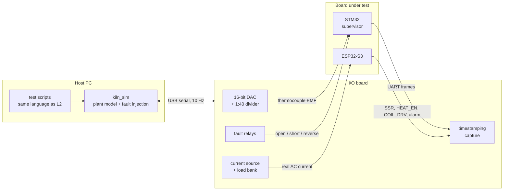

<!--
SPDX-FileCopyrightText: 2026 Bitcrush Testing
SPDX-License-Identifier: GPL-3.0-or-later
-->

# Test concept

How this product is verified, at four levels, and what each one can and cannot
prove. The testability requirements it answers are `TR-01` to `TR-28` in
[`requirements.sdoc`](requirements.sdoc); section 10 states plainly which of
them are met today and which are not.

The organising idea is that each level exists to prove something the level
below it cannot, and that saying so is more useful than counting tests. A
suite of 431 passing tests that has never seen a thermocouple is not evidence
that the kiln will stop heating when the probe falls out.

## 1. The levels

| | Level | Runs on | Proves | Cannot prove |
|---|---|---|---|---|
| **L1** | Unit | Development host, seconds | Each rule and algorithm against its requirement, including arithmetic nobody can see by reading | That the components are wired together |
| **L2** | Integration | Development host, in process | Components against each other and against a plant model: closed-loop control, persistence across power cuts, the API's answers | That the real image runs, or that any hardware works |
| **L3** | System | QEMU, and a host harness with real sockets | The real firmware image booting and firing; the HTTP interface as a client actually sees it | Anything analogue, anything about timing on real silicon, anything about the hardware safety chain |
| **L4** | HIL | The board, with a fixture | The adapters, the electrical detections, timing under load, and the hardware interlocks that are the whole safety case | Nothing below it, which is why it is last and not instead |

Two independent firmwares are tested, not one: the ESP32 application and the
STM32 supervisor of [`AD-22`](architecture.sdoc). They share no product code,
so they have separate unit suites, and they first meet each other at L4.

## 2. L1, unit tests

**Where:** `firmware/test/host/unit/` (302 tests) and
`supervisor/test/host/` (33 tests). Plain CMake, no ESP-IDF, no ARM toolchain,
about four seconds for the lot.

This level is cheap because of `AD-01` to `AD-03`, and those decisions exist
mostly to make it cheap: logic components take an explicit context (`TR-04`),
reach hardware only through port interfaces (`TR-02`), and never read a clock
(`TR-03`). A 168-hour firing, a 15-minute runaway timer and a two-hour autotune
are therefore all exercised in milliseconds of wall time, because time is an
argument.

What belongs here: every safety rule, the PID, the setpoint generator, program
validation, the log codec, the configuration model, the JSON parser, the trip
logic and wire format of the supervisor. What does not: anything needing two
components to be connected.

Run under ASan and UBSan as well as plain (`TR-20`), because an arithmetic
rule that is correct and also reads past an array is not correct.

The fuzz suite (`firmware/test/host/fuzz/`) sits here too. It feeds the log
record decoder deliberately hostile bytes, on the argument that the one thing
reading data written by an earlier firmware version should survive is a record
that makes no sense.

## 3. L2, integration tests

**Where:** `firmware/test/host/integration/` (92 tests), in one process,
against the plant simulator and the fake ports of `kiln_hal_host`.

This is where the real control, setpoint, safety and autotune code runs
closed-loop against a thermal model (`TR-14`), and where the properties that
only emerge from interaction get tested:

- **A firing, end to end.** Programs execute, setpoints advance, hold-back
  suspends them, dwells complete, the log fills.
- **Power loss.** The fake flash can be told to lose power at the *n*th write,
  which is how `AD-09`'s claim that the log is the recovery journal gets
  tested rather than asserted.
- **The API's answers**, route by route, without a socket in sight.
- **Fault injection.** `kiln_sim` carries the `KILN_INJ_*` faults of `TR-11`
  and `TR-27`: open element, shorted SSR, welded contactor, disconnected CT,
  reversed or stuck thermocouple, open lid. `TR-09` requires every fault
  condition to be reachable without hardware, and this is where that is
  satisfied.

The simulator is deterministic from a seed (`TR-12`), so a failure can be
replayed rather than reproduced.

## 4. L3, system tests

The real image, through its real external interfaces. Two harnesses, because
no single one has both properties that matter.

**QEMU** (`tools/run-qemu.sh`, and the `qemu-smoke` CI job) boots the actual
`safekiln.bin` built by the actual toolchain, on the target's scheduler and
FPU, and fires a program. It is not a substitute for L2, which covers far more
in far less time. What it adds is the one thing L2 cannot: that the image
*works as an image*. It currently fires to 190 °C through segment 2 of 5 with
no fault latched.

**`host/webhost`** runs the real firmware logic behind a real POSIX socket
server with the plant simulated and time accelerated. This is where the HTTP
interface is exercised as a client sees it (`TR-16`): URI splitting, chunked
log streaming, the four-session limit, a slow client holding a buffer.
Tasklist `P4` records that this is not yet done; the harness exists and the
tests do not.

System tests are the right home for requirements expressed in terms of what an
operator or a client can observe, which is most of `FR-WEB`, `FR-RUN`,
`FR-LOG` and `FR-CFG`.

## 5. L4, hardware in the loop

### 5.1 Why this level is not optional

Everything above it shares one blind spot: it proves things about *software*.
The central claims of this product are not about software.

- That the supervisor's series element opens the contactor coil.
- That a hung ESP32 stops toggling `HEAT_EN` and the charge pump drops the
  contactor within about a second (`AD-05`).
- That the lid switch breaks the coil in hardware with no firmware involved
  (`HR-21`).
- That a thermocouple pulled out of its terminals is detected as an open
  circuit by a real MAX31856, and that its `~FAULT` output asserts.
- That `SR-27` can tell a shorted SSR from a welded contactor by dropping the
  contactor and re-measuring real current.
- That the loop meets `NFR-01` to `NFR-04` on real silicon under HTTP and WiFi
  load (`TR-18`).

None of those is testable in simulation, and all of them are load-bearing.
`TR-17` requires a documented HIL procedure with a low-power resistive load
and a thermocouple simulator; `TR-28` requires the jig to present a known
current and emulate a welded contactor. This section is that design.

### 5.2 The fixture, in one idea

**The fixture is a plant simulator with real analogue outputs, and it runs the
same plant model the host tests run.**

That is the whole architecture. `kiln_sim` already exists, already models
temperature *and* current, already carries the `KILN_INJ_*` fault injections,
and is already deterministic from a seed. Rather than writing a second plant
model that will disagree with the first, the fixture runs that one.

The consequence is worth stating: an L4 scenario can be the *same* scenario as
an L2 test, with the same seed and the same expected outcome. When they
disagree, the difference is isolated to the adapters, the analogue front ends
and the electricals, which is exactly and only what L4 is for.



The split is deliberate: the **model runs on the host**, so it is the same code
and the test scripts are the same language as L2; the **I/O board is close to
dumb**, but does its own hardware timestamping, because USB latency is fine for
a 10 Hz thermal model and useless for measuring a 10 ms SSR window.

### 5.3 Simulating the thermocouple

The hard part, and the part with a subtlety that is easy to get wrong.

**The device adds cold-junction compensation, so the fixture must subtract
it.** The MAX31856 reports a temperature derived from the EMF at its terminals
*plus* the EMF corresponding to its own cold-junction temperature. To make it
read `T_target`, the fixture must present

```
EMF = f(T_target) - f(T_cj)
```

where `f` is the type K polynomial and `T_cj` is the temperature of the chip,
which drifts with the enclosure. A fixture that ignores this reads correctly in
a cold lab and wrongly after an hour of firing.

The loop is already closed for us: **the supervisor reports `cj_c` in every
frame**, ten times a second, because the wire format carries it. The fixture
reads the UART it is already monitoring and computes the EMF it needs. No extra
sensor, no calibration against ambient, and the compensation tracks whatever
the board is actually doing.

**Resolution.** Type K is about 41 µV/°C over the range that matters, so 0.1 °C
is roughly 4 µV, and the full scale to 1350 °C is about 54 mV. A 16-bit DAC
spanning 0 to 2.5 V through a **1:40 divider** gives 0 to 62.5 mV at about
0.95 µV per step: 0.025 °C, which is finer than anything being tested.

**Accuracy, and why it needs less than it looks.** Almost every test here
verifies a *threshold crossing* or a *trend*, not an absolute reading. The
supervisor's backstop is tested by presenting 1340 °C and expecting no trip,
then 1360 °C and expecting one. With 20 °C of headroom either side, a fixture
good to ±2 °C absolute is ample. What it does need is **monotonicity and
repeatability**, plus a handful of calibrated points so the mapping is known
rather than assumed.

**The real error source is the fixture's own wiring.** Any dissimilar-metal
junction sitting in a temperature gradient generates microvolts, which is the
same unit the signal is in. The divider's low side must sit at the terminals,
its junctions must be paired and isothermal, and the connection to the DUT must
be the same alloy as the couple it replaces. This matters more than the DAC's
datasheet.

**Fault injection** is relays, not maths:

| Relay | Presents | Verifies |
|---|---|---|
| Open both leads | Open circuit | `SR-04`, the MAX31856's open-circuit detect, `~FAULT` asserting |
| Short the pair | Shorted couple | `SR-04` |
| Lead to 3V3 | Short to supply | `SR-04`, front-end `OVUV` |
| Lead to ground | Short to ground | `SR-04` |
| Swap the pair | Reversed polarity | `SR-05`, which detects a reading that falls while heat is commanded |
| Hold the DAC | Stuck sensor | `SR-06` |

Reversal is worth having as a relay rather than as a negative DAC output,
because reversing the *leads* is the failure that actually happens in the
field.

### 5.4 Simulating heater current

`TR-28` asks for a known current presented to the transformer, and the word
*transformer* is load-bearing: injecting a voltage into the CT's burden would
test the firmware's arithmetic while leaving the CT, the burden and the
anti-alias network untested.

So: a **low-power resistive load** on the SSR output with the clip-on CT around
that conductor (`TR-17`), and a separate, fixture-controlled **bypass path**
across it.

The bypass is the important part, because the fixture must be able to present
current the DUT did not ask for, and withhold current the DUT did ask for:

| Fixture does | DUT commands | Emulates | Verifies |
|---|---|---|---|
| Energise bypass | Off | Shorted SSR or welded contactor | `SR-08`, `SR-25` |
| Open the load | On | Open element | `SR-26` |
| Partial load | On | Degraded element | `SR-28` |
| Bypass, then watch the contactor drop | Off | Welded contactor | `SR-27`'s discrimination sequence, which is the one `TR-28` names |
| Remove the CT | Either | CT unfitted or fallen off | `FR-CUR-11`, `FR-CUR-12` |

`SR-27` is the reason this cannot be a signal generator. The discrimination
works by dropping the contactor and re-measuring: if current stops, the SSR was
shorted; if it persists, the contactor is welded. The fixture has to make a
real contactor's real contacts behave both ways.

### 5.5 Discrete inputs

The lid switch is a contact closure, so the fixture closes a contact. It must
be driven on **both** paths independently, because `HR-21` wires it to a
controller input *and* in series with the coil, and a fixture that drives only
the sense line would let a broken series contact pass. Opening the series path
with the sense line still closed is a specific, testable fault.

The encoder is quadrature plus a button: the fixture generates A/B sequences,
including the invalid transitions a worn encoder produces, and this is the one
place to settle tasklist `M5`, which records that the encoder's direction is
currently a guess.

The supervisor's clear button is a contact, and the fixture must be able to
hold it closed from power-on, because that is the stuck-line case the edge
triggering exists for.

### 5.6 What the fixture observes

Simulating the inputs is half of it. The assertions are on the outputs, with
timestamps.

| Observed | Resolution | For |
|---|---|---|
| `SSR1`, `SSR2` gates | microseconds | Window period, min-on and min-off (`FR-CTL-07`, `FR-CTL-08`, `AD-07`) |
| `HEAT_EN` | microseconds | That it is a *square wave* and not a level, and its frequency (`AD-05`) |
| `COIL_DRV`, and coil current | milliseconds | That the contactor actually closed, and when it dropped (`NFR-04`'s 1 s) |
| The supervisor's permit line | microseconds | Its trip latency, independently of what it reports |
| The supervisor's UART frames | per frame | Decoded with the same `sup_proto` codec the firmware uses, so the fixture cannot disagree about the format |
| Alarm output | milliseconds | `SR-20` patterns |
| Current through the load | per mains cycle | The DUT's own measurement against the fixture's, which is the only way to check calibration |

Two of these deserve emphasis. **The supervisor's permit line is observed
separately from its reports**, because the whole point of `AD-22` is that the
line does not depend on the firmware that describes it; a test that believed
the frame would be testing the wrong thing. And **the fixture links the real
`sup_proto.cpp`**, so a protocol change cannot make the fixture and the
firmware quietly disagree.

### 5.7 The independence test

One scenario matters more than any other at this level, and it exists only
here. Hold the ESP32 in reset, or run a build that deliberately hangs its
safety task, drive the chamber above 1350 °C with the DAC, and confirm the
contactor opens.

That is the single experiment that distinguishes this design from the one it
replaced. It cannot be done at any other level, and it should be run on every
hardware revision and recorded with the result.

### 5.8 Build or buy

The chamber channel's precision is the only part that is genuinely demanding.
A commercial thermocouple calibrator with a serial interface removes that risk
and costs more than the rest of the jig together.

The recommendation is to **build**, on the grounds in 5.3: the accuracy
required is modest because the tests are threshold tests, the cold-junction
loop closes itself from a frame the device already sends, and a fixture that
lives in the repository and is version-controlled alongside the firmware is
worth more than a more accurate instrument that lives in a drawer. One
calibrated reference is still wanted, once, to establish the mapping.

## 6. Verifying the architecture, not just the behaviour

[`architecture.sdoc`](architecture.sdoc) holds 22 decisions, and most of them
are **structural claims rather than behavioural ones**. They are verified by
assertions at build time, which is cheaper and much harder to fool than a
runtime test.

| How | Decisions |
|---|---|
| Static: grep, AST, `nm`, `static_assert`, link | `AD-01`, `AD-02`, `AD-03`, `AD-08`, `AD-10`, `AD-11`, `AD-13`, `AD-14`, `AD-16`, `AD-18`, `AD-19`, `AD-20`, `AD-21` |
| Runtime, in process (L2) | `AD-04`, `AD-06`, `AD-07`, `AD-09`, `AD-12`, `AD-17` |
| HIL only (L4) | `AD-05`, `AD-15`, `AD-22` |
| Nothing to assert | `AD-10`'s storage trade-off has no requirement behind it |

Several already have checks that nobody can see, because the link did not exist
until recently: `AD-01` and `AD-14` are the `checks` CI job, `AD-20` is the
`tidy` jobs, `AD-09` and `AD-17` are covered by `test_persistence` and
`test_current`. Connecting those to the decisions they verify is tracked work,
not new work.

Three decisions hold today **by discipline alone** and are cheap to make
structural, which is the most valuable unclaimed work at this level:

- `AD-18`, that the log record is 20 bytes, has no `static_assert` anywhere.
- `AD-03`, no globals in the core, is true (zero mutable file-scope objects in
  `kiln_core`) and unenforced, because
  `cppcoreguidelines-avoid-non-const-global-variables` is switched off.
- `AD-02`, time is injected, is true (zero direct clock reads in the core) and
  unenforced. It is a grep.

## 7. Traceability

`TR-22` requires every requirement to trace to a verification artefact and
`TR-26` requires test names to carry the requirement identifiers. The
convention exists and has decayed: **28 of 268 requirements** appear in a test
function name, and **147 appear nowhere in any test file at all**. The tool
that was to enforce it, `tools/trace`, was never built.

The recommendation is to stop building it. StrictDoc, which now owns the
requirements, has source traceability: an annotation of the form

```
/* @relation(SR-25, scope=function) */
```

ties a test to a requirement, and the existing `requirements` CI job can
publish the coverage matrix as an artefact. That retires a tracked item instead
of adding one, and the gate becomes "no `T` requirement without a claiming
test", ratcheted rather than demanded all at once.

**The honest target is not one test per requirement.** Of 268 requirements,
192 are verifiable by test; the other 76 are inspection (42), demonstration
(21) or analysis (13). Chasing a test for "licences audited" produces either a
fake test or a reclassified requirement, and both are worse than an explicit
split. For those 76, the evidence belongs in the requirements document as a
child node citing the artefact or the commit, so that "verified by inspection"
stops being an unbacked assertion.

`TR-23` is stricter and worth keeping: every requirement in section 5, the
safety requirements, needs an **automated** test. Inspection is not sufficient
there.

## 8. Coverage

`TR-19` wants 90 % line coverage of the control and safety components and 100 %
of safety decision branches. The line floor is enforced in CI and was measured
at 97.5 % on `kiln_core`. Branch coverage is around 83 % and is **not** gated,
which tasklist `C10` records.

Coverage is used here as a floor and not as a goal. A safety rule with 100 %
line coverage and no test for the case where its input is absent is covered and
wrong, which is why section 5 of this document exists.

## 9. What is deliberately not tested

- **The external over-temperature cutout** (`HR-13`). It is outside the product
  and mandatory; the project tests that it is not relied upon, not that it
  works.
- **Mains-voltage behaviour of the installation.** `ASM-04` assumes competent
  installation.
- **Real firings, as a gate.** A kiln takes a day. Long-duration behaviour is
  verified by accelerated simulation and a soak test (`TR-21`), not by waiting.

## 10. Status against the testability requirements

| | Requirement | Status |
|---|---|---|
| `TR-01`–`TR-08` | Testable structure | **Met**, and enforced by the `checks` job for the layering parts |
| `TR-09` | Every fault reachable without hardware | **Met** via `kiln_sim`'s injections |
| `TR-10` | Test interfaces compiled out of production | **Not verified** by a build check |
| `TR-11`, `TR-12`, `TR-27` | Plant simulator, deterministic, models current | **Met** |
| `TR-13` | Host unit tests, one command | **Met**, 335 across two firmwares |
| `TR-14` | Closed-loop integration tests | **Met**, 92 |
| `TR-15` | On-target HAL tests | **Not met**. No adapter has run on hardware (`L2`) |
| `TR-16` | API tests end to end | **Partly**. Route behaviour yes, socket half no (`P4`) |
| `TR-17`, `TR-28` | HIL procedure and jig | **Not met**. Designed in section 5, not built |
| `TR-18` | Timing measured on target | **Not met** |
| `TR-19` | Coverage | **Partly**. Line floor gated, branch not (`C10`) |
| `TR-20` | Sanitisers | **Met** |
| `TR-21` | Soak and accelerated long-duration | **Not met** |
| `TR-22`, `TR-26` | Traceability, test names carry IDs | **Not met**. 28 of 268; see section 7 |
| `TR-23` | Every safety requirement automated | **Unverified**, because the traceability to check it against does not exist |
| `TR-24` | CI does all of it on every push | **Met** for what exists |
| `TR-25` | A fix comes with a regression test | **Met** by practice, not enforced |

The pattern is worth naming: everything that can be done on a development host
is done, and almost nothing that needs hardware is. That is a reasonable place
to have got to, and it is not a reasonable place to ship from.
